# Dive Into DESIGN PATTERNS

# Dive Into DESIGN PATTERNS

# A Few Words on Copyright

Hi! My name is Alexander Shvets. I'm the author of the book Dive Into Design Patterns and the online course Dive Into Refactoring.

This book is for your personal use only. Please don't share it with any third parties except your family members.If you'd like to share the book with a friend or colleague,buy and send them a new copy. You can also buy a site license for your whole team or the entire company.

All profit from the sale of my books and courses is spent on the development of Refactoring.Guru. Each copy sold helps the project immensely and brings the moment of a new book release a little bit closer.

$\circledcirc$ Alexander Shvets, Refactoring.Guru, 2021 support@refactoring.guru

I dedicate this book to my wife,Maria. If it hadn't been for her, I'd probably have finished the book some 30 years later.

# Table of Contents

Table of Contents 4

How to Read This Book. 6

INTRODUCTION TO OOP 7

Basics of OOP. 8   
Pillars of OOP. 13   
Relations Between Objects. 20

# INTRODUCTION TO DESIGN PATTERNS 26

What's a Design Pattern?. 27   
Why Should I Learn Patterns?. 31

# SOFTWARE DESIGN PRINCIPLES 32

Features of Good Design. .33

# Design Principles.. 37

§ Encapsulate What Varies.. 38   
§ Program to an Interface, not an Implementation....42   
§ Favor Composition Over Inheritance. 47

# SOLID Principles . .51

Single Responsibility Principle 52   
Open/Closed Principle. 54   
§ Liskov Substitution Principle. 57   
S Interface Segregation Principle 64   
§ Dependency Inversion Principle 67

# CATALOG OF DESIGN PATTERNS 71

# Creational Design Patterns. 72

§ Factory Method 74   
§ Abstract Factory. 90   
§Builder. .105   
S Prototype.. .124   
S Singleton.. .138

# Structural Design Patterns. 147

S Adapter.. .150   
§ Bridge... .163   
s Composite .178   
§ Decorator.. .192   
Facade.. .210   
§ Flyweight.. .220   
S Proxy . .234

# Behavioral Design Patterns .246

§ Chain of Responsibility .250   
§ Command .268   
§ Iterator... .289   
§ Mediator.. .304   
$^ { \mathsection }$ Memento.. .320   
§ Observer.. .336   
State.. .352   
S Strategy... .368   
$^ { \mathsection }$ Template Method. .381   
§ Visitor... .393

# Conclusion . .409

# How to Read This Book

This book contains the descriptions of 22 classic design patterns formulated by the“Gang of Four" (or simply GoF) in 1994.

Each chapter explores a particular pattern. Therefore, you can read from cover to cover or by picking the patterns you're interested in.

Many patterns are related, so you can easily jump from topic to topic using numerous anchors.The end of each chapter has a list of links between the current pattern and others. If you see the name of a pattern that you haven't seen yet, just keep reading-this item will appear in one of the next chapters.

Design patterns are universal. Therefore,all code samples in this book are written in pseudocode that doesn't constrain the material to a particular programming language.

Prior to studying patterns,you can refresh your memory by going over the key terms of object-oriented programming. That chapter also explains the basics of UML diagrams,which is useful because the book has tons of them. Of course, if you already know all of that, you can proceed to learning patterns right away.

# INTRODUCTION TO OOP

# Basics of OOP

Object-oriented programming is a paradigm based on the concept of wrapping pieces of data,and behavior related to that data, into special bundles called objects,which are constructed from a set of“blueprints”, defined by a programmer, called classes.

# Objects, classes

Do you like cats? I hope you do because I'll try to explain the OOP concepts using various cat examples.

Cat Name Visibility + hame $+ \ =$ public + gender $- =$ private +age Fields + weight (state) + color   
The ellipsis means ： t tinthesmtare, + breathe()   
but it's not relevant at the moment. + eat(food) + run(destination) Methods (behavior) + sleep(hours) + meow0

This is a UML class diagram. You'llsee a lot of such diagrams in the book.

Say you have a cat named Oscar. Oscar is an object,an instance of the Cat class. Every cat has a lot of standard attributes: name, sex,age,weight,color, favorite food, etc.These are the class's fields.

All cats also behave similarly: they breathe,eat, run, sleep and meow. These are the class's methods. Collectively， fields and methods can be referenced as the members of their class.

Data stored inside the object's fields is often referenced as state,and all the object's methods define its behavior.

# Oscar: Cat

name $=$ "Oscar" sex $=$ "male" age 3 weight 7 color $=$ brown texture $=$ striped

# Luna: Cat

name $=$ "Luna" sex $=$ "female" age 2 weight = 5 color $=$ gray texture $=$ plain

Objects are instances of classes.

Luna,your friend's cat, is also an instance of the Cat class. It has the same set of attributes as Oscar. The difference is in values of these attributes: its sex is female, it has a different color,and weighs less.

So a class is like a blueprint that defines the structure for objects,which are concrete instances of that class.

# Class hierarchies

Everything's fine and dandy when we talk about one class. Naturally, a real program contains more than a single class. Some of these classes might be organized into class hierarchies. Let's find out what that means.

Say your neighbor has a dog called Fido. It turns out, dogs and cats have a lot in common: name, sex,age,and color are attributes of both dogs and cats. Dogs can breathe, sleep and run the same way cats do. So it seems that we can define the base Animal class that would list the common attributes and behaviors.

A parent class, like the one we've just defined, is called a superclass. Its children are subclasses. Subclasses inherit state and behavior from their parent, defining only attributes or behaviors that differ. Thus, the Cat class would have the meow method,and the Dog class the bark method.

Animal Superclass + name + sex +age + weight Arrows with empty triangle + color hedsindisgeirohrtance + breathe() subolas tomasuperclass + eat(food) subclasses can overlap (as in + run(destination) this diagram) or be drawn + sleep(hours) 全 Cat Dog   
- isNasty: bool - bestFriend: Human   
+ meow0 + bark0 Subclasses

UML diagram of a class hierarchy.All classes in this diagram are part of the Animal class hierarchy.

Assuming that we have a related business requirement, we can go even further and extract a more general class for all living Organisms which will become a superclass for Animals and Plants .Such a pyramid of classes is a hierarchy. In such a hierarchy,the Cat class inherits everything from both the Animal and Organism classes.

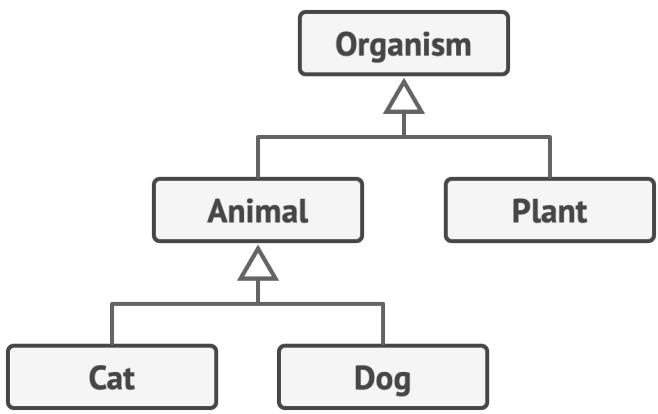  
Classes in a UML diagram can be simplifed if it's more important to show their relations than their contents.

Subclasses can override the behavior of methods that they inherit from parent classes.A subclass can either completely replace the default behavior or just enhance it with some extra stuff.

# Pillars of OOP

Object-oriented programming is based on four pillars,concepts that differentiate it from other programming paradigms.

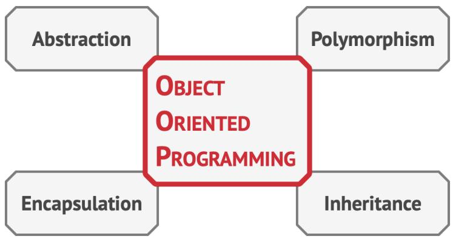

# Abstraction

Most of the time when you're creating a program with OOP, you shape objects of the program based on real-world objects. However,objects of the program don’t represent the originals with $100 \%$ accuracy (and it's rarely required that they do). Instead,your objects only model attributes and behaviors of real objects in a specific context, ignoring the rest.

For example,an Airplane class could probably exist in both a flight simulator and a flight booking application. But in the former case,it would hold details related to the actual flight, whereas in the latter class you would care only about the seat map and which seats are available.

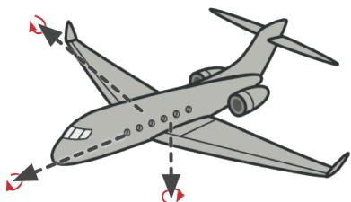

<table><tr><td>Airplane</td></tr><tr><td>- speed</td></tr><tr><td>- altitude</td></tr><tr><td>- rollAngle</td></tr><tr><td>- pitchAngle</td></tr><tr><td>- yawAngle</td></tr><tr><td>+ fly0</td></tr></table>

<table><tr><td>Airplane</td></tr><tr><td>- seats</td></tr><tr><td>+ reserveSeat(n)</td></tr></table>

Different models of the same real-world object.

Abstraction is a model of a real-world object or phenomenon, limited to a specific context, which represents all details relevant to this context with high accuracy and omits all the rest.

# Encapsulation

To start a car engine, you only need to turn a key or press a button. You don't need to connect wires under the hood, rotate the crankshaft and cylinders,and initiate the power cycle of the engine. These details are hidden under the hood of the car. You have only a simple interface: a start switch,a steering wheel and some pedals. This illustrates how each object has an interface-a public part of an object, open to interactions with other objects.

Encapsulation is the ability of an object to hide parts of its state and behaviors from other objects, exposing only a limited interface to the rest of the program.

To encapsulate something means to make it private ，and thus accessible only from within the methods of its own class. There's a little bit less restrictive mode called protected that makes a member of a class available to subclasses as well.

Interfaces and abstract classes/methods of most programming languages are based on the concepts of abstraction and encapsulation. In modern object-oriented programming languages, theinterfacemechanism(usually declared withthe interface or protocol keyword) lets you define contracts of interaction between objects. That's one of the reasons why the interfaces only care about behaviors of objects,and why you can't declare a field in an interface.

The fact that the word interface stands for a public part of an object, while there's also the interface type in most programming languages, is very confusing.l'm with you on that.

Imagine that you have a FlyingTransport interface with a method fly(origin, destination， passengers). When designing an air transportation simulator, you could restrict the Airport class to work only with objects that implement the FlyingTransport interface. After this, you can be sure that any object passed to an airport object, whether it'san Airplane , a Helicopter orafreaking DomesticatedGryphon Would be able to arrive or depart from this type of airport.

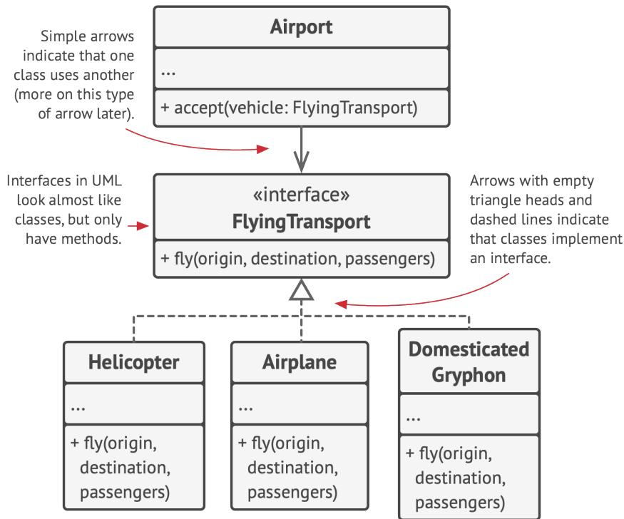  
UML diagram of several classes implementing an interface.

You could change the implementation of the fly method in these classes in any way you want. As long as the signature of the method remains the same as declared in the interface, all instances of the Airport class can work with your flying objects just fine.

# Inheritance

Inheritance is the ability to build new classes on top of existing ones. The main benefit of inheritance is code reuse. If you want to create a class that's slightly different from an existing one, there's no need to duplicate code. Instead, you extend the existing class and put the extra functionality into a resulting subclass,which inherits fields and methods of the superclass.

The consequence of using inheritance is that subclasses have the same interface as their parent class. You can't hide a method in a subclass if it was declared in the superclass. You must also implement all abstract methods, even if they don't make sense for your subclass.

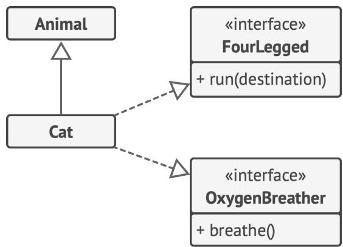  
UML diagram of extending a single class versus implementing multiple interfaces at the same time.

In most programming languages a subclass can extend only one superclass.On the other hand,any class can implement several interfaces at the same time. But,as l mentioned before, if a superclass implements an interface,all of its subclasses must also implement it.

# Polymorphism

Let's look at some animal examples.Most Animals can make sounds.We can anticipate that all subclasses will need to override the base makeSound method so each subclass can emit the correct sound; therefore we can declare it abstract right away. This lets us omit any default implementation of the method in the superclass, but force allsubclasses to come up with their own.

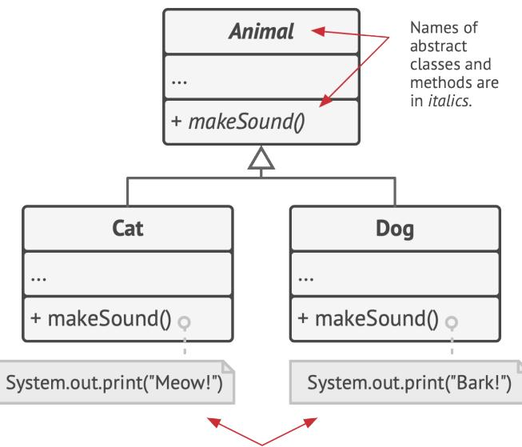  
These are UML comments.Usually they explain implementation details of the given classes or methods.

Imagine that we've put several cats and dogs into a large bag. Then,with closed eyes,we take the animals one-by-one out of the bag. After taking an animal from the bag,we don't know for sure what it is. However, if we cuddle it hard enough, the animal will emit a specific sound of joy, depending on its concrete class.

1 bag $=$ [new Cat $( )$ ，new Dog()];   
2   
3 foreach (Animal a : bag)   
4 a.makeSound()   
5   
6 // Meow!   
7 // Woof!

The program doesn't know the concrete type of the object contained inside the a variable; but, thanks to the special mechanism called polymorphism, the program can trace down the subclass of the object whose method is being executed and run the appropriate behavior.

Polymorphism is the ability of a program to detect the real class of an object and call its implementation even when its real type is unknown in the current context.

You can also think of polymorphism as the ability of an object to “pretend” to be something else,usually a class it extends or an interface it implements. In our example, the dogs and cats in the bag were pretending to be generic animals.

# Relations Between Objects

In addition to inheritance and implementation that we've already seen, there are other types of relations between objects that we haven't talked about yet.

# Dependency

  
UML Dependency. Professor depends on the course materials.

Dependency is the most basic and the weakest type of relations between classes. There is a dependency between two classes if some changes to the definition of one class might result in modifications to another class. Dependency typically occurs when you use concrete class names in your code. For example, when specifying types in method signatures,when instantiating objects via constructor calls,etc. You can make a dependency weaker if you make your code dependent on interfaces or abstract classes instead of concrete classes.

Usually，a UML diagram doesn't show every dependency-there are far too many of them in any real code. Instead of polluting the diagram with dependencies, you should be very selective and show only those that are important to whatever it is you are communicating.

# Association

  
UML Association.Professor communicates with students.

Association is a relationship in which one object uses or interacts with another. In UML diagrams, the association relationship is shown by a simple arrow drawn from an object and pointing to the object it uses. By the way, having a bi-directional association is a completely normal thing.In this case, the arrow has a point at each end. Association can be seen as a specialized kind of dependency, where an object always has access to the objects with which it interacts,whereas simple dependency doesn't establish a permanent link between objects.

In general, you use an association to represent something like a field in a class. The link is always there,in that you can always ask an order for its customer. But it doesn't always have to be a field.If you are modeling your classes from an interface perspective,it can just indicate the presence of a method that will return the order's customer.

To solidify your understanding of the difference between association and dependency, let's look at a combined example. Imagine that we have a Professor class:

1 class Professor is   
2 field Student student   
3   
4 method teach(Course c） is   
5   
6 this.student.remember(c.getKnowledge())

Take a look at the teach method. It takes an argument of the Course class,which is then used in the body of the method. If Someone changes the getKnowledge method of the Course class (alters its name,or adds some required parameters,etc.) our code will break. This is called a dependency.

Now, look at the student field and how it's used in the teach method.We can say for sure that the Student class is also a dependency for the Professor : if the method remember changes,the Professor 's code will break. However, since the student field is always accessible to any method of the Professor ,the Student class is not just a dependency, but also an association.

# Aggregation

Department □ Professor

UML Aggregation. Department contains professors.

Aggregation is a specialized type of association that represents“one-to-many”,“many-to-many”or“whole-part" relations between multiple objects.

Usually, under aggregation,an object“has”a set of other objects and serves as a container or collection.The component can exist without the container and can be linked to several containers at the same time.In UML the aggregation relationship is shown by a line with an empty diamond at the container end and an arrow at the end pointing toward the component.

While we talk about relations between objects, keep in mind that UML represents relations between classes.It means that a university object might consist of multiple departments even though you see just one“block" for each entity in the diagram. UML notation can represent quantities on both sides of relationships,but it's okay to omit them if the quantities are clear from the context.

# Composition

  
UML Composition. University consists of departments.

Composition is a specific kind of aggregation, where one object is composed of one or more instances of the other. The distinction between this relation and others is that the component can only exist as a part of the container. In UML the composition relationship is drawn the same as for aggregation,but with a filled diamond at the arrow's base.

Note that many people often use the term “composition”when they really mean both the aggregation and composition.The most notorious example for this is the famous principle "choose composition over inheritance." It's not because people are ignorant about the difference, but rather because the word "composition” (e.g.“object composition") sounds more natural in the English language.

# The big picture

Now that we know all types of relations between objects let's see how they all are connected. Hopefully, this will guide you through questions like“what is the difference between aggregation and composition”or“is inheritance a type of dependency?”

Dependency: Class A can be affected by changes in class B.

Association: Object A knows about object B. Class A depends on B.

Aggregation: Object A knows about object B,and consists of B.   
Class A depends on B.

Composition: Object A knows about object B, consists of B,and manages B's life cycle. Class A depends on B.

Implementation: Class A defines methods declared in interface B. Objects A can be treated as B. Class A depends on B.

Inheritance: Class A inherits interface and implementation of class B but can extend it. Objects A can be treated as B. Class A depends on B.

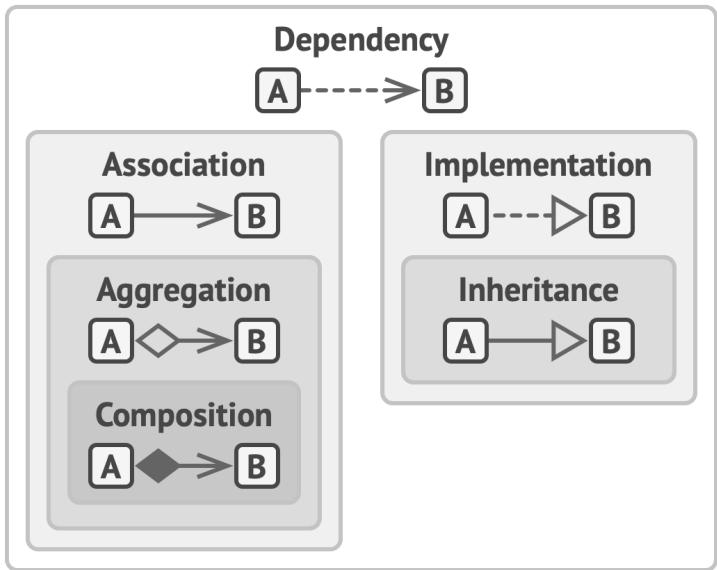

Relations between objects and classes: from weakest to strongest.

# INTRODUCTION TO PATTERNS

# What's a Design Pattern?

Design patterns are typical solutions to commonly occurring problems in software design. They are like pre-made blueprints that you can customize to solve a recurring design problem in your code.

You can't just find a pattern and copy it into your program, the way you can with off-the-shelf functions or libraries.The pattern is not a specific piece of code,but a general concept for solving a particular problem. You can follow the pattern details and implement a solution that suits the realities of your own program.

Patterns are often confused with algorithms,because both concepts describe typical solutions to some known problems. While an algorithm always defines a clear set of actions that can achieve some goal, a pattern is a more high-level descrip-tion of a solution. The code of the same pattern applied to two different programs may be different.

An analogy to an algorithm is a cooking recipe: both have clear steps to achieve a goal. On the other hand,a pattern is more like a blueprint: you can see what the result and its features are, but the exact order of implementation is up to you.

# ↓ What does the pattern consist of?

Most patterns are described very formally so people can reproduce them in many contexts. Here are the sections that are usually present in a pattern description:

Intent of the pattern briefly describes both the problem and the solution.

Motivation further explains the problem and the solution the pattern makes possible.

Structure of classes shows each part of the pattern and how they are related.

Code example in one of the popular programming languages makes it easier to grasp the idea behind the pattern.

Some pattern catalogs list other useful details, such as applicability of the pattern, implementation steps and relations with other patterns.

# Classification of patterns

Design patterns differ by their complexity, level of detail and scale of applicability to the entire system being designed. I like the analogy to road construction: you can make an intersection safer by either installing some traffic lights or building an entire multi-level interchange with underground passages for pedestrians.

The most basic and low-level patterns are often called idioms.   
They usually apply only to a single programming language.

The most universal and high-level patterns are architectural patterns. Developers can implement these patterns in virtually any language. Unlike other patterns, they can be used to design the architecture of an entire application.

In addition,all patterns can be categorized by their intent, or purpose. This book covers three main groups of patterns:

Creational patterns provide object creation mechanisms that increase flexibility and reuse of existing code.

Structural patterns explain how to assemble objects and classes into larger structures,while keeping the structures flexible and efficient.

Behavioral patterns take care of effective communication and the assignment of responsibilities between objects.

# Who invented patterns?

That's a good, but not a very accurate, question. Design patterns aren't obscure,sophisticated concepts-quite the opposite.Patterns are typical solutions to common problems in object-oriented design. When a solution gets repeated over and over in various projects, someone eventually puts a name to it and describes the solution in detail. That's basically how a pattern gets discovered.

The concept of patterns was first described by Christopher Alexander in A Pattern Language: Towns， Buildings, Construction1.The book describes a“language"for designing the urban environment. The units of this language are patterns. They may describe how high windows should be, how many levels a building should have, how large green areas in a neighborhood are supposed to be,and so on.

The idea was picked up by four authors: Erich Gamma, John Vlissides, Ralph Johnson,and Richard Helm.In 1994, they published Design Patterns: Elements of Reusable Object-Oriented Software²,in which they applied the concept of design patterns to programming. The book featured 23 patterns solving various problems of object-oriented design and became a best-seller very quickly. Due to its lengthy name,people started to call it “the book by the gang of four”which was soon shortened to simply“the GoF book".

Since then,dozens of other object-oriented patterns have been discovered. The“pattern approach” became very popular in other programming fields, so lots of other patterns now exist outside of object-oriented design as well.

# Why Should I Learn Patterns?

The truth is that you might manage to work as a programmer for many years without knowing about a single pattern. A lot of people do just that. Even in that case, though,you might be implementing some patterns without even knowing it.So why would you spend time learning them?

Design patterns are a toolkit of tried and tested solutions to common problems in software design.Even if you never encounter these problems, knowing patterns is still useful because it teaches you how to solve allsorts of problems using principles of object-oriented design.

Design patterns define a common language that you and your teammates can use to communicate more efficiently. You can say，“Oh, just use a Singleton for that,” and everyone will understand the idea behind your suggestion. No need to explain what a singleton is if you know the pattern and its name.

# SOFTWARE DESIGN PRINCIPLES

# Features of Good Design

Before we proceed to the actual patterns, let's discuss the process of designing software architecture: things to aim for and things you'd better avoid.

# Code reuse

Cost and time are two of the most valuable metrics when developing any software product. Less time in development means entering the market earlier than competitors. Lower development costs mean more money is left for marketing and a broader reach to potential customers.

Code reuse is one of the most common ways to reduce development costs.The intent is pretty obvious: instead of developing something over and over from scratch,why don't we reuse existing code in new projects?

The idea looks great on paper, but it turns out that making existing code work in a new context usually takes extra effort. Tight coupling between components，dependencies on concrete classes instead of interfaces,hardcoded operations-all of this reduces flexibility of the code and makes it harder to reuse it.

Using design patterns is one way to increase flexibility of software components and make them easier to reuse. However, this sometimes comes at the price of making the components more complicated.

Here's a piece of wisdom from Erich Gamma1,one of the founding fathers of design patterns,about the role of design patterns in code reuse:

I see three levels of reuse.

At the lowest level, you reuse classes: class libraries,containers,maybe some class“teams”like container/iterator.

Frameworks are at the highest level.They really try to distill your design decisions. They identify the key abstractions for solving a problem, represent them by classes and define relationships between them. JUnit is a small framework, for example. It is the“Hello,world” of frameworks. It has Test , TestCase ，TestSuite and relationships defined.

A framework is typically larger-grained than just a single class. Also,you hook into frameworks by subclassing somewhere. They use the so-called Hollywood principle of“don't call us, we'll call you.” The framework lets you define your custom behavior,and it will call you when it's your turn to do something. Same with JUnit, right? It calls you when it wants to execute a test for you, but the rest happens in the framework.

There also is a middle level. This is where I see patterns. Design patterns are both smaller and more abstract than frameworks. They're really a description about how a couple of classes can relate to and interact with each other. The level of reuse increases when you move from classes to patterns and finally frameworks.

What is nice about this middle layer is that patterns offer reuse in a way that is less risky than frameworks. Building a framework is high-risk and a significant investment. Patterns let you reuse design ideas and concepts independently of concrete code.

# Extensibility

Change is the only constant thing in a programmer's life.

You released a video game for Windows, but now people ask for a macOS version.   
You created a GUl framework with square buttons, but several months later round buttons become a trend.   
You designed a brilliant e-commerce website architecture, but just a month later customers ask for a feature that would let them accept phone orders.

Each software developer has dozens of similar stories. There are several reasons why this happens.

First,we understand the problem better once we start to solve it. Often by the time you finish the first version of an app, you're ready to rewrite it from scratch because now you under-stand many aspects of the problem much better. You have also grown professionally,and your own code now looks like crap.

Something beyond your control has changed. This is why so many dev teams pivot from their original ideas into something new. Everyone who relied on Flash in an online application has been reworking or migrating their code as browser after browser drops support for Flash.

The third reason is that the goalposts move. Your client was delighted with the current version of the application, but now sees eleven “little”changes he'd like so it can do other things he never mentioned in the original planning sessions. These aren't frivolous changes: your excellent first version has shown him that even more is possible.

There's a bright side: if someone asks you to change something in your app, that means someone still cares about it.

That's why all seasoned developers try to provide for possible future changes when designing an application's architecture.

# Design Principles

What is good software design? How would you measure it? What practices would you need to follow to achieve it? How can you make your architecture flexible, stable and easy to understand?

These are the great questions; but, unfortunately, the answers are different depending on the type of application you're building.Nevertheless, there are several universal principlesof software design that might help you answer these questions for your own project. Most of the design patterns listed in this book are based on these principles.

# Encapsulate What Varies

Identify the aspects of your application that vary and separate them from what stays the same.

The main goal of this principle is to minimize the effect caused by changes.

Imagine that your program is a ship,and changes are hideous mines that linger under water. Struck by the mine, the ship sinks.

Knowing this,you can divide the ship's hull into independent compartments that can be safely sealed to limit damage to a single compartment. Now, if the ship hits a mine, the ship as a whole remains afloat.

In the same way, you can isolate the parts of the program that vary in independent modules,protecting the rest of the code from adverse effects. As a result, you spend less time getting the program back into working shape,implementing and testing the changes. The less time you spend making changes, the more time you have for implementing features.

# Encapsulation on a method level

Say you're making an e-commerce website. Somewhere in your code, there's a getorderTotal method that calculates a grand total for the order, including taxes.

We can anticipate that tax-related code might need to change in the future. The tax rate depends on the country, state or even city where the customer resides,and the actual formula may change over time due to new laws or regulations. As a result, you’ll need to change the get0rderTotal method quite often.But even the method's name suggests that it doesn't care about how the tax is calculated.

1 method getOrderTotal(order) is   
2 $\tan \tt { Q } \tt { Q } \tt { Q } \tt { L } = \tt { Q }$   
3 foreach item in order.lineItems   
4 total $+ =$ item.price $^ *$ item.quantity   
5   
6 if (order.country $\scriptstyle \mathbf { \mu = \mu } 0 5 ^ { \prime \prime }$   
7 total $+ =$ total $* \ 0 . 0 7 \ \mathrm { ~ / ~ }$ US sales tax   
8 else if (order.country $= =$ "EU") :   
9 total $+ =$ total \* 0.20 // European VAT   
10   
11 return total

BEFORE: tax calculation code is mixed with the rest of the method's code.

You can extract the tax calculation logic into a separate method, hiding it from the original method.

1 method getOrderTotal(order) is 2 total $= ~ 0$ 3 foreach item in order.lineItems 4 total $+ =$ item.price $^ *$ item.quantity 5 6 total $+ =$ total $^ *$ getTaxRate(order.country) 7 8 return total 9 10 method getTaxRate(country） is 11 if (country $= =$ "US") 12 return $0 . 0 7 ~ / /$ US sales tax 13 else if (country $= =$ "EU") 14 return $0 . 2 0 ~ / /$ European VAT 15 else 16 return 0

Tax-related changes become isolated inside a single method. Moreover, if the tax calculation logic becomes too complicated, it's now easier to move it to a separate class.

# Encapsulation on a class level

Over time you might add more and more responsibilities to a method which used to do a simple thing.These added behaviors often come with their own helper fields and methods that eventually blur the primary responsibility of the containing class. Extracting everything to a new class might make things much more clear and simple.

<table><tr><td>Order</td></tr><tr><td>- lineltems - country - state - city</td></tr><tr><td>..20+ fields + getOrderTotal( + getTaxRate(country, state, product)</td></tr></table>

BEFORE: calculating tax in Order class.

Objects of the Order class delegate all tax-related work to a special object that does just that.

Order TaxCalculator - taxCalculator - lineltems - country + getTaxRate(country, state, product) -state -getEUTax(country) ..20+ fields - getChineseTax(product) + getOrderTotal0 1 一 total $= 0$ foreach item in lineltems subtotal $=$ item.price \*item.quantity total $+ =$ subtotal \* taxCalc.getTaxRate(country, state, item.product) return total

# Program to an Interface, not an Implementation

Program to an interface, not an implementation. Depend on abstractions, not on concrete classes.

You can tell that the design is flexible enough if you can easily extend it without breaking any existing code. Let's make sure that this statement is correct by looking at another cat example. A Cat that can eat any food is more flexible than one that can eat just sausages. You can still feed the first cat with sausages because they are a subset of “any food"; however, you can extend that cat's menu with any other food.

When you want to make two classes collaborate, you can start by making one of them dependent on the other. Hell,I often start by doing that myself. However, there's another, more flexible way to set up collaboration between objects:

1.Determine what exactly one object needs from the other: which methods does it execute?   
2.Describe these methods in a new interface or abstract class.   
3.Make the class that is a dependency implement this interface.   
4. Now make the second class dependent on this interface rather than on the concrete class. You still can make it work with

objects of the original class, but the connection is now much more flexible.

Cat Cat   
-energy this.energy $+ =$ - energy   
$^ +$ eat(Sausage s) s.getNutrition( + eat(Food s) ↓ Sausage 《interface> Food + getNutrition0   
$^ +$ getNutritiono   
$^ +$ 全   
+ getExpiration0 Sausage $^ +$ getNutrition( + getColor0 + getExpiration0

Before and after extracting the interface.The code on the right is more flexible than the code on the left, but it's also more complicated.

After making this change, you won't probably feel any immediate benefit. On the contrary, the code has become more complicated than it was before. However, if you feel that this might be a good extension point for some extra functionality, or that some other people who use your code might want to extend it here, then go for it.

# Example

Let's look at another example which illustrates that working with objects through interfaces might be more beneficial than depending on their concrete classes. Imagine that you're creating a software development company simulator. You have different classes that represent various employee types.

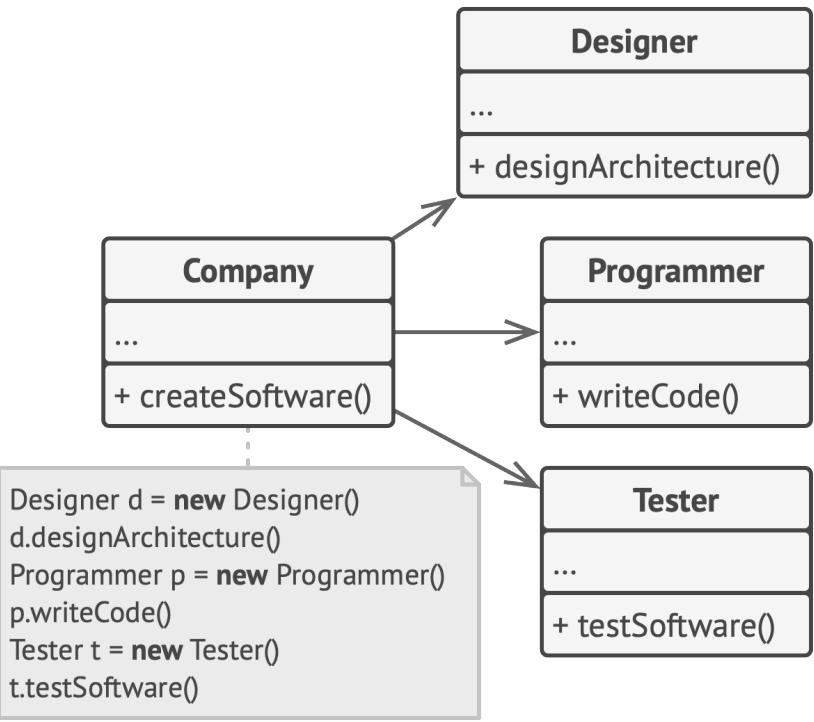  
BEFORE: all classes are tightly coupled.

In the beginning, the Company class is tightly coupled to concrete classes of employees.However, despite the difference in their implementations,we can generalize various work-related methods and then extract a common interface for all employee classes.

After doing that，we can apply polymorphism inside the Company  class, treating various employee objects via the Employee interface.

Company 《interface> Employee · + doWork0 + createSoftware0 全 employees $=$ [ Designer new Designer(), new Programmer(), new Tester() + doWork0 1 + doWork0 foreach (Employee e in employees) { 1 e.doWork0 Design + doWork(0 } architecture.

BETTER: polymorphism helped us simplify the code,but the rest of the Company class stilldepends on the concrete employee classes.

The Company class remains coupled to the employee classes. This is bad because if we introduce new types of companies that work with other types of employees, we'll need to override most of the Company class instead of reusing that code.

To solve this problem,we could declare the method for getting employees as abstract. Each concrete company will implement this method differently, creating only those employees that it needs.

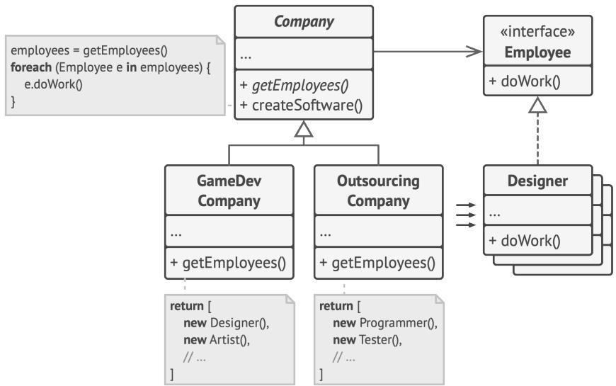  
AFTER:the primary method of the Company class is independent from concrete employee classes. Employee objects are created in concrete company subclasses.

After this change,the Company class has become independent from various employee classes. Now you can extend this class and introduce new types of companies and employees while still reusing a portion of the base company class. Extending the base company class doesn't break any existing code that already relies on it.

By the way, you've just seen applying a design pattern in action! That was an example of the Factory Method pattern. Don't worry: we'll discuss it later in detail.

# Favor Composition Over Inheritance

Inheritance is probably the most obvious and easy way of reusing code between classes. You have two classes with the same code. Create a common base class for these two and move the similar code into it. Piece of cake!

Unfortunately， inheritance comes with caveats that often become apparent only after your program already has tons of classes and changing anything is pretty hard. Here's a list of those problems.

A subclass can't reduce the interface of the superclass. You have to implement all abstract methods of the parent class even if you won't be using them.

When overriding methods you need to make sure that the new behavior is compatible with the base one. It's important because objects of the subclass may be passed to any code that expects objects of the superclass and you don't want that code to break.

Inheritance breaks encapsulation of the superclass because the internal details of the parent class become available to the subclass. There might be an opposite situation where a programmer makes a superclass aware of some details of subclasses for the sake of making further extension easier.

Subclasses are tightly coupled to superclasses. Any change in a superclass may break the functionality of subclasses.

Trying to reuse code through inheritance can lead to creating parallel inheritance hierarchies. Inheritance usually takes place in a single dimension. But whenever there are two or more dimensions, you have to create lots of class combinations,bloating the class hierarchy to a ridiculous size.

There's an alternative to inheritance called composition. Whereas inheritance represents the“is a” relationship between classes (a car is α transport), composition represents the“has a" relationship (a car has an engine).

I should mention that this principle also applies to aggregation-a more relaxed variant of composition where one object may have a reference to the other one but doesn't manage its lifecycle. Here's an example: a car has α driver, but he or she may use another car or just walk without the car.

# Example

Imagine that you need to create a catalog app for a car manufacturer. The company makes both cars and trucks; they can be either electric or gas; all models have either manual controls or an autopilot.

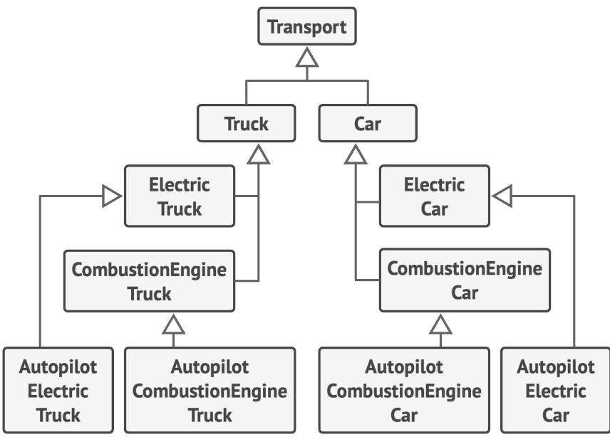  
INHERITANCE: extending a class in several dimensions (cargo type $\times$ engine type $\times$ navigation type) may lead to α combinatorial explosion of subclasses.

As you see,each additional parameter results in multiplying the number of subclasses. There's a lot of duplicate code between subclasses because a subclass can't extend two classes at the same time.

You can solve this problem with composition. Instead of car objects implementing a behavior on their own, they can delegate it to other objects.

The added benefit is that you can replace a behavior at runtime. For instance,you can replace an engine object linked to a car object just by assigning a different engine object to the car.

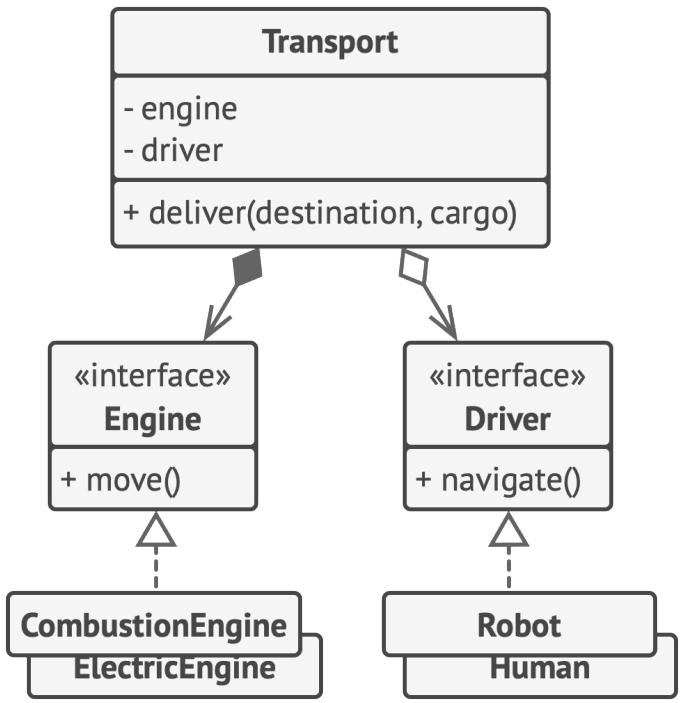  
COMPOSITiON: diferent “dimensions”offunctionality extracted to their own class hierarchies.

This structure of classes resembles the Strategy pattern, which we'll go over later in this book.

# SOLID Principles

Now that you know the basic design principles, let's take a look at five that are commonly known as the SOLID principles. Robert Martin introduced them in the book Agile Software Development, Principles,Patterns,and Practices1.

SOLID is a mnemonic for five design principles intended to make software designs more understandable, flexible and maintainable.

As with everything in life,using these principles mindlessly can cause more harm than good. The cost of applying these principles into a program's architecture might be making it more complicated than it should be.l doubt that there's a successful software product in which all of these principles are applied at the same time. Striving for these principles is good, but always try to be pragmatic and don't take everything written here as dogma.

# Single Responsibility Principle

A class should have just one reason to change.

Try to make every class responsible for a single part of the functionality provided by the software,and make that responsibility entirely encapsulated by (you can also say hidden within) the class.

The main goal of this principle is reducing complexity. You don't need to invent a sophisticated design for a program that only has about 2Oo lines of code.Make a dozen methods pretty, and you'll be fine.

The real problems emerge when your program constantly grows and changes. At some point classes become so big that you can no longer remember their details. Code navigation slows down to a crawl,and you have to scan through whole classes or even an entire program to find specific things. The number of entities in program overflows your brain stack,and you feel that you're losing control over the code.

There's more: if a class does too many things,you have to change it every time one of these things changes.While doing that, you're risking breaking other parts of the class which you didn't even intend to change.

If you feel that it's becoming hard to focus on specific aspects of the program one at a time,remember the single responsibil-ity principle and check whether it's time to divide some classes into parts.

# Example

The Employee class has several reasons to change. The frst reason might be related to the main job of the class: managing employee data. However, there's another reason: the format of the timesheet report may change over time, requiring you to change the code within the class.

<table><tr><td>Employee</td></tr><tr><td>- name</td></tr><tr><td>+ getName()</td></tr><tr><td>+ printTimeSheetReport()</td></tr></table>

BEFORE:the class contains several different behaviors.

Solve the problem by moving the behavior related to printing timesheet reports into a separate class. This change lets you move other report-related stuff to the new class.

TimeSheetReport Employee ->-name + print(employee) + getName()

AFTER:the extra behavior is in its own class.

# Open/Closed Principle

Classes should be open for extension but closed for modification.

The main idea of this principle is to keep existing code from breaking when you implement new features.

A class is open if you can extend it, produce a subclass and do whatever you want with it-add new methods or fields, override base behavior, etc.Some programming languages let you restrict further extension of a class with special keywords, such as final . After this, the class is no longer open. At the same time, the class is closed (you can also say complete) if it's $100 \%$ ready to be used by other classes-its interface is clearly defined and won't be changed in the future.

When l first learned about this principle, I was confused because the words open & closed sound mutually exclusive. But in terms of this principle,a class can be both open (for extension) and closed (for modification) at the same time.

If a class is already developed, tested, reviewed,and included in some framework or otherwise used in an app, trying to mess with its code is risky. Instead of changing the code of the class directly, you can create a subclass and override parts of the original class that you want to behave differently. You'll achieve your goal but also won't break any existing clients of the original class.

This principle isn't meant to be applied for all changes to a class. If you know that there's a bug in the class, just go on and fix it; don't create a subclass for it. A child class shouldn't be responsible for the parent's issues.

# Example

You have an e-commerce application with an Order class that calculates shipping costs and all shipping methods are hardcoded inside the class. If you need to add a new shipping method,you have to change the code of the Order class and risk breaking it.

if (shipping $= =$ "ground") { Order // Free ground delivery on big orders. if (getTotal $1 0 > 1 0 0$ {   
- lineltems return 0   
- shipping }   
$^ +$ getTotal() // \$1.5 per kilogram, but return max(10, getTotalWeight() $\$ 10$ minimum. $^ { * } 1 . 5$   
$^ +$ getTotalWeight( }   
$^ +$ setShipping Type(st)   
$^ +$ getShippingCost( o if (shipping $= =$ "air") {   
+ getShippingDate0 // \$3 per kilogram, but $\$ 20$ minimum. return max(20,getTotalWeight() \* 3) }

BEFORE: you have to change the Order class whenever you add a new shipping method to the app.

You can solve the problem by applying the Strategy pattern. Start by extracting shipping methods into separate classes with a common interface.

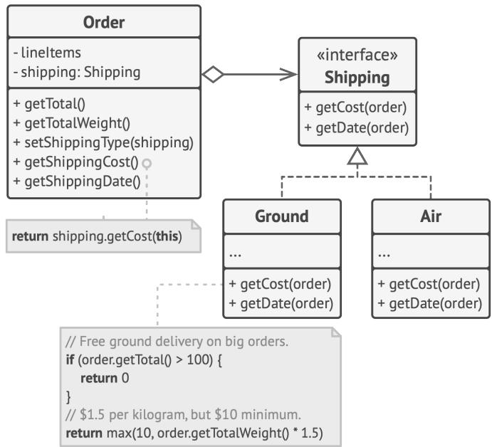  
AFTER: adding a new shipping method doesn't require changing existing classes.

Now when you need to implement a new shipping method, you can derive a new class from the Shipping interface without touching any of the Order class' code. The client code of the 0rder class will link orders with a shipping object of the new class whenever the user selects this shipping methods in the Ul.

As a bonus, this solution let you move the delivery time calculation to more relevant classes,according to the single responsibility principle.

# Liskov Substitution Principle

When extending a class, remember that you should be able to pass objects of the subclass in place of objects of the parent class without breaking the client code.

This means that the subclass should remain compatible with the behavior of the superclass. When overriding a method, extend the base behavior rather than replacing it with something else entirely.

The substitution principle is a set of checks that help predict whether a subclass remains compatible with the code that was able to work with objects of the superclass.This concept is critical when developing libraries and frameworks because your classes are going to be used by other people whose code you can't directly access and change.

Unlike other design principles which are wide open for interpretation, the substitution principle has a set of formal requirements for subclasses,and specifically for their methods. Let's go over this checklist in detail.

Parameter types in a method of a subclass should match or be more abstract than parameter types in the method of the superclass. Sounds confusing? Let's have an example.

。Say there's a class with a method that's supposed to feed cats: feed(Cat c） . Client code always passes cat objects into this method.

。 Good: Say you created a subclass that overrode the method so that it can feed any animal (a superclass of cats): feed(Animal c） .Now if you pass an object of this subclass instead of an object of the superclass to the client code, everything would still work fine.The method can feed all animals,so it can still feed any cat passed by the client.

Bad: You created another subclass and restricted the feeding method to only accept Bengal cats (a subclass of cats): feed(BengalCat c） .What will happen to the client code if you link it with an object like this instead of with the original class? Since the method can only feed a specific breed of cats,it won't serve generic cats passed by the client, breaking all related functionality.

The return type in a method of a subclass should match or be a subtype of the return type in the method of the superclass. As you can see,requirements for a return type are inverse to requirements for parameter types.

。 Say you have a class with a method buyCat(): Cat .The client code expects to receive any cat as a result of executing this method.

。Good: A subclass overrides the method as follows: buyCat(): BengalCat . The client gets a Bengal cat, which is still a cat,so everything is okay.

。Bad: A subclass overrides the method as follows: buyCat(): Animal .Now the client code breaks since it receives an unknown generic animal (an alligator? a bear?) that doesn't fit a structure designed for a cat.

Another anti-example comes from the world of programming languages with dynamic typing: the base method returns a string, but the overridden method returns a number.

A method in a subclass shouldn't throw types of exceptions which the base method isn't expected to throw. In other words, types of exceptions should match or be subtypes of the ones that the base method is already able to throw. This rule comes from the fact that try-catch blocks in the client code target specific types of exceptions which the base method is likely to throw.Therefore,an unexpected exception might slip through the defensive lines of the client code and crash the entire application.

In most modern programming languages, especially statically typed ones (Java, C#,and others), these rules are built into the language. You won't be able to compile a program that violates these rules.

A subclass shouldn't strengthen pre-conditions. For example, the base method has a parameter with type int .If a subclass overrides this method and requires that the value of an argument passed to the method should be positive (by throwing an exception if the value is negative), this strengthens the pre-conditions.The client code,which used to work fine when passing negative numbers into the method, now breaks if it starts working with an object of this subclass.

A subclass shouldn't weaken post-conditions. Say you have a class with a method that works with a database.A method of the class is supposed to always close all opened database connections upon returning a value.

You created a subclass and changed it so that database connections remain open so you can reuse them. But the client might not know anything about your intentions. Because it expects the methods to close all the connections, it may simply terminate the program right after calling the method, polluting a system with ghost database connections.

Invariants of a superclass must be preserved.This is probably the least formal rule of all. Invariants are conditions in which an object makes sense. For example, invariants of a cat are having four legs,a tail,ability to meow, etc. The confusing part about invariants is that while they can be defined explicitly in the form of interface contracts or a set of assertions within methods, they could also be implied by certain unit tests and expectations of the client code.

The rule on invariants is the easiest to violate because you might misunderstand or not realize all of the invariants of a complex class. Therefore, the safest way to extend a class is to introduce new fields and methods,and not mess with any existing members of the superclass. Of course, that's not always doable in real life.

A subclass shouldn't change values of private fields of the superclass.What? How's that even possible? It turns out some programming languages let you access private members of a class via reflection mechanisms. Other languages (Python, JavaScript) don't have any protection for the private members at all.

# Example

Let's look at an example of a hierarchy of document classes that violates the substitution principle.

Document Project   
- data - documents   
- filename foreach (doc in documents) {   
+ aeno +openAloO } doc.open( 4 freach (doc indocuments) [ if (!doc instanceof ReadOnlyDocument)   
ReadOnlyDocument doc.save( } }   
+ save0o ：

throw new Exception(“Unable to save read-only file.")

BEFORE: saving doesn't make sense in α read-only document, so the subclass tries to solve it by resetting the base behavior in the overridden method.

The save method in the ReadOnlyDocuments subclass throws an exception if someone tries to call it. The base method doesn't have this restriction. This means that the client code will break if we don't check the document type before saving it.

The resulting code also violates the open/closed principle, since the client code becomes dependent on concrete classes of documents.If you introduce a new document subclass, you'll need to change the client code to support it.

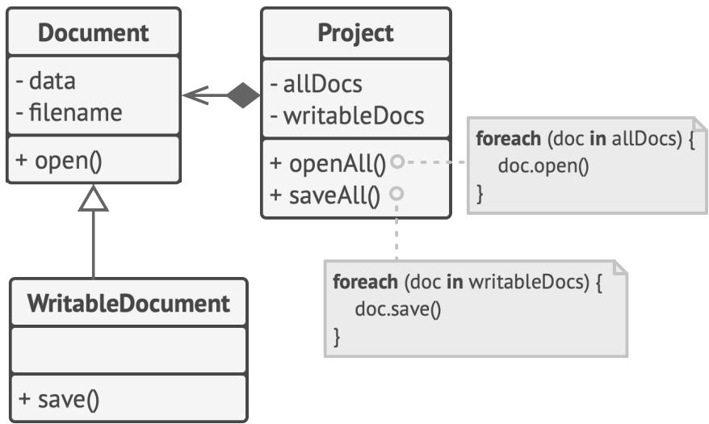  
AFTER: the problem is solved after making the read-only document class the base class of the hierarchy.

You can solve the problem by redesigning the class hierarchy: a subclass should extend the behavior of a superclass, therefore the read-only document becomes the base class of the hierarchy. The writable document is now a subclass which extends the base class and adds the saving behavior.

# Interface Segregation Principle

Clients shouldn't be forced to depend on methods they do not use.

Try to make your interfaces narrow enough that client classes don't have to implement behaviors they don't need.

According to the interface segregation principle,you should break down“fat” interfaces into more granular and specific ones. Clients should implement only those methods that they really need. Otherwise,a change to a“fat” interface would break even clients that don't use the changed methods.

Class inheritance lets a class have just one superclass, but it doesn't limit the number of interfaces that the class can implement at the same time. Hence, there's no need to cram tons of unrelated methods to a single interface. Break it down into several more refined interfaces-you can implement them all in a single class if needed. However, some classes may be fine with implementing just one of them.

# Example

Imagine that you created a library that makes it easy to integrate apps with various cloud computing providers.While in the initial version it only supported Amazon Cloud, it covered the full set of cloud services and features.

At the time you assumed that all cloud providers have the same broad spectrum of features as Amazon. But when it came to implementing support for another provider, it turned out that most of the interfaces of the library are too wide. Some methods describe features that other cloud providers just don't have.

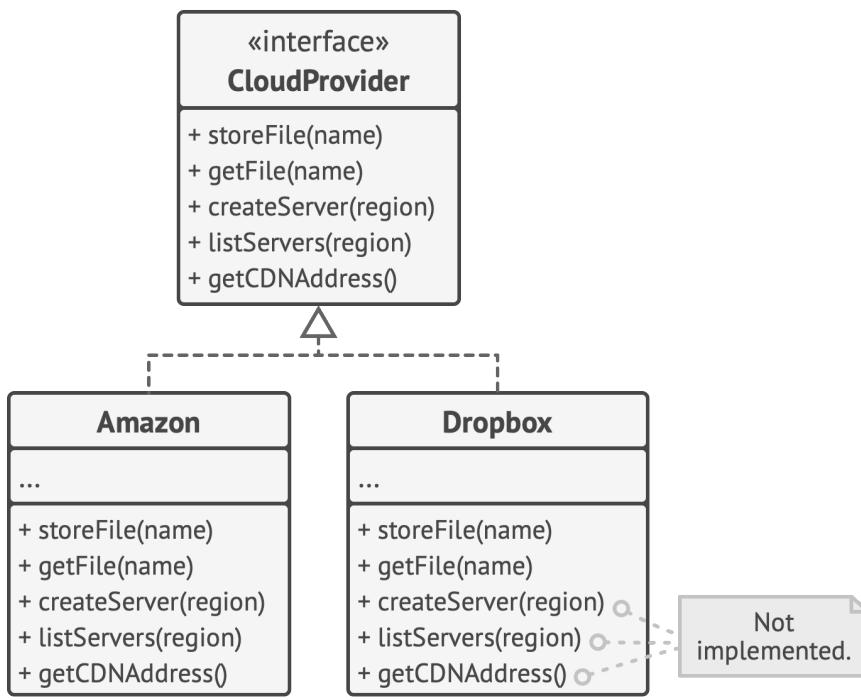  
BEFORE: not all clients can satisfy the requirements of the bloated interface.

While you can still implement these methods and put some stubs there,it wouldn't be a pretty solution.The better approach is to break down the interface into parts. Classes that are able to implement the original interface can now just implement several refined interfaces. Other classes can implement only those interfaces which have methods that make sense for them.

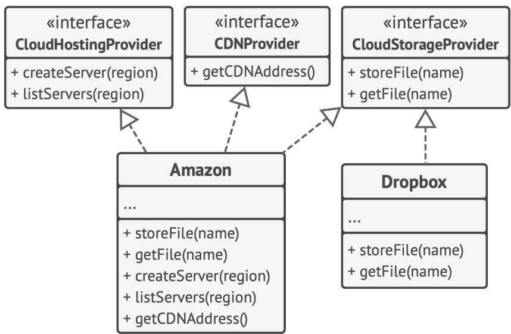  
AFTER: one bloated interface is broken down into α set of more granular interfaces.

As with the other principles,you can go too far with this one. Don't further divide an interface which is already quite specific. Remember that the more interfaces you create,the more complex your code becomes. Keep the balance.

# Dependency Inversion Principle

High-level classes shouldn't depend on low-level classes.Both should depend on abstractions.Abstractions shouldn't depend on details. Details should depend on abstractions.

Usually when designing software, you can make a distinction between two levels of classes.

Low-level classes implement basic operations such as working with a disk, transferring data over a network, connecting to a database, etc.

High-level classes contain complex business logic that directs low-level classes to do something.

Sometimes people design low-level classes first and only then start working on high-level ones. This is very common when you start developing a prototype on a new system,and you're not even sure what's possible at the higher level because low-level stuff isn't yet implemented or clear. With such an approach business logic classes tend to become dependent on primitive low-level classes.

The dependency inversion principle suggests changing the direction of this dependency.

1.For starters,you need to describe interfaces for low-level operations that high-level classes rely on, preferably in business terms.For instance，business logic should call a method openReport(file) ratherthanaseriesofmethods openFile $( \times )$ ，readBytes(n），closeFile(x) .These interfaces count as high-level ones.

2. Now you can make high-level classes dependent on those interfaces, instead of on concrete low-level classes. This dependency will be much softer than the original one.

3.Once low-level classes implement these interfaces， they become dependent on the business logic level, reversing the direction of the original dependency.

The dependency inversion principle often goes along with the open/closed principle: you can extend low-level classes to use with different business logic classes without breaking existing classes.

# Example

In this example, the high-level budget reporting class uses a low-level database class for reading and persisting its data. This means that any change in the low-level class, such as when a new version of the database server gets released, may affect the high-level class,which isn't supposed to care about the data storage details.

High level Low level MySQLDatabase BudgetReport - database + insert(   
+ open(date) + update()   
+save0 +delete0

BEFORE: a high-level class depends on a low-level class.

You can fix this problem by creating a high-level interface that describes read/write operations and making the reporting class use that interface instead of the low-level class. Then you can change or extend the original low-level class to implement the new read/write interface declared by the business logic.

High level Abstraction BudgetReport 《interface> Database   
- database + insert(0   
+ open(date) + update()   
+ save() +delete() 全 MySQL MongoDB ··· ··· + insert0 + insert0 + update( + update( Low level +delete) +delete(

AFTER: low-level classes depend on a high-level abstraction.

As a result, the direction of the original dependency has been inverted: low-level classes are now dependent on high-level abstractions.

# CATALOG OF DESIGN PATTERNS

# Creational Design Patterns

Creational patterns provide various object creation mechanisms,which increase flexibility and reuse of existing code.

Factory Method

Provides an interface for creating objects in a superclass, but allows subclasses to alter the type of objects that will be created.

# Abstract Factory

Lets you produce families of related objects without specifying their concrete classes.

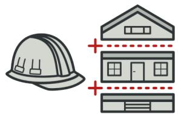

# Builder

Lets you construct complex objects step by step.The pattern allows you to produce different types and representations of an object using the same construction code.

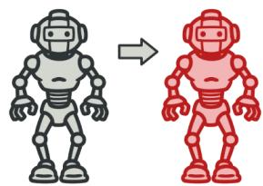

# Prototype

Lets you copy existing objects without making your code dependent on their classes.

1 1 1

# Singleton

Lets you ensure that a class has only one instance, while providing a global access point to this instance.

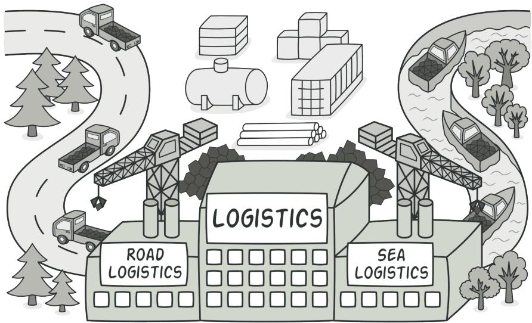

# FACTORY METHOD

Also known as: Virtual Constructor

Factory Method is a creational design pattern that provides an interface for creating objects in a superclass, but allows subclasses to alter the type of objects that will be created.

Imagine that you're creating a logistics management application.The first version of your app can only handle transportation by trucks,so the bulk of your code lives inside the Truck class.

After a while,your app becomes pretty popular. Each day you receive dozens of requests from sea transportation companies to incorporate sea logistics into the app.

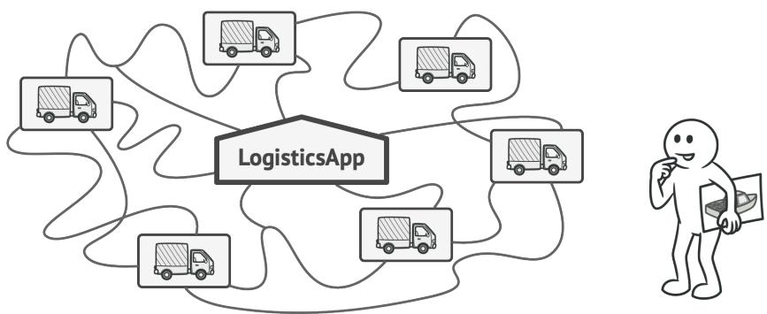

Adding a new class to the program isn’t that simple if the rest of the code is already coupled to existing classes.

Great news, right? But how about the code? At present, most of your code is coupled to the Truck class.Adding Ships into the app would require making changes to the entire codebase. Moreover,if later you decide to add another type of transportation to the app, you will probably need to make all of these changes again.

As a result, you will end up with pretty nasty code, riddled with conditionals that switch the app's behavior depending on the class of transportation objects.

# Solution

The Factory Method pattern suggests that you replace direct object construction calls (using the new operator) with calls to a special factory method. Don't worry: the objects are still created via the new operator, but it's being called from within the factory method. Objects returned by a factory method are often referred to as products.

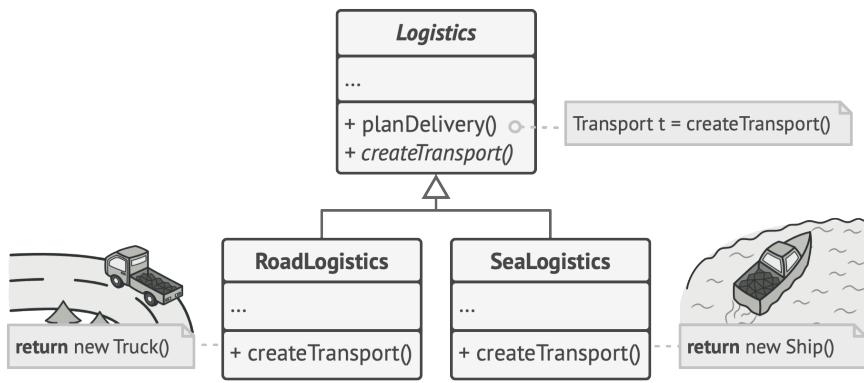  
Subclasses can alter the class of objects being returned by the factory method.

At first glance, this change may look pointless: we just moved the constructor call from one part of the program to another. However, consider this: now you can override the factory method in a subclass and change the class of products being created by the method.

There's a slight limitation though: subclasses may return different types of products only if these products have a common base class or interface.Also, the factory method in the base class should have its return type declared as this interface.

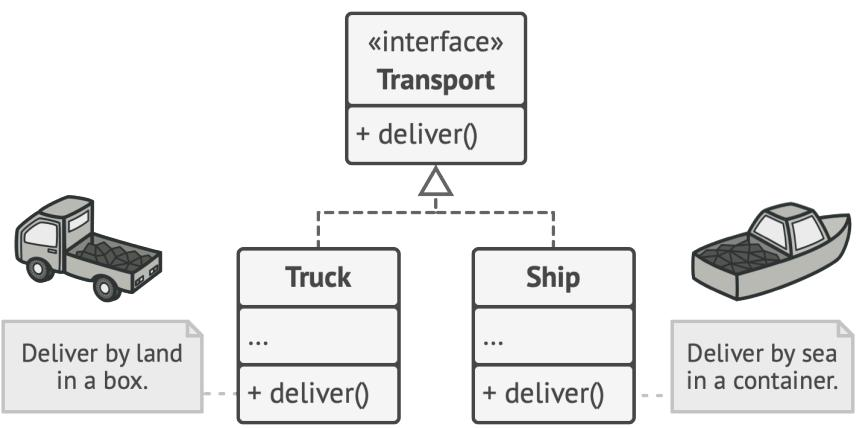  
All products must follow the same interface.

For example,both Truck and Ship classes should implement the Transport interface，which declares a method called deliver .Each class implements this method differently: trucks deliver cargo by land, ships deliver cargo by sea. The factory method in the RoadLogistics class returns truck objects,whereas the factory method in the SeaLogistics class returns ships.

The code that uses the factory method (often called the client code)doesn't see a difference between the actual products returned by various subclasses. The client treats all the products as abstract Transport .

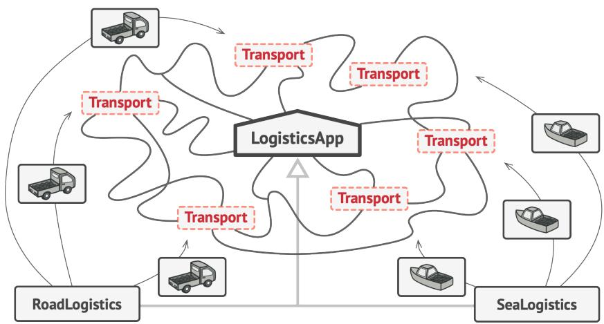  
As long as all product classes implement a common interface, you can pass their objects to the client code without breaking it.

The client knows that all transport objects are supposed to have the deliver method, but exactly how it works isn't important to the client.

# Structure

Product p = createProduct0   
p.doStuff0 ③ Creator ① .·· 《interface》 Product + someOperation() + createProduct0: Product + doStuff0 A 全 ConcreteCreatorA ConcreteCreatorB Concrete ② Concrete ④ ProductA Productb   
+ createProduct(): Product + createProduct0): Product 1   
return new ConcreteProductA0

1.The Product declares the interface,which is common to all objects that can be produced by the creator and its subclasses.

2. Concrete Products are different implementations of the product interface.

3.The Creator class declares the factory method that returns new product objects. It's important that the return type of this method matches the product interface.

You can declare the factory method as abstract to force all subclasses to implement their own versions of the method.As an alternative, the base factory method can return some default product type.

Note,despite its name,product creation is not the primary responsibility of the creator. Usually, the creator class already has some core business logic related to products.The factory method helps to decouple this logic from the concrete product classes. Here is an analogy: a large software development company can have a training department for programmers. However, the primary function of the company as a whole is still writing code, not producing programmers.

4. Concrete Creators override the base factory method so it returns a different type of product.

Note that the factory method doesn't have to create new instances all the time. It can also return existing objects from a cache,an object pool, or another source.

# # Pseudocode

This example illustrates how the Factory Method can be used for creating cross-platform Ul elements without coupling the client code to concrete Ul classes.

The base dialog class uses different Ul elements to render its window. Under various operating systems, these elements may look a little bit different, but they should still behave consistently. A button in Windows is still a button in Linux.

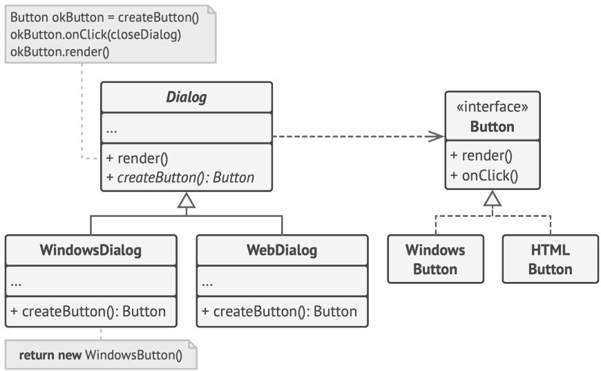  
The cross-platform dialog example.

When the factory method comes into play, you don't need to rewrite the logic of the dialog for each operating system. If we declare a factory method that produces buttons inside the base dialog class,we can later create a dialog subclass that returns Windows-styled buttons from the factory method. The subclass then inherits most of the dialog's code from the base class,but, thanks to the factory method, can render Windowslooking buttons on the screen.

For this pattern to work, the base dialog class must work with abstract buttons: a base class or an interface that all concrete buttons follow. This way the dialog's code remains functional, whichever type of buttons it works with.

Of course, you can apply this approach to other Ul elements as well.However,with each new factory method you add to the dialog, you get closer to the Abstract Factory pattern. Fear not, we'll talk about this pattern later.

1 // The creator class declares the factory method that must   
2 // return an object of a product class. The creator's subclasses   
3 // usually provide the implementation of this method.   
4 class Dialog is   
// The creator may also provide some default implementation   
6 // of the factory method.   
/ abstract method createButton $( )$ : Button   
8   
9 // Note that， despite its name， the creator's primary   
10 // responsibility isn't creating products. It usually   
11 // contains some core business logic that relies on product   
12 // objects returned by the factory method. Subclasses can   
13 // indirectly change that business logic by overriding the   
14 // factory method and returning a different type of product   
15 // from it.   
16 method render(） is   
17 // Call the factory method to create a product object.   
18 Button okButton $=$ createButton()   
19 // Now use the product.   
20 okButton.onClick(closeDialog)   
21 okButton.render()   
22   
23   
24 // Concrete creators override the factory method to change the   
25 // resulting product's type.   
26 class WindowsDialog extends Dialog is   
27 method createButton $( )$ : Button is   
28 return new WindowsButton $( )$   
29   
30 class WebDialog extends Dialog is   
31 method createButton $( )$ : Button is   
32 return new HTMLButton()   
33   
34   
35 // The product interface declares the operations that all   
36 // concrete products must implement.   
37 interface Button is   
38 method render()   
39 method onClick(f)   
40   
41 // Concrete products provide various implementations of the   
42 // product interface.   
43 class WindowsButton implements Button is   
44 method render(a，b） is   
45 // Render a button in Windows style.   
46 method onClick(f） is   
47 // Bind a native OS click event.   
48   
49 class HTMLButton implements Button is   
50 method render(a，b） is   
51 // Return an HTML representation of a button.   
52 method onClick(f） is   
53 // Bind a web browser click event.   
54   
55   
56 class Application is   
57 field dialog: Dialog   
58   
59 // The application picks a creator's type depending on the   
60 // current configuration or environment settings.   
61 method initialize $( )$ is   
62 config $=$ readApplicationConfigFile $( )$   
63   
64 if (config. $0 S ~ = =$ "Windows"） then   
65 dialog $=$ new WindowsDialog()   
66 else if (config. $0 S ~ = =$ "Web"） then   
67 dialog $=$ new WebDialog()   
68 else   
69 throw new Exception("Error! Unknown operating system.")   
70   
71 // The client code works with an instance of a concrete   
72 // creator，albeit through its base interface. As long as   
73 // the client keeps working with the creator via the base   
74 // interface, you can pass it any creator's subclass:   
75 method main(） is   
76 this.initialize()   
77 dialog.render()

# Applicability

Use the Factory Method when you don't know beforehand the exact types and dependencies of the objects your code should work with.

The Factory Method separates product construction code from the code that actually uses the product.Therefore it's easier to extend the product construction code independently from the rest of the code.

For example, to add a new product type to the app,you'll only need to create a new creator subclass and override the factory method in it.

Use the Factory Method when you want to provide users of your library or framework with a way to extend its internal components.

Inheritance is probably the easiest way to extend the default behavior of a library or framework. But how would the frame-Work recognize that your subclass should be used instead of a standard component?

The solution is to reduce the code that constructs components across the framework into a single factory method and let anyone override this method in addition to extending the component itself.

Let's see how that would work. Imagine that you write an app using an open source Ul framework. Your app should have round buttons,but the framework only provides square ones.You extend the standard Button class with a glorious RoundButton subclass. But now you need to tell the main UIFramework class to use the new button subclass instead of a default one.

To achieve this, you create a subclass UIWithRoundButtons from a base framework class and override its createButton method.While this method returns Button objects in the base class, you make your subclass return RoundButton objects. Now use the UIWithRoundButtons class instead of UIFramework . And that's about it!

Use the Factory Method when you want to save system resources by reusing existing objects instead of rebuilding them each time.

You often experience this need when dealing with large, resource-intensive objects such as database connections, file systems,and network resources.

Let's think about what has to be done to reuse an existing object:

1.First, you need to create some storage to keep track of all of the created objects.

2. When someone requests an object, the program should look for a free object inside that pool.

3．.. and then return it to the client code.

4.If there are no free objects,the program should create a new one (and add it to the pool).

That's a lot of code! And it must all be put into a single place so that you don't pollute the program with duplicate code.

Probably the most obvious and convenient place where this code could be placed is the constructor of the class whose objects we're trying to reuse. However，a constructor must always return new objects by definition. It can’t return existing instances.

Therefore,you need to have a regular method capable of creating new objects as well as reusing existing ones. That sounds very much like a factory method.

# How to Implement

1.Make all products follow the same interface.This interface should declare methods that make sense in every product.

2.Add an empty factory method inside the creator class. The return type of the method should match the common product interface.

3.In the creator's code find all references to product constructors. One by one,replace them with calls to the factory method, while extracting the product creation code into the factory method.

You might need to add a temporary parameter to the factory method to control the type of returned product.

At this point,the code of the factory method may look pretty ugly. It may have a large switch operator that picks which product class to instantiate. But don't worry, we'll fix it soon enough.

4.Now, create a set of creator subclasses for each type of product listed in the factory method. Override the factory method in the subclasses and extract the appropriate bits of construction code from the base method.

5.If there are too many product types and it doesn't make sense to create subclasses for all of them, you can reuse the control parameter from the base class in subclasses.

For instance,imagine that you have the following hierarchy of classes: the base Mail class with a couple of subclasses: AirMail and GroundMail ; the Transport classes are Plane ， Truck and Train .While the AirMail class only uses Plane objects， GroundMail may Work with both Truck and Train objects. You can create a new subclass (say TrainMail）to handle both cases, but there's another option.The client code can pass an argument to the factory method of the GroundMail class to control which product it wants to receive.

6.If, after all of the extractions,the base factory method has become empty, you can make it abstract. If there's something left, you can make it a default behavior of the method.

# Pros and Cons

You avoid tight coupling between the creator and the concrete products.

Single Responsibility Principle. You can move the product creation code into one place in the program, making the code easier to support.

Open/Closed Principle. You can introduce new types of products into the program without breaking existing client code.

XThe code may become more complicated since you need to introduce a lot of new subclasses to implement the pattern. The best case scenario is when you're introducing the pattern into an existing hierarchy of creator classes.

# ← Relations with Other Patterns

Many designs start by using Factory Method (less complicated and more customizable via subclasses) and evolve toward Abstract Factory, Prototype, or Builder (more flexible, but more complicated).

Abstract Factory classes are often based on a set of Factory Methods, but you can also use Prototype to compose the methods on these classes.

You can use Factory Method along with Iterator to let collec-tion subclasses return different types of iterators that are compatible with the collections.

Prototype isn't based on inheritance, so it doesn't have its drawbacks. On the other hand, Prototype requires a complicated initialization of the cloned object. Factory Method is based on inheritance but doesn't require an initialization step.

Factory Method is a specialization of Template Method. At the same time,a Factory Method may serve as a step in a large Template Method.

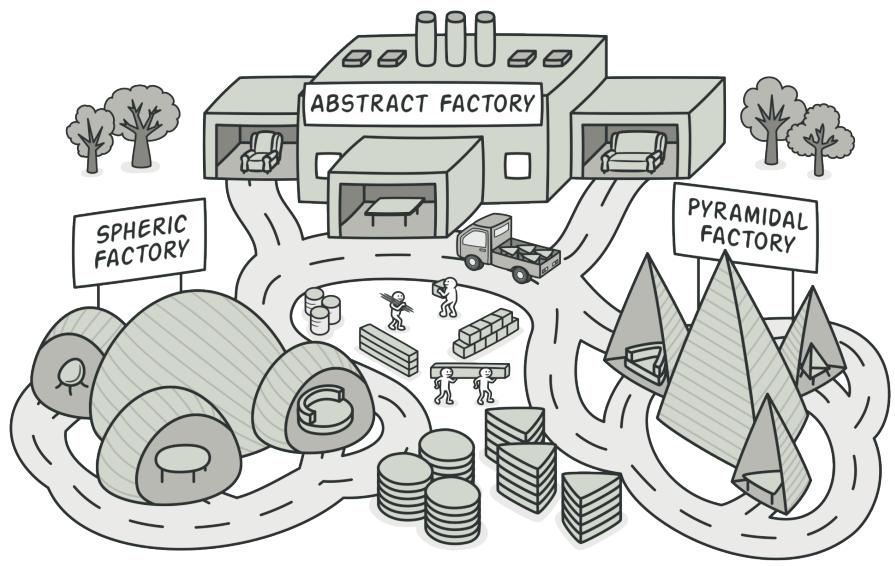

# ABSTRACT FACTORY

Abstract Factory is a creational design pattern that lets you produce families of related objects without specifying their concrete classes.

# Problem

Imagine that you're creating a furniture shop simulator. Your code consists of classes that represent:

1.A family of related products， say:Chair+ Sofa + CoffeeTable .

2.Several variants of this family. For example, products Chair $^ +$ Sofa $^ +$ CoffeeTable are available in these variants: Modern，Victorian ，ArtDeco .

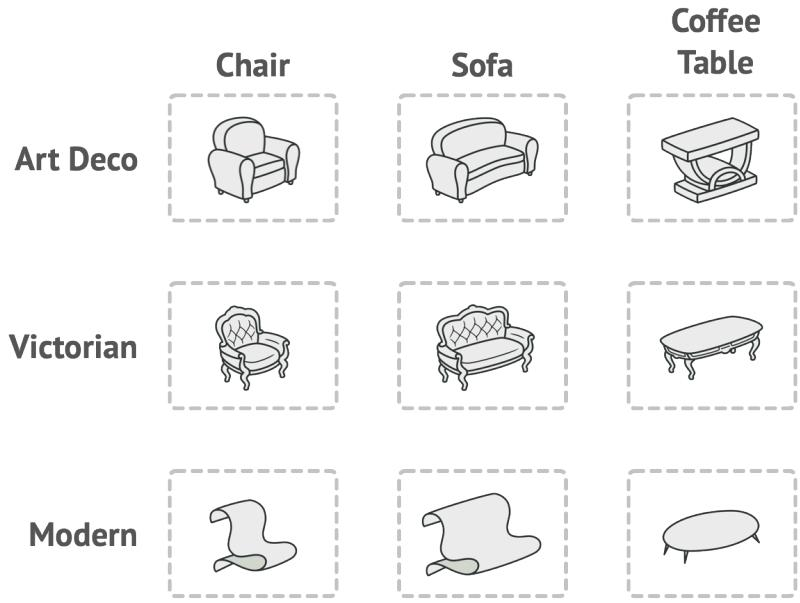

Product families and their variants.

You need a way to create individual furniture objects so that they match other objects of the same family. Customers get quite mad when they receive non-matching furniture.

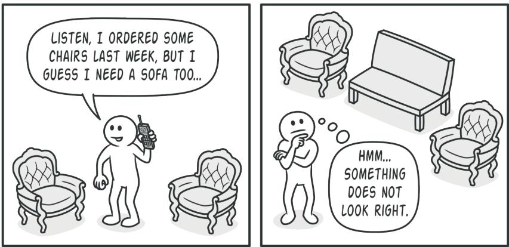  
A Modern-style sofa doesn't match Victorian-style chairs.

Also, you don't want to change existing code when adding new products or families of products to the program. Furniture vendors update their catalogs very often,and you wouldn't want to change the core code each time it happens.

# Solution

The first thing the Abstract Factory pattern suggests is to explicitly declare interfaces for each distinct product of the product family (e.g.，chair, sofa or coffee table). Then you can make all variants of products follow those interfaces. For example,all chair variants can implement the Chair interface; all coffee table variants can implement the CoffeeTable interface, and so on.

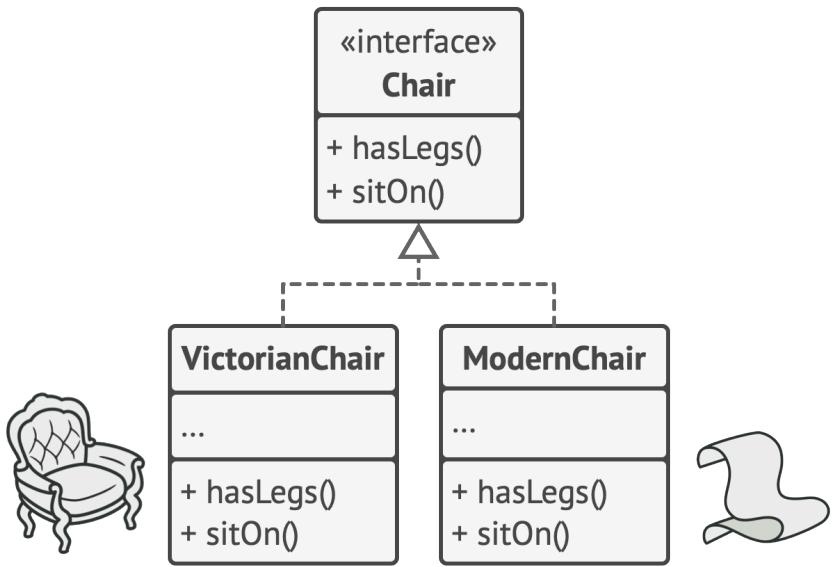  
All variants of the same object must be moved to α single class hierarchy.

The next move is to declare the Abstract Factory-an interface with a list of creation methods for all products that are part of the product family (for example, createChair ， createSofa and createCoffeeTable ). These methods must return abstract product types represented by the interfaces we extracted previously: Chair ， Sofa ，CoffeeTable and so on.

Now,how about the product variants? For each variant of a product family， we create a separate factory class based on the AbstractFactory interface. A factory is a class that returns products of a particular kind.For example， the ModernFurnitureFactory can only createModernChair , ModernSofa and ModernCoffeeTable objects.

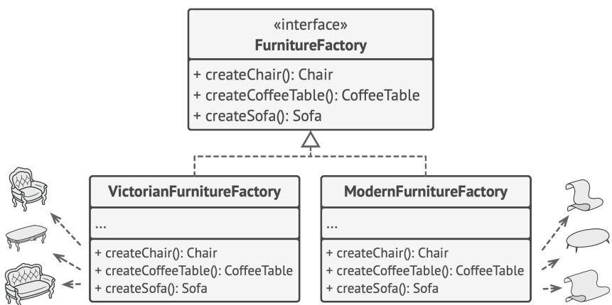

Each concrete factory corresponds to a specific product variant.

The client code has to work with both factories and products via their respective abstract interfaces. This lets you change the type of a factory that you pass to the client code,as well as the product variant that the client code receives,without breaking the actual client code.

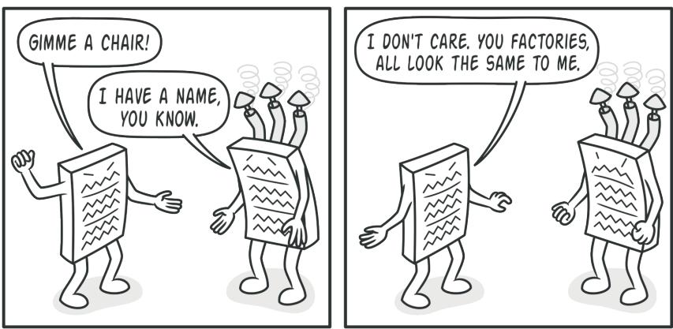

The client shouldn't care about the concrete class of the factory it works with.

Say the client wants a factory to produce a chair. The client doesn't have to be aware of the factory's class, nor does it matter what kind of chair it gets.Whether it's a Modern model or a Victorianstyle chair, the client must treat all chairs in the same manner, using the abstract Chair interface.With this approach, the only thing that the client knows about the chair is that it implements the‘siton method in some way. Also,whichever variant of the chair is returned, it'll always match the type of sofa or coffee table produced by the same factory object.

One more thing left to clarify: if the client is only exposed to the abstract interfaces,what creates the actual factory objects? Usually, the application creates a concrete factory object at the initialization stage.Just before that, the app must select the factory type depending on the configuration or the environment settings.

# Structure

④ ConcreteFactory1 1 + createProductA(): ProductA V + createProductB(): ProductB   
PConcrete 2 Poncrete ③ Client ⑤ Asbsinteraea -factory: AbstractFactory   
ProductA Productb + createProductA(): ProductA $^ +$ Client(f: AbstractFactory) A A + createProductB(): ProductB + someOperation()   
Concrete Concrete ：   
ProductA2 2 ProductB2 ProductA pa $=$ factory.createProductA( 个 个 ConcreteFactory2 ④ . return new + createProductA(): ProductA ConcreteProductA20 + createProductB(): ProductB

1.Abstract Products declare interfaces for a set of distinct but related products which make up a product family.

2. Concrete Products are various implementations of abstract products,grouped by variants. Each abstract product (chair/ sofa)must be implemented in all given variants (Victorian/ Modern).

3.The Abstract Factory interface declares a set of methods for creating each of the abstract products.

4.Concrete Factories implement creation methods of the abstract factory. Each concrete factory corresponds to a specific variant of products and creates only those product variants.

5.Although concrete factories instantiate concrete products, signatures of their creation methods must return corresponding abstract products. This way the client code that uses a factory doesn't get coupled to the specific variant of the product it gets from a factory. The Client can work with any concrete factory/product variant,as long as it communicates with their objects via abstract interfaces.

# # Pseudocode

This example illustrates how the Abstract Factory pattern can be used for creating cross-platform Ul elements without coupling the client code to concrete Ul classes,while keeping all created elements consistent with a selected operating system.

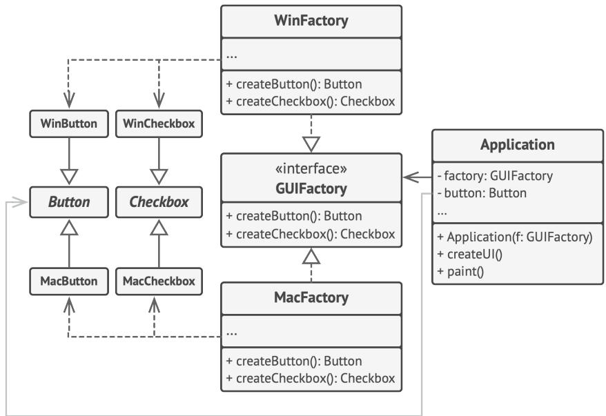  
The cross-platform Ul classes example.

The same Ul elements in a cross-platform application are expected to behave similarly， but look a little bit different under different operating systems. Moreover, it's your job to make sure that the Ul elements match the style of the current operating system. You wouldn't want your program to render macOS controls when it's executed in Windows.

The Abstract Factory interface declares a set of creation methods that the client code can use to produce different types of Ul elements. Concrete factories correspond to specific operat-ing systems and create the Ul elements that match that particular OS.

It works like this: when an application launches, it checks the type of the current operating system. The app uses this information to create a factory object from a class that matches the operating system. The rest of the code uses this factory to create Ul elements.This prevents the wrong elements from being created.

With this approach, the client code doesn't depend on concrete classes of factories and Ul elements as long as it works with these objects via their abstract interfaces. This also lets the client code support other factories or Ul elements that you might add in the future.

As a result, you don't need to modify the client code each time you add a new variation of Ul elements to your app. You just have to create a new factory class that produces these elements and slightly modify the app's initialization code so it selects that class when appropriate.

1 // The abstract factory interface declares a set of methods that   
2 // return different abstract products. These products are called   
3 // a family and are related by a high-level theme or concept.   
4 // Products of one family are usually able to collaborate among   
5 // themselves. A family of products may have several variants,   
6 // but the products of one variant are incompatible with the   
7 // products of another variant.   
8 interface GUIFactory is   
9 method createButton $( )$ : Button   
10 method createCheckbox $( )$ : Checkbox   
13 // Concrete factories produce a family of products that belong   
14 // to a single variant. The factory guarantees that the   
15 // resulting products are compatible. Signatures of the concrete   
16 // factory's methods return an abstract product，while inside   
17 // the method a concrete product is instantiated.   
18 class WinFactory implements GUIFactory is   
19 method createButton $( )$ : Button is   
20 return new WinButton()   
21 method createCheckbox $( )$ :Checkbox is   
22 return new WinCheckbox $( )$   
23   
24 // Each concrete factory has a corresponding product variant.   
25 class MacFactory implements GUIFactory is   
26 method createButton $( )$ :Button is   
27 return new MacButton $( )$   
28 method createCheckbox $( )$ :Checkbox is   
29 return new MacCheckbox $( )$   
30   
31   
32   
33 // Each distinct product of a product family should have a base   
34 // interface. All variants of the product must implement this   
35 // interface.   
36 interface Button is   
37 method paint $( )$   
38   
39 // Concrete products are created by corresponding concrete   
40 // factories.   
41 class WinButton implements Button is   
42 method paint $( )$ is   
43 // Render a button in Windows style.   
44   
45 class MacButton implements Button is   
46 method paint $( )$ is   
47 // Render a button in macOS style.   
48   
49 // Here's the base interface of another product. All products   
50 // can interact with each other， but proper interaction is   
51 // possible only between products of the same concrete variant.   
52 interface Checkbox is   
53 method paint $( )$   
54   
55 class WinCheckbox implements Checkbox is   
56 method paint $( )$ is   
57 // Render a checkbox in Windows style.   
58   
59 class MacCheckbox implements Checkbox is   
60 method paint $( )$ is   
61 // Render a checkbox in macOS style.   
62   
63   
64 // The client code works with factories and products only   
65 // through abstract types: GUIFactory， Button and Checkbox. This   
66 // lets you pass any factory or product subclass to the client   
67 // code without breaking it.   
68 class Application is   
69 private field factory: GUIFactory   
70 private field button: Button   
71 constructor Application(factory: GUIFactory） is   
72 this.factory $=$ factory   
73 method createUI $( )$ is   
74 this.button $=$ factory.createButton $( )$   
75 method paint $( )$ is   
76 button.paint $( )$   
77 // The application picks the factory type depending on the   
78 // current configuration or environment settings and creates it   
79 // at runtime (usually at the initialization stage).   
80 class ApplicationConfigurator is   
81 method main(） is   
82 config $=$ readApplicationConfigFile $( )$   
83   
84 if (config. $0 S ~ = =$ "Windows"） then   
85 factory $=$ new WinFactory()   
86 else if (config. $0 S ~ = =$ "Mac"） then   
87 factory $=$ new MacFactory()   
88 else   
89 throw new Exception("Error! Unknown operating system.")

# Applicability

Use the Abstract Factory when your code needs to work with various families of related products, but you don't want it to depend on the concrete classes of those products-they might be unknown beforehand or you simply want to allow for future extensibility.

The Abstract Factory provides you with an interface for creating objects from each class of the product family. As long as your code creates objects via this interface,you don't have to worry about creating the wrong variant of a product which doesn't match the products already created by your app.

Consider implementing the Abstract Factory when you have a class with a set of Factory Methods that blur its primary responsibility.

In a well-designed program each class is responsible only for one thing.When a class deals with multiple product types, it may be worth extracting its factory methods into a standalone factory class or a full-blown Abstract Factory implementation.

# How to Implement

1.Map out a matrix of distinct product types versus variants of these products.

2.Declare abstract product interfaces for all product types. Then make all concrete product classes implement these interfaces.

3.Declare the abstract factory interface with a set of creation methods for all abstract products.

4.Implement a set of concrete factory classes,one for each product variant.

5.Create factory initialization code somewhere in the app. It should instantiate one of the concrete factory classes, depending on the application configuration or the current environment. Pass this factory object to all classes that construct products.

6.Scan through the code and find all direct calls to product constructors. Replace them with calls to the appropriate creation method on the factory object.

# Pros and Cons

You can be sure that the products you're getting from a factory are compatible with each other.

You avoid tight coupling between concrete products and client code.

Single Responsibility Principle. You can extract the product creation code into one place, making the code easier to support.

Open/Closed Principle. You can introduce new variants of products without breaking existing client code.

‘The code may become more complicated than it should be, since a lot of new interfaces and classes are introduced along with the pattern.

# ← Relations with Other Patterns

Many designs start by using Factory Method (less complicated and more customizable via subclasses) and evolve toward Abstract Factory, Prototype, or Builder (more flexible, but more complicated).

Builder focuses on constructing complex objects step by step. Abstract Factory specializes in creating families of related objects. Abstract Factory returns the product immediately, whereas Builder lets you run some additional construction steps before fetching the product.

Abstract Factory classes are often based on a set of Factory Methods, but you can also use Prototype to compose the methods on these classes.

Abstract Factory can serve as an alternative to Facade when you only want to hide the way the subsystem objects are created from the client code.

You can use Abstract Factory along with Bridge. This pairing is useful when some abstractions defined by Bridge can only work with specific implementations. In this case, Abstract Factory can encapsulate these relations and hide the complexity from the client code.

Abstract Factories, Builders and Prototypes can all be implemented as Singletons.

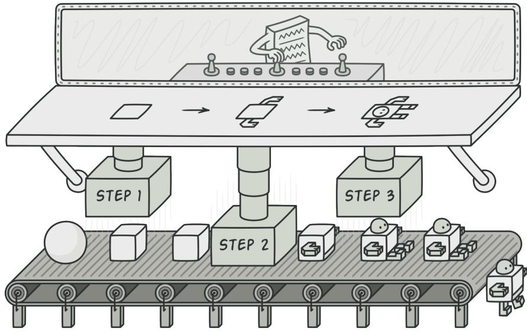

# BUILDER

Builder is a creational design pattern that lets you construct complex objects step by step. The pattern allows you to produce different types and representations of an object using the same construction code.

Imagine a complex object that requires laborious, step-by-step initialization of many fields and nested objects. Such initialization code is usually buried inside a monstrous constructor with lots of parameters. Or even worse: scattered all over the client code.

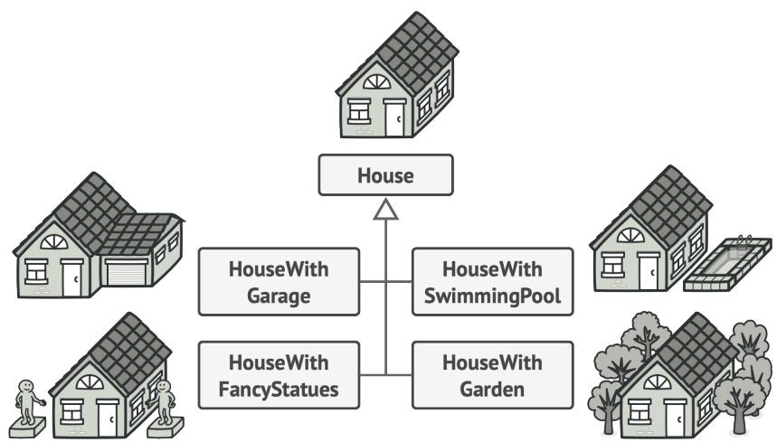

You might make the program too complex by creating a subclass for every possible configuration of an object.

For example,let's think about how to create a House object. To build a simple house, you need to construct four walls and a floor, install a door, fit a pair of windows,and build a roof. But what if you want a bigger, brighter house, with a backyard and other goodies (like a heating system, plumbing,and electrical wiring)?

The simplest solution is to extend the base House class and create a set of subclasses to cover all combinations of the parameters. But eventually you'll end up with a considerable number of subclasses. Any new parameter, such as the porch style,will require growing this hierarchy even more.

There's another approach that doesn't involve breeding subclasses. You can create a giant constructor right in the base House class with all possible parameters that control the house object.While this approach indeed eliminates the need for subclasses,it creates another problem.

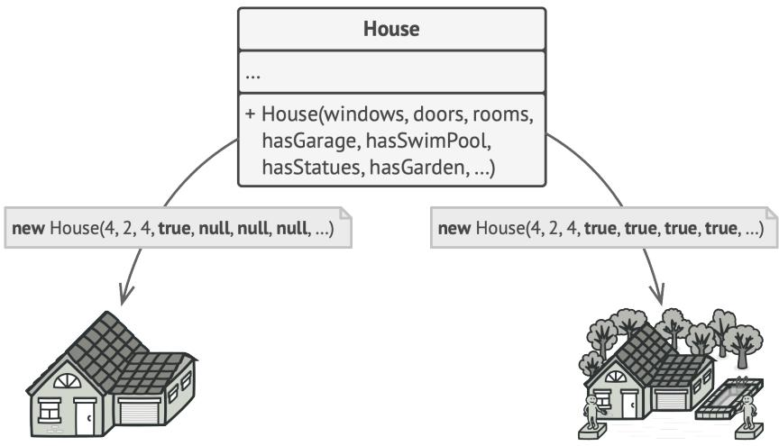  
The constructor with lots of parameters has its downside: not all the parameters are needed at all times.

In most cases most of the parameters will be unused, making the constructor calls pretty ugly. For instance, only a fraction of houses have swimming pools, so the parameters related to swimming pools will be useless nine times out of ten.

# Solution

The Builder pattern suggests that you extract the object construction code out of its own class and move it to separate objects called builders.

<table><tr><td>HouseBuilder</td></tr><tr><td></td></tr><tr><td>+ buildWalls(</td></tr><tr><td>+ buildDoors()</td></tr><tr><td>+ buildWindows()</td></tr><tr><td>+ buildRoof0</td></tr><tr><td>+ buildGarage0</td></tr><tr><td>+ getResult(): House</td></tr></table>

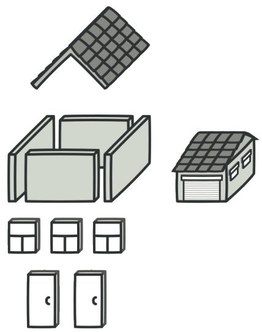

The Builder pattern lets you construct complex objects step by step.The Builder doesn't allow other objects to access the product while it's being built.

The pattern organizes object construction into a set of steps ( buildwalls ， buildDoor ,etc.). To create an object, you execute a series of these steps on a builder object. The important part is that you don't need to call all of the steps. You can call only those steps that are necessary for producing a particular configuration of an object.

Some of the construction steps might require diferent implementation when you need to build various representations of the product. For example,walls of a cabin may be built of wood, but the castle walls must be built with stone.

In this case,you can create several different builder classes that implement the same set of building steps,but in a different manner. Then you can use these builders in the construction process (i.e.,an ordered set of calls to the building steps) to produce different kinds of objects.

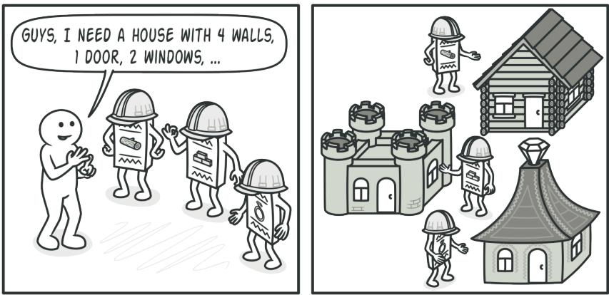  
Different builders execute the same task in various ways.

For example,imagine a builder that builds everything from wood and glass,a second one that builds everything with stone and iron and a third one that uses gold and diamonds. By calling the same set of steps, you get a regular house from the first builder, a small castle from the second and a palace from the third. However, this would only work if the client code that calls the building steps is able to interact with builders using a common interface.

# Director

You can go further and extract a series of calls to the builder steps you use to construct a product into a separate class called director. The director class defines the order in which to execute the building steps,while the builder provides the implementation for those steps.

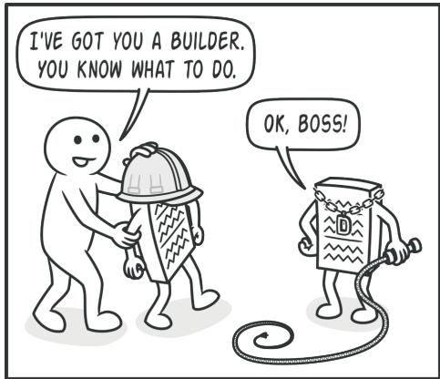  
The director knows which building steps to execute to get a working product.

Having a director class in your program isn't strictly neces-sary. You can always call the building steps in a specific order directly from the client code. However, the director class might be a good place to put various construction routines so you can reuse them across your program.

In addition, the director class completely hides the details of product construction from the client code. The client only needs to associate a builder with a director, launch the construction with the director,and get the result from the builder.

# Structure

$\flat =$ new ConcreteBuilder10 ${ \sf d } =$ new Director(b) d.make( 5 Product1 p = b.getResut0 Client 《interface> Director Builder - builder: Builder + reset0 + buildStepA0 $^ +$ Director(builder) + buildStepB0 $^ +$ changeBuilder(builder) + buildStepZ0 + make(type) A V bulder $= =$ etmpley Concrete Builder1 ② Concrete Builder2 uilderbuilustegAO builder.buildStepB() builder.buildStepZ0   
- result: Product1 - result: Product2 1   
+ bultdStepAO $^ +$ builtstepAo result $=$ new Product20 $^ +$   
$^ +$ buildStepB( $^ +$ buildStepB0 o A   
+ buildStepZ0 + buildStepZ0 result.setFeatureB(   
+ getResult0): + getResult0): O - Product1 Product2 return this.result √ √ Product1 ③ Product2

1.The Builder interface declares product construction steps that are common to all types of builders.

2.Concrete Builders provide different implementations of the construction steps. Concrete builders may produce products that don't follow the common interface.

3.Products are resulting objects. Products constructed by different builders don't have to belong to the same class hierarchy or interface.

4.The Director class defines the order in which to call construction steps, so you can create and reuse specific configurations of products.

5.The Client must associate one of the builder objects with the director. Usually， it's done just once, via parameters of the director's constructor. Then the director uses that builder object for all further construction. However, there's an alternative approach for when the client passes the builder object to the production method of the director. In this case, you can use a different builder each time you produce something with the director.

# # Pseudocode

This example of the Builder pattern ilustrates how you can reuse the same object construction code when building different types of products,such as cars,and create the corresponding manuals for them.

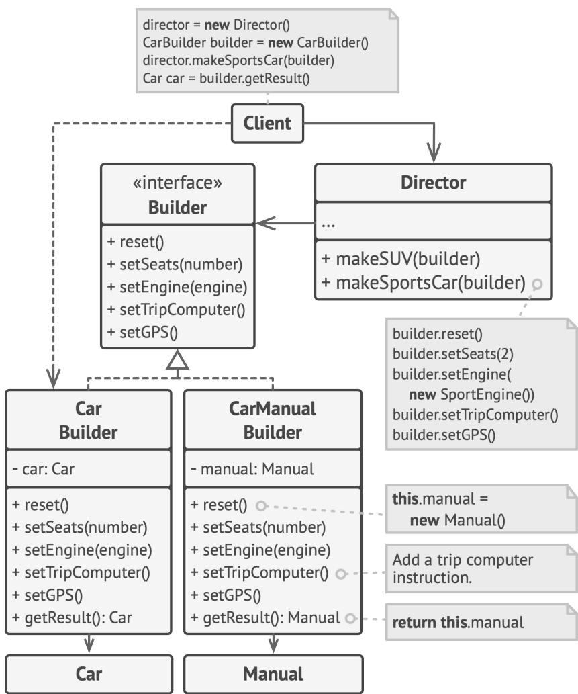  
The example of step-by-step construction of cars and the user guides that fit those car models.

A car is a complex object that can be constructed in a hundred different ways. Instead of bloating the Car class with a huge constructor, we extracted the car assembly code into a separate car builder class.This class has a set of methods for configuring various parts of a car.

If the client code needs to assemble a special, fine-tuned model of a car, it can work with the builder directly. On the other hand, the client can delegate the assembly to the director class, which knows how to use a builder to construct several of the most popular models of cars.

You might be shocked, but every car needs a manual (seriously,who reads them?). The manual describes every feature of the car, so the details in the manuals vary across the different models. That's why it makes sense to reuse an existing construction process for both real cars and their respective manuals. Of course, building a manual isn't the same as building a car, and that's why we must provide another builder class that specializes in composing manuals. This class implements the same building methods as its car-building sibling, but instead of crafting car parts, it describes them. By passing these builders to the same director object,we can construct either a car or a manual.

The final part is fetching the resulting object. A metal car and a paper manual, although related,are still very different things. We can't place a method for fetching results in the director without coupling the director to concrete product classes.Hence,we obtain the result of the construction from the builder which performed the job.

1 // Using the Builder pattern makes sense only when your products   
2 // are quite complex and require extensive configuration. The 3 // following two products are related，although they don't have 4 // a common interface. 5 class Car is 6 // A car can have a GPS，trip computer and some number of 7 // seats. Different models of cars (sports car，Suv, 8 // cabriolet) might have different features installed or 9 // enabled.   
10   
11 class Manual is   
12 // Each car should have a user manual that corresponds to   
13 // the car's configuration and describes all its features.   
14   
15   
16 // The builder interface specifies methods for creating the   
17 // different parts of the product objects.   
18 interface Builder is   
19 method reset $( )$   
20 method setSeats(...)   
21 method setEngine(..\*)   
22 method setTripComputer(..\*)   
23 method setGPS(..\*)   
24   
25 // The concrete builder classes follow the builder interface and   
26 // provide specific implementations of the building steps. Your   
27 // program may have several variations of builders，each   
28 // implemented differently.   
29 class CarBuilder implements Builder is   
30 private field car:Car   
31   
32

33 // A fresh builder instance should contain a blank product   
34 // object which it uses in further assembly.   
35 constructor CarBuilder $( )$ is   
36 this.reset $( )$   
37   
38 // The reset method clears the object being built.   
39 method reset $( )$ is   
40 this.car $=$ new Car $( )$   
41   
42 // All production steps work with the same product instance.   
43 method setSeats(...） is   
44 // Set the number of seats in the car.   
45   
46 method setEngine(...） is   
47 // Install a given engine.   
48   
49 method setTripComputer(...） is   
50 // Install a trip computer.   
51   
52 method setGPS(...） is   
53 // Install a global positioning system.   
54   
55 // Concrete builders are supposed to provide their own   
56 // methods for retrieving results. That's because various   
57 // types of builders may create entirely different products   
58 // that don't all follow the same interface. Therefore such   
59 // methods can't be declared in the builder interface (at   
60 // least not in a statically-typed programming language).   
61 //   
62 // Usually，after returning the end result to the client，a   
63 // builder instance is expected to be ready to start   
64 // producing another product. That's why it's a usual   
65 // practice to call the reset method at the end of the   
66 //‘getProduct’ method body. However， this behavior isn't   
67 // mandatory， and you can make your builder wait for an   
68 // explicit reset call from the client code before disposing   
69 // of the previous result.   
70 method getProduct $( )$ :Car is   
71 product $=$ this.car   
72 this.reset()   
73 return product   
74   
75 // Unlike other creational patterns，builder lets you construct   
76 // products that don't follow the common interface.   
77 class CarManualBuilder implements Builder is   
78 private field manual:Manual   
79   
80 constructor CarManualBuilder $( )$ is   
81 this.reset()   
82   
83 method reset $( )$ is   
84 this.manual $=$ new Manual $( )$   
85   
86 method setSeats(...） is   
87 // Document car seat features.   
88   
89 method setEngine(...） is   
90 // Add engine instructions.   
91   
92 method setTripComputer(...） is   
93 // Add trip computer instructions.   
94   
95 method setGPS(...） is   
96 // Add GPS instructions.

method getProduct $( )$ :Manual is // Return the manual and reset the builder.

// The director is only responsible for executing the building // steps in a particular sequence. It's helpful when producing // products according to a specific order or configuration. // Strictly speaking， the director class is optional， since the // client can control builders directly.

# class Director is

private field builder:Builder

97 98 112 113 114

// The director works with any builder instance that the   
// client code passes to it. This way， the client code may   
// alter the final type of the newly assembled product.   
method setBuilder(builder:Builder) this.builder $=$ builder   
// Ihe director can construct several product variations   
// using the same building steps.   
method constructSportsCar(builder: Builder) is builder.reset() builder.setSeats(2) builder.setEngine(new SportEngine $( )$ ） builder.setTripComputer(true) builder.setGPS(true)

method constructSuV(builder: Builder) is

129 // The client code creates a builder object，passes it to the   
130 // director and then initiates the construction process. The e   
131 // result is retrieved from the builder object.   
132 class Application is   
133   
134 method makeCar $( )$ is   
135 director $=$ new Director()   
136   
137 CarBuilder builder $=$ new CarBuilder()   
138 director.constructSportsCar(builder)   
139 Car car $=$ builder.getProduct()   
140   
141 CarManualBuilder builder $=$ new CarManualBuilder()   
142 director.constructSportsCar(builder)   
143   
144 // The final product is often retrieved from a builder   
145 // object since the director isn't aware of and not   
146 // dependent on concrete builders and products.   
147 Manual manual $=$ builder.getProduct()

# Applicability

# Use the Builder pattern to get rid of a“telescopic constructor".

Say you have a constructor with ten optional parameters. Calling such a beast is very inconvenient； therefore,you overload the constructor and create several shorter versions with fewer parameters.These constructors still refer to the main one, passing some default values into any omitted parameters.

1 class Pizza {  
2 Pizza(int size) { .\* }  
3 Pizza(int size, boolean cheese) $\left\{ \begin{array} { l l } { \begin{array} { r l r l } \end{array} } \end{array} \right. \ \cdot \ \cdot \ \begin{array} { r l } \end{array}$   
4 Pizza(int size，boolean cheese， boolean pepperoni） { .. }  
5 /

Creating such a monster is only possible in languages that support method overloading,such as C# or Java.

The Builder pattern lets you build objects step by step, using only those steps that you really need. After implementing the pattern, you don't have to cram dozens of parameters into your constructors anymore.

Use the Builder pattern when you want your code to be able to create different representations of some product (for example, stone and wooden houses).

The Buildepatterncanbapledwhenconstructionofarious representations of the product involves similar steps that differ only in the details.

The base builder interface defines all possible construction steps,and concrete builders implement these steps to construct particular representations of the product. Meanwhile, the director class guides the order of construction.

# Use the Builder to construct Composite trees or other complex objects.

The Builder patern lets you construct products step-by-step. You could defer execution of some steps without breaking the final product. You can even callsteps recursively, which comes in handy when you need to build an object tree.

A builder doesn't expose the unfinished product while running construction steps. This prevents the client code from fetching an incomplete result.

# How to Implement

1.Make sure that you can clearly define the common construction steps for building all available product representations. Otherwise,you won't be able to proceed with implementing the pattern.

2.Declare these steps in the base builder interface.

3.Create a concrete builder class for each of the product repre-sentations and implement their construction steps.

Don't forget about implementing a method for fetching the result of the construction. The reason why this method can't be declared inside the builder interface is that various builders may construct products that don't have a common interface. Therefore,you don't know what would be the return type for such a method. However, if you're dealing with products from a single hierarchy, the fetching method can be safely added to the base interface.

4.Think about creating a director class. It may encapsulate various ways to construct a product using the same builder object.

5.The client code creates both the builder and the director objects.Before construction starts, the client must pass a builder object to the director. Usually, the client does this only once,via parameters of the director's constructor. The director uses the builder object in all further construction. There's an alternative approach,where the builder is passed directly to the construction method of the director.

6.The construction result can be obtained directly from the director only if all products follow the same interface. Otherwise,the client should fetch the result from the builder.

# Pros and Cons

You can construct objects step-by-step，defer construction steps or run steps recursively.

You can reuse the same construction code when building various representations of products.

Single Responsibility Principle. You can isolate complex construction code from the business logic of the product.

XThe overall complexity of the code increases since the pattern requires creating multiple new classes.

# ← Relations with Other Patterns

Many designs start by using Factory Method (less complicated and more customizable via subclasses) and evolve toward Abstract Factory, Prototype, or Builder (more flexible, but more complicated).

Builder focuses on constructing complex objects step by step. Abstract Factory specializes in creating families of related objects. Abstract Factory returns the product immediately, whereas Builder lets you run some additional construction steps before fetching the product.

You can use Builder when creating complex Composite trees because you can program its construction steps to work recursively.

You can combine Builder with Bridge: the director class plays the role of the abstraction,while different builders act as implementations.

. Abstract Factories, Builders and Prototypes can all be implemented as Singletons.

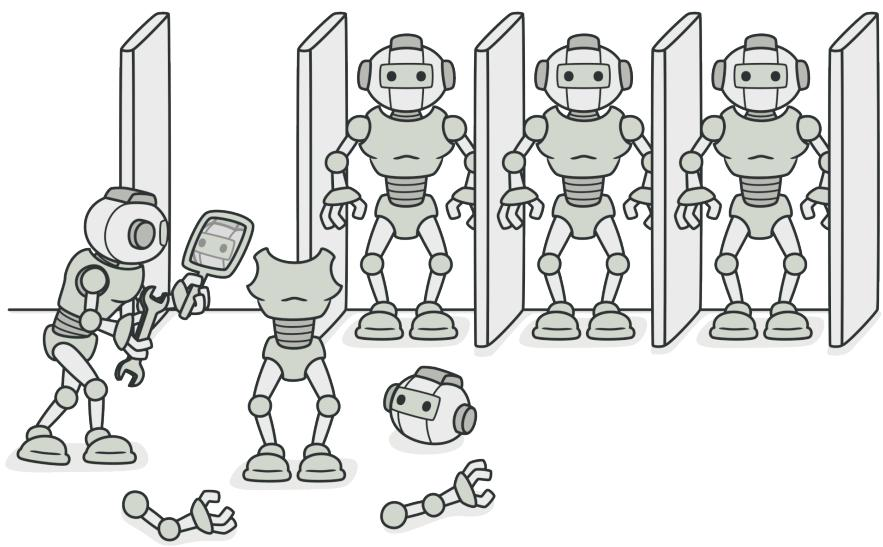

PROTOTYPE

Also known as: Clone

Prototype is a creational design pattern that lets you copy existing objects without making your code dependent on their classes.

Say you have an object,and you want to create an exact copy of it. How would you do it? First, you have to create a new object of the same class. Then you have to go through all the fields of the original object and copy their values over to the new object.

Nice! But there's a catch. Not all objects can be copied that way because some of the object's fields may be private and not visible from outside of the object itself.

  
Copying an object“from the outside”isn't always possible.

There's one more problem with the direct approach. Since you have to know the object's class to create a duplicate, your code becomes dependent on that class. If the extra dependency doesn't scare you, there's another catch. Sometimes you only know the interface that the object follows, but not its concrete class,when,for example,a parameter in a method accepts any objects that follow some interface.

# Solution

The Prototype pattern delegates the cloning process to the actual objects that are being cloned. The pattern declares a common interface for all objects that support cloning.This interface lets you clone an object without coupling your code to the class of that object. Usually, such an interface contains just a single clone method.

The implementation of the clone method is very similar in all classes.The method creates an object of the current class and carries over all of the field values of the old object into the new one. You can even copy private fields because most programming languages let objects access private fields of other objects that belong to the same class.

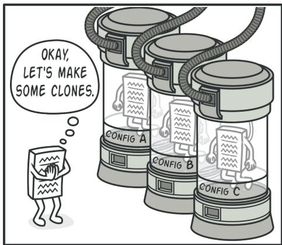

Pre-built prototypes can be an alternative to subclassing.

An object that supports cloning is called a prototype. When your objects have dozens of fields and hundreds of possible configurations, cloning them might serve as an alternative to subclassing.

Here's how it works: you create a set of objects, configured in various ways. When you need an object like the one you've configured, you just clone a prototype instead of constructing a new object from scratch.

# Real-World Analogy

In real life, prototypes are used for performing various tests before starting mass production of a product. However, in this case，prototypes don't participate in any actual production, playing a passive role instead.

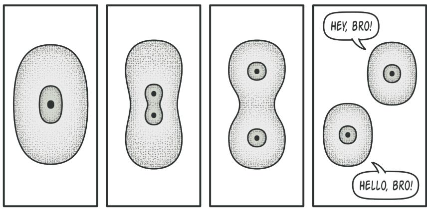  
The division of a cell.

Since industrial prototypes don't really copy themselves，a much closer analogy to the pattern is the process of mitotic cell division (biology, remember?). After mitotic division,a pair of identical cells is formed. The original cell acts as a prototype and takes an active role in creating the copy.

# Structure

# Basic implementation

① 《interface》 Client Prototype L + clone(): Prototype copy $=$ existing.clone() 全 ② ConcretePrototype - field1 this.field1 $=$ prototype.field1 I+ ConcretePrototype(prototype) return new ConcretePrototype(this) + clone(): Prototype SubclassPrototype super(prototype) -field2 this.field2 $=$ prototype.field2 + SubclassPrototype(prototype) return new SubclassPrototype(this) + clone(): Prototype

1.The Prototype interface declares the cloning methods.In most cases, it's a single clone method.

2.The Concrete Prototype class implements the cloning method. In addition to copying the original object's data to the clone, this method may also handle some edge cases of the cloning process related to cloning linked objects, untangling recursive dependencies, etc.

3.The Client can produce a copy of any object that follows the prototype interface.

# Prototype registry implementation

button $=$ new Button(10,40,"red") registry.addltem("LandingButton", button) Client button $=$ registry.getByColor("red") ① PrototypeRegistry 《interface> - items : Prototype[] Prototype $^ +$ addltem(id: string, p: Prototype) + getColor(): string + getByld(id: string): Prototype + clone(): Prototype foreach (item in items) if (item.getColor( $) = =$ color) Button return item.clone() - x, y, color + Button(x,y, color) + Button(prototype) + getColor0: string + clone(): Prototype return new Button(this)

1. The Prototype Registry provides an easy way to access frequently-used prototypes. It stores a set of pre-built objects that are ready to be copied. The simplest prototype registry is a name prototype hash map. However, if you need better search criteria than a simple name,you can build a much more robust version of the registry.

# # Pseudocode

In this example, the Prototype pattern lets you produce exact copies of geometric objects,without coupling the code to their classes.

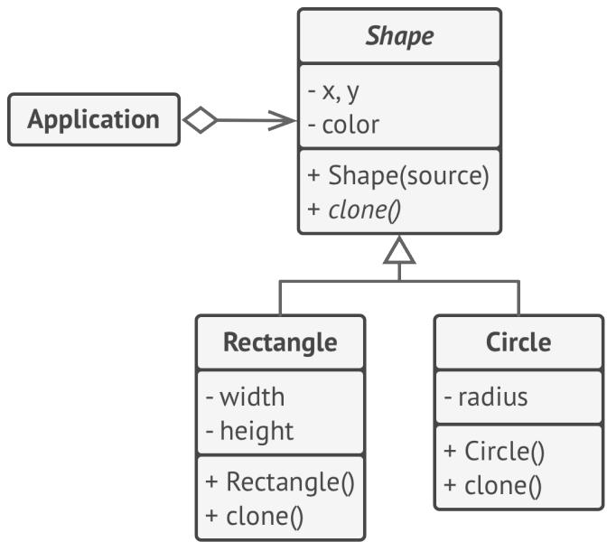

Cloning a set of objects that belong to α class hierarchy.

All shape classes follow the same interface,which provides a cloning method. A subclass may call the parent's cloning method before copying its own field values to the resulting object.

1 // Base prototype.   
2 abstract class Shape is   
3 field X: int   
4 field Y: int   
5 field color: string   
6   
7 // A regular constructor.   
8 constructor Shape(） is   
9 /   
10   
11 // The prototype constructor. A fresh object is initialized   
12 // with values from the existing object.   
13 constructor Shape(source: Shape） is   
14 this $( )$   
15 this $. { \sf X } =$ source.X   
16 this $. { \textsf { Y } } =$ source.Y   
17 this.color $=$ source.color   
18   
19 // The clone operation returns one of the Shape subclasses.   
20 abstract method clone $( )$ : Shape   
21   
22   
23 // Concrete prototype. The cloning method creates a new objec1   
24 // and passes it to the constructor. Until the constructor is   
25 // finished，it has a reference to a fresh clone. Therefore,   
26 // nobody has access to a partly-built clone. This keeps the   
27 // cloning result consistent.   
28 class Rectangle extends Shape is   
29 field width: int   
30 field height: int   
31   
32 constructor Rectangle(source: Rectangl   
34 // A parent constructor call is need   
// fields defined in the parent clas   
super(source)   
this.width $=$ source.width   
this.height $=$ source.height   
38   
39 method clone $( )$ :Shape is   
40 return new Rectangle(this)   
41   
42   
43 class Circle extends Shape is   
44 field radius: int   
45   
46 constructor Circle(source: Circle) is   
47 super(source)   
48 this.radius $=$ source.radius   
49   
50 method clone $( )$ :Shape is   
51 return new Circle(this)   
52   
53   
54 // Somewhere in the client code.   
55 class Application is   
56 field shapes: array of Shape   
57   
58 constructor Application $( )$ is   
59 Circle circle $=$ new Circle()   
60 circle. $\times \ : = \ : 1 0$   
61 circle. $\textsf { Y } = \ 1 0$   
62 circle.radius $= 2 0$   
63 shapes.add(circle)   
65 Circle anotherCircle $=$ circle.clone()   
66 shapes.add(anotherCircle)   
67 // The \`anotherCircle’ variable contains an exact copy   
68 // of the ‘circle' object.   
70 Rectangle rectangle $=$ new Rectangle()   
71 rectangle.width $= ~ 1 0$   
72 rectangle.height $= 2 0$   
73 shapes.add(rectangle)

# method businessLogic $( )$ is

// Prototype rocks because it lets you produce a copy of // an object without knowing anything about its type. Array shapesCopy $=$ new Array of Shapes:

// For instance， we don't know the exact elements in the // shapes array. All we know is that they are all   
// shapes. But thanks to polymorphism，when we call the //‘clone’ method on a shape the program checks its real // class and runs the appropriate clone method defined // in that class. That's why we get proper clones   
// instead of a set of simple Shape objects.   
foreach(s in shapes） do   
shapesCopy.add(s.clone())

90 // The ‘shapesCopy' array contains exact copies of the   
91 //‘shape' array's children.

# Applicability

Use the Prototype pattern when your code shouldn't depend on the concrete classes of objects that you need to copy.

This happens a lot when your code works with objects passed to you from 3rd-party code via some interface. The concrete classes of these objects are unknown,and you couldn't depend on them even if you wanted to.

The Prototype pattern provides the client code with a general interface for working with all objects that support cloning. This interface makes the client code independent from the concrete classes of objects that it clones.

Use the pattern when you want to reduce the number of subclasses that only differ in the way they initialize their respective objects. Somebody could have created these subclasses to be able to create objects with a specific configuration.

The Prototype pattern letsyouuseasetofpre-builtobjects, configured in various ways,as prototypes.

Instead of instantiating a subclass that matches some configuration,the client can simply look for an appropriate prototype and clone it.

# How to Implement

1.Create the prototype interface and declare the clone method in it. Or just add the method to all classes of an existing class hierarchy, if you have one.

2.A prototype class must define the alternative constructor that accepts an object of that class as an argument. The constructor must copy the values of all fields defined in the class from the passed object into the newly created instance. If you're changing a subclass, you must call the parent constructor to let the superclass handle the cloning of its private fields.

If your programming language doesn't support method overloading，you may define a special method for copying the object data. The constructor is a more convenient place to do this because it delivers the resulting object right after you call the new operator.

3.The cloning method usually consists of just one line: running a new operator with the prototypical version of the constructor. Note,that every class must explicitly override the cloning method and use its own class name along with the new operator. Otherwise, the cloning method may produce an object of a parent class.

4.Optionally， create a centralized prototype registry to store a catalog of frequently used prototypes.

You can implement the registry as a new factory class or put it in the base prototype class with a static method for fetching the prototype. This method should search for a prototype based on search criteria that the client code passes to the method.The criteria might either be a simple string tag or a complex set of search parameters. After the appropriate prototype is found, the registry should clone it and return the copy to the client.

Finally, replace the direct calls to the subclasses' constructors with calls to the factory method of the prototype registry.

# Pros and Cons

You can clone objects without coupling to their concrete classes.

You can get rid of repeated initialization code in favor of cloning pre-built prototypes.

You can produce complex objects more conveniently.

You get an alternative to inheritance when dealing with configuration presets for complex objects.

XCloning complex objects that have circular references might be very tricky.

# ← Relations with Other Patterns

Many designs start by using Factory Method (less complicated and more customizable via subclasses) and evolve toward Abstract Factory, Prototype, or Builder (more flexible, but more complicated).

Abstract Factory classes are often based on a set of Factory Methods, but you can also use Prototype to compose the methods on these classes.

Prototype can help when you need to save copies of Commands into history.

Designs that make heavy use of Composite and Decorator can often benefit from using Prototype. Applying the pattern lets you clone complex structures instead of re-constructing them from scratch.

Prototype isn't based on inheritance， so it doesn't have its drawbacks. On the other hand, Prototype requires a complicated initialization of the cloned object. Factory Method is based on inheritance but doesn't require an initialization step.

Sometimes Prototype can be a simpler alternative to Memento. This works if the object, the state of which you want to store in the history, is fairly straightforward and doesn't have links to external resources, or the links are easy to re-establish.

Abstract Factories, Builders and Prototypes can all be implemented as Singletons.

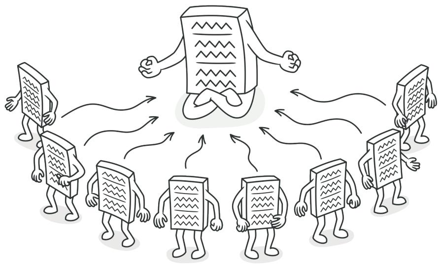

# SINGLETON

Singleton is a creational design pattern that lets you ensure that a class has only one instance,while providing a global access point to this instance.

# Problem

The Singleton pattern solves two problems at the same time, violating the Single Responsibility Principle:

1.Ensure that a class has just a single instance. Why would anyone want to control how many instances a class has? The most common reason for this is to control access to some shared resource-for example,a database ora file.

Here's how it works: imagine that you created an object, but after a while decided to create a new one. Instead of receiving a fresh object, you'll get the one you already created.

Note that this behavior is impossible to implement with a regular constructor since a constructor call must always return a new object by design.

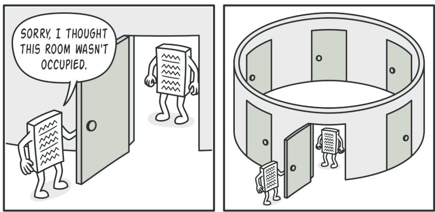

Clients may not even realize that they're working with the same object all the time.

2.Provide a global access point to that instance. Remember those global variables that you (all right, me) used to store some essential objects? While they're very handy, they're also very unsafe since any code can potentially overwrite the contents of those variables and crash the app.

Just like a global variable,the Singleton pattern lets you access some object from anywhere in the program.However, it also protects that instance from being overwritten by other code.

There's another side to this problem: you don't want the code that solves problem #1 to be scattered all over your program. It's much better to have it within one class, especially if the rest of your code already depends on it.

Nowadays, the Singleton pattern has become so popular that people may call something a singleton even if it solves just one of the listed problems.

# Solution

All implementations of the Singleton have these two steps in common:

Make the default constructor private,to prevent other objects from using the new operator with the Singleton class.

Create a static creation method that acts as a constructor. Under the hood, this method calls the private constructor to

create an object and saves it in a static field. All following calls to this method return the cached object.

If your code has access to the Singleton class, then it's able to call the Singleton's static method. So whenever that method is called, the same object is always returned.

# Real-World Analogy

The government is an excellent example of the Singleton pattern. A country can have only one official government. Regardless of the personal identities of the individuals who form governments,the title,“The Government of X", is a global point of access that identifies the group of people in charge.

# Structure

Singleton instance: Singleton - Singleton() Client + getlnstance(): Singleton 1 if (instance $= =$ null) { // Note: if you're creating an app with // multithreading support, you should // place a thread lock here. instance $=$ new Singleton( } return instance

1. The Singleton class declares the static method getInstance that returns the same instance of its own class.

The Singleton's constructor should be hidden from the client code.Calling the getInstance method should be the only way of getting the Singleton object.

# # Pseudocode

In this example, the database connection class acts as a Singleton. This class doesn't have a public constructor, so the only way to get its object is to call the getInstance method. This method caches the first created object and returns it in all subsequent calls.

1 // The Database class defines the \`getInstance' method that let   
2 // clients access the same instance of a database connection   
3 // throughout the program.   
4 class Database is   
5 // The field for storing the singleton instance should be   
6 // declared static.   
/ private static field instance: Database   
8   
9 // The singleton's constructor should always be private to   
10 // prevent direct construction calls with the \`new\`   
11 // operator.   
12 private constructor Database $( )$ is   
13 // Some initialization code， such as the actual   
14 // connection to a database server.   
15   
16 // The static method that controls access to the singleton   
17 // instance.   
18 public static method getInstance $( )$ is   
19 if (Database.instance $= =$ null） then   
20 acquireThreadLock(） and then   
21 // Ensure that the instance hasn't yet been   
22 // initialized by another thread while this one   
23 // has been waiting for the lock's release.   
24 if (Database.instance $\scriptstyle = = { \mathsf { n u l l } }$ ） then   
25 Database.instance $=$ new Database()   
26 return Database.instance   
27   
28 // Finally， any singleton should define some business logic   
29 // which can be executed on its instance.   
30 public method query(sql） is   
31 // For instance，all database queries of an app go   
32 // through this method. Therefore，you can place   
33 // throttling or caching logic here.   
34 // ..   
35   
36 class Application is   
37 method main(） is   
38 Database foo $=$ Database.getInstance()   
39 foo.query("SELECT ...")   
40 // ...   
41 Database bar $=$ Database.getInstance()   
42 bar.query("SELECT ...")   
43 // The variable \`bar\` will contain the same object as   
44 // the variable\`foo\`.

# Applicability

Use the Singleton pattern when aclassin your program should have just a single instance available to all clients; for example, a single database object shared by different parts of the program.

The Singleton pattern disables all other means of creating objects of a class except for the special creation method.This method either creates a new object or returns an existing one if it has already been created.

# Use the Singleton pattern when you need stricter control over global variables.

Unlike global variables,the Singleton pattern guarantees that there's just one instance of a class. Nothing,except for the Singleton class itself, can replace the cached instance.

Note that you can always adjust this limitation and allow creating any number of Singleton instances. The only piece of code that needs changing is the body of the getInstance method.

# How to Implement

1.Add a private static field to the class for storing the singleton instance.

2.Declare a public static creation method for getting the singleton instance.

3.Implement “lazy initialization” inside the static method. It should create a new object on its first call and put it into the static field. The method should always return that instance on all subsequent calls.

4.Make the constructor of the class private. The static method of the class will still be able to call the constructor, but not the other objects.

5.Go over the client code and replace all direct calls to the singleton's constructor with calls to its static creation method.

# Pros and Cons

You can be sure that a class has only a single instance.

You gain a global access point to that instance.

The singleton object is initialized only when it's requested for the first time.

Violates the Single Responsibility Principle.The pattern solves two problems at the time.

XThe Singleton pattern can mask bad design,for instance, when the components of the program know too much about each other.

XThe pattern requires special treatment in a multithreaded environment so that multiple threads won't create a singleton object several times.

XIt may be difficult to unit test the client code of the Singleton because many test frameworks rely on inheritance when producing mock objects.Since the constructor of the singleton class is private and overriding static methods is impossible in most languages, you will need to think of a creative way to mock the singleton. Or just don't write the tests. Or don't use the Singleton pattern.

# ← Relations with Other Patterns

A Facade class can often be transformed into a Singleton since a single facade object is sufficient in most cases.

Flyweight would resemble Singleton if you somehow managed to reduce all shared states of the objects to just one flyweight object. But there are two fundamental differences between these patterns:

1.There should be only one Singleton instance,whereas a Flyweight class can have multiple instances with different intrinsic states.

2.The Singleton object can be mutable.Flyweight objects are immutable.

Abstract Factories, Builders and Prototypes can all be implemented as Singletons.

# Structural Design Patterns

Structural patterns explain how to assemble objects and classes into larger structures,while keeping this structures flexible and efficient.

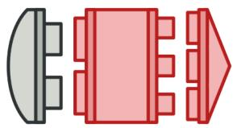

Adapter

Allows objects with incompatible interfaces to collaborate.

Lets you split a large class or a set of closely related classes into two separate hierarchies-abstraction and implementation-which can be developed independently of each other.

#

# Composite

Lets you compose objects into tree structures and then work with these structures as if they were individual objects.

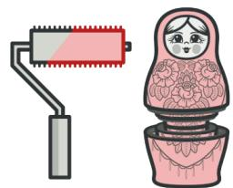

# Decorator

Lets you attach new behaviors to objects by placing these objects inside special wrapper objects that contain the behaviors.

丨

# Facade

Provides a simplified interface to a library, a framework,or any other complex set of classes.

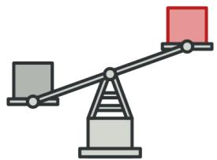

# Flyweight

Lets you fit more objects into the available amount of RAM by sharing common parts of state between multiple objects instead of keeping all of the data in each object.

C Proxy

Lets you provide a substitute or placeholder for another object. A proxy controls access to the original object,allowing you to perform something either before or after the request gets through to the original object.

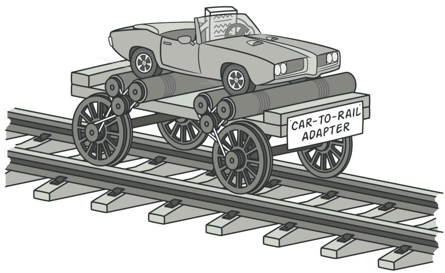

ADAPTER

Also known as: Wrapper

Adapter is a structural design pattern that allows objects with incompatible interfaces to collaborate.

Imagine that you're creating a stock market monitoring app. The app downloads the stock data from multiple sources in XML format and then displays nice-looking charts and diagrams for the user.

At some point, you decide to improve the app by integrating a smart 3rd-party analytics library. But there's a catch: the analytics library only works with data in JSON format.

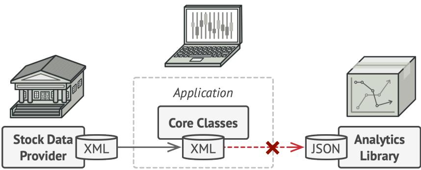  
You can't use the analytics library“as is" because it expects the data in a format that's incompatible with your app.

You could change the library to work with XML. However, this might break some existing code that relies on the library. And worse,you might not have access to the library's source code in the first place, making this approach impossible.

You can create an adapter.This is a special object that converts the interface of one object so that another object can understand it.

An adapter wraps one of the objects to hide the complexity of conversion happening behind the scenes. The wrapped object isn't even aware of the adapter. For example,you can wrap an object that operates in meters and kilometers with an adapter that converts all of the data to imperial units such as feet and miles.

Adapters can not only convert data into various formats but can also help objects with different interfaces collaborate. Here's how it works:

1. The adapter gets an interface, compatible with one of the existing objects.   
2.Using this interface,the existing object can safely call the adapter's methods.   
3.Upon receiving a call, the adapter passes the request to the second object, but in a format and order that the second object expects.

Sometimes it's even possible to create a two-way adapter that can convert the calls in both directions.

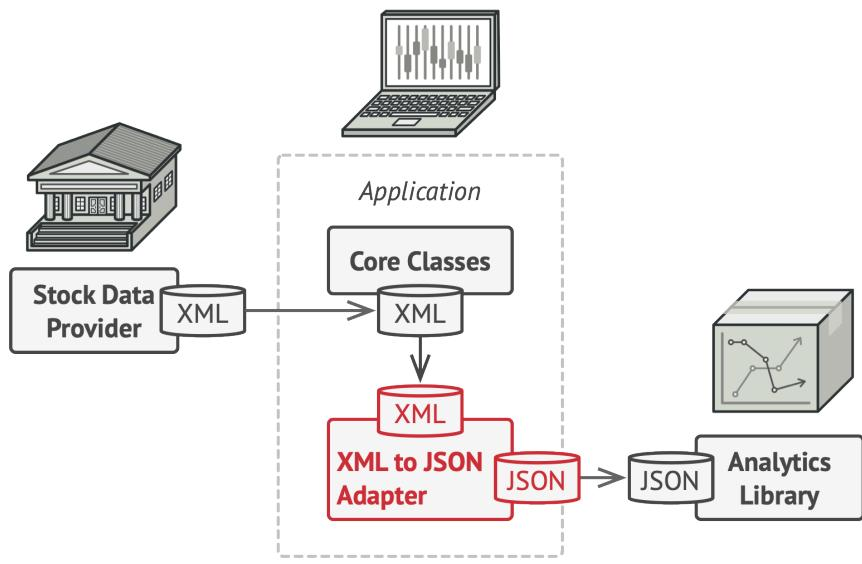

Let's get back to our stock market app. To solve the dilemma of incompatible formats, you can create XML-to-JSON adapters for every class of the analytics library that your code works with directly. Then you adjust your code to communicate with the library only via these adapters.When an adapter receives a call, it translates the incoming XML data into a JSON structure and passes the call to the appropriate methods of a wrapped analytics object.

# Real-World Analogy

When you travel from the US to Europe for the first time, you may get a surprise when trying to charge your laptop. The power plug and sockets standards are different in different countries.

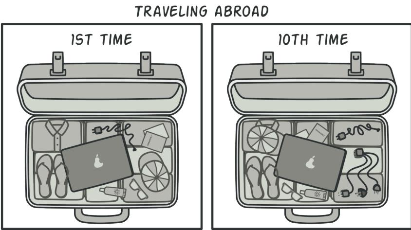  
A suitcase before and after a trip abroad.

That's why your US plug won't fit a German socket. The problem can be solved by using a power plug adapter that has the American-style socket and the European-style plug.

# Structure

# Object adapter

This implementation uses the object composition principle: the adapter implements the interface of one object and wraps the other one. It can be implemented in all popular programming languages.

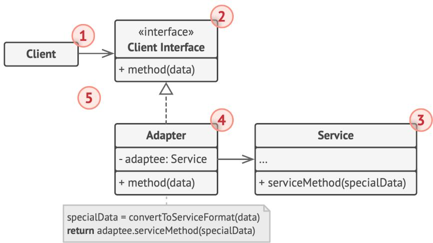

1.The Client is a class that contains the existing business logic of the program.

2.The Client Interface describes a protocol that other classes must follow to be able to collaborate with the client code.

3.The Service is some useful class (usually 3rd-party or legacy). The client can't use this class directly because it has an incompatible interface.

4.The Adapter is a class that's able to work with both the client and the service: it implements the client interface, while wrapping the service object. The adapter receives calls from the client via the adapter interface and translates them into calls to the wrapped service object in a format it can understand.

5.The client code doesn't get coupled to the concrete adapter class as long as it works with the adapter via the client interface. Thanks to this,you can introduce new types of adapters into the program without breaking the existing client code. This can be useful when the interface of the service class gets changed or replaced: you can just create a new adapter class without changing the client code.

# Class adapter

This implementation uses inheritance: the adapter inherits interfaces from both objects at the same time.Note that this approach can only be implemented in programming languages that support multiple inheritance, such as ${ \mathsf { C } } { + } { + }$

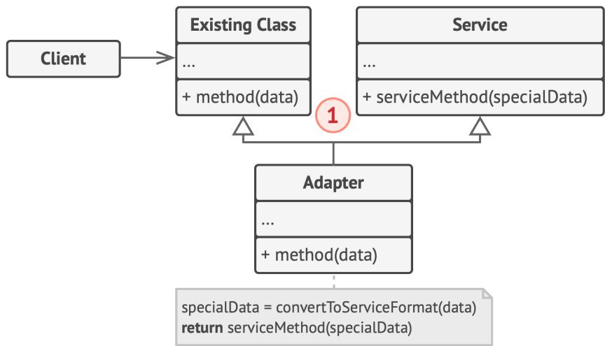

1.The Class Adapter doesn't need to wrap any objects because it inherits behaviors from both the client and the service. The adaptation happens within the overridden methods. The resulting adapter can be used in place of an existing client class.

# # Pseudocode

This example of the Adapter pattern is based on the classic conflict between square pegs and round holes.

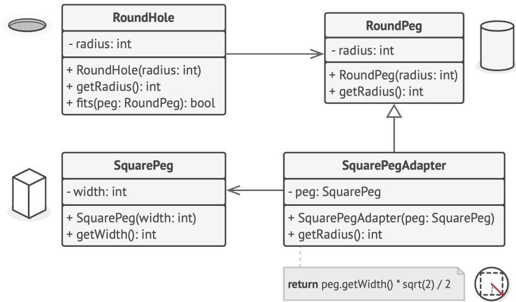  
Adapting square pegs to round holes.

The Adapter pretends to be a round peg,with a radius equal to a half of the square's diameter (in other words,the radius of the smallest circle that can accommodate the square peg).

1 // Say you have two classes with compatible interfaces:   
2 // RoundHole and RoundPeg.   
3 class RoundHole is   
4 constructor RoundHole(radius） { ..  }   
5   
6 method getRadius $( )$ is   
1 // Return the radius of the hole.   
8   
9 method fits(peg: RoundPeg） is   
10 return this.getRadius $( ) \ > =$ peg.getRadius $( )$   
11   
12 class RoundPeg is   
13 constructor RoundPeg(radius） { .\*. }   
14   
15 method getRadius $( )$ is   
16 // Return the radius of the peg.   
17   
18   
19 // But there's an incompatible class: SquarePeg.   
20 class SquarePeg is   
21 constructor SquarePeg(width） { \* }   
22   
23 method getWidth $( )$ is   
24 // Return the square peg width.   
25   
26   
27 // An adapter class lets you fit square pegs into round holes.   
28 // It extends the RoundPeg class to let the adapter objects act   
29 // as round pegs.   
30 class SquarePegAdapter extends RoundPeg is   
31 // In reality， the adapter contains an instance of the   
32 // SquarePeg class.   
33 private field peg: SquarePeg   
34   
35 constructor SquarePegAdapter(peg: SquarePeg） is   
36 this.peg $=$ peg   
37   
38 method getRadius $( )$ is   
39 // The adapter pretends that it's a round peg with a   
40 // radius that could fit the square peg that the adapter   
41 // actually wraps.   
42 return peg.getWidth(） \* Math.sqrt(2) / 2   
43   
44   
45 // Somewhere in client code.   
46 hole $=$ new RoundHole(5)   
47 rpeg $=$ new RoundPeg(5)   
48 hole.fits(rpeg) // true   
49   
50 small_sqpeg $=$ new SquarePeg(5)   
51 large_sqpeg $=$ new SquarePeg(10)   
52 hole.fits(small_sqpeg) // this won't compile (incompatible types)   
53   
54 small_sqpeg_adapter $=$ new SquarePegAdapter(small_sqpeg)   
55 large_sqpeg_adapter $=$ new SquarePegAdapter(large_sqpeg)   
56 hole.fits(small_sqpeg_adapter) // true   
57 hole.fits(large_sqpeg_adapter) // false

# Applicability

Use the Adapter class when you want to use some existing class,but its interface isn't compatible with the rest of your code.

The Adapter patrn lets you create a middle-layer class that serves as a translator between your code and a legacy class,a 3rd-party class or any other class with a weird interface.

Use the pattern when you want to reuse several existing subclasses that lack some common functionality that can't be added to the superclass.

You could extend each subclassand put the missing functionality into new child classes. However, you'll need to duplicate the code across all of these new classes, which smells really bad.

The much more elegant solution would be to put the missing functionality into an adapter class. Then you would wrap objects with missing features inside the adapter, gaining needed features dynamically. For this to work, the target classes must have a common interface,and the adapter's field should follow that interface. This approach looks very similar to the Decorator pattern.

# How to Implement

1.Make sure that you have at least two classes with incompatible interfaces:

。A useful service class,which you can't change (often 3rdparty, legacy or with lots of existing dependencies). 。 One or several client classes that would benefit from using the service class.

2.Declare the client interface and describe how clients communicate with the service.

3.Create the adapter class and make it follow the client interface.Leave all the methods empty for now.

4.Add a field to the adapter class to store a reference to the service object. The common practice is to initialize this field via the constructor, but sometimes it's more convenient to pass it to the adapter when calling its methods.

5.One by one, implement all methods of the client interface in the adapter class. The adapter should delegate most of the real work to the service object, handling only the interface or data format conversion.

6.Clients should use the adapter via the client interface.This will let you change or extend the adapters without affecting the client code.

# Pros and Cons

Single Responsibility Principle. You can separate the interface or data conversion code from the primary business logic of the program.

Open/Closed Principle. You can introduce new types of adapters into the program without breaking the existing client code, as long as they work with the adapters through the client interface.

XThe overall complexity of the code increases because you need to introduce a set of new interfaces and classes. Sometimes it's simpler just to change the service class so that it matches the rest of your code.

# ← Relations with Other Patterns

Bridge is usually designed up-front, letting you develop parts of an application independently of each other. On the other hand,Adapter is commonly used with an existing app to make Some otherwise-incompatible classes work together nicely.

Adapter changes the interface of an existing object, while Decorator enhances an object without changing its interface. In addition, Decorator supports recursive composition,which isn't possible when you use Adapter.

Adapter provides a different interface to the wrapped object, Proxy provides it with the same interface,and Decorator provides it with an enhanced interface.

Facade defines a new interface for existing objects,whereas Adapter tries to make the existing interface usable. Adapter usually wraps just one object, while Facade works with an entire subsystem of objects.

Bridge, State, Strategy (and to some degree Adapter) have very similar structures. Indeed,all of these patterns are based on composition,which is delegating Work to other objects. However, they all solve different problems.A pattern isn't just a recipe for structuring your code in a specific way. It can also communicate to other developers the problem the pattern solves.

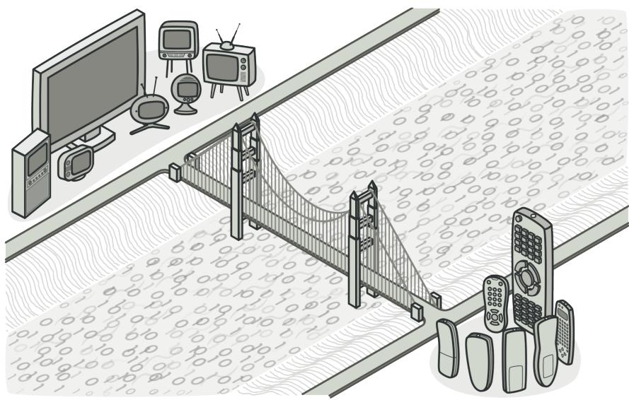

# BRIDGE

Bridge is a structural design pattern that lets you split a large class or a set of closely related classes into two separate hierarchies-abstraction and implementation-which can be developed independently of each other.

# Problem

Abstraction? Implementation? Sound scary? Stay calm and let's consider a simple example.

Say you have a geometric Shape class with a pair of subclasses: Circle and Square . You want to extend this class hierarchy to incorporate colors, so you plan to create Red and Blue shape subclasses. However, since you already have two subclasses, you'll need to create four class combinations such as BlueCircle and RedSquare .

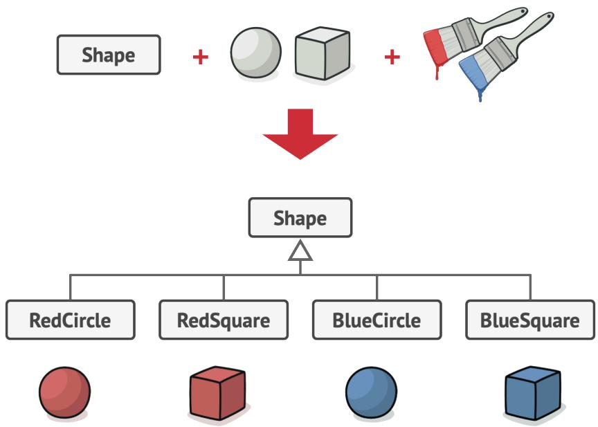

Number of class combinations grows in geometric progression.

Adding new shape types and colors to the hierarchy will grow it exponentially. For example, to add a triangle shape you'd need to introduce two subclasses, one for each color. And after that,adding a new color would require creating three subclasses,one for each shape type.The further we go, the worse it becomes.

# Solution

This problem occurs because we're trying to extend the shape classes in two independent dimensions: by form and by color. That's a very common issue with class inheritance.

The Bridge pattern attempts to solve this problem by switching from inheritance to the object composition. What this means is that you extract one of the dimensions into a separate class hierarchy, so that the original classes will reference an object of the new hierarchy, instead of having all of its state and behaviors within one class.

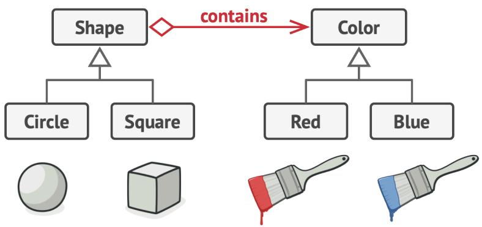

You can prevent the explosion of a class hierarchy by transforming it into several related hierarchies.

Following this approach,we can extract the color-related code into its own class with two subclasses: Red and Blue .The Shape class then gets a reference field pointing to one of the color objects. Now the shape can delegate any color-related Work to the linked color object. That reference will act as a bridge between the Shape and Color classes.From now on, adding new colors won't require changing the shape hierarchy, and vice versa.

# Abstraction and Implementation

The GoF book1 introduces the terms Abstraction and Implementation as part of the Bridge definition.In my opinion, the terms Sound too academic and make the pattern seem more complicated than it really is. Having read the simple example with shapes and colors, let's decipher the meaning behind the GoF book's scary words.

Abstraction (also called interface) is a high-level control layer for some entity. This layer isn't supposed to do any real work on its own.It should delegate the work to the implementation layer (also called platform).

Note that we're not talking about interfaces or abstract classes from your programming language.These aren't the same things.

When talking about real applications, the abstraction can be represented by a graphical user interface (GUl),and the implementation could be the underlying operating system code (APl) which the GUl layer calls in response to user interactions.

Generally speaking,you can extend such an app in two independent directions:

Have several different GUls (for instance, tailored for regular customers or admins).

Support several different APls (for example, to be able to launch the app under Windows,Linux,and macOS).

In a worst-case scenario, this app might look like a giant spaghetti bowl, where hundreds of conditionals connect different types of GUl with various APls all over the code.

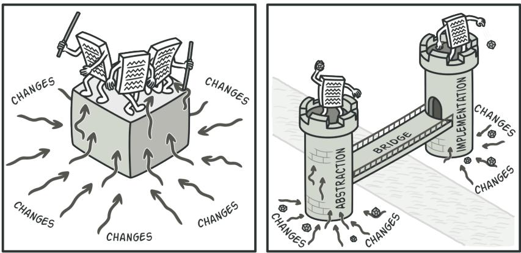

Making even α simple change to α monolithic codebase is pretty hard because you must understand the entire thing very well. Making changes to smaller, well-defined modules is much easier.

You can bring order to this chaos by extracting the code related to specific interface-platform combinations into separate classes. However, soon you'll discover that there are lots of these classes. The class hierarchy will grow exponentially because adding a new GUl or supporting a different APl would require creating more and more classes.

Let's try to solve this issue with the Bridge pattern. It suggests that we divide the classes into two hierarchies:

Abstraction: the GUl layer of the app.

Implementation: the operating systems' APls.

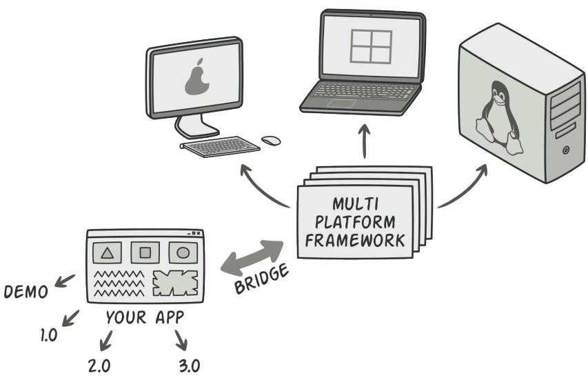  
One of the ways to structure α cross-platform application.

The abstraction object controls the appearance of the app, delegating the actual work to the linked implementation object. Different implementations are interchangeable as long as they follow a common interface,enabling the same GUl to work under Windows and Linux.

As a result, you can change the GUl classes without touching the APl-related classes. Moreover,adding support for another operating system only requires creating a subclass in the implementation hierarchy.

# Structure

Client abstraction.feature10 4 Bridge V Abstraction 《interface》 2 Implementation i.method10 - i: Implementation 石 + method1() + feature10 + method2( i.method20 4 + feature20 + method30 i.method30 A △ (optional) Refined Abstraction Concrete A Implementations i.methodN0 i.methodM0 + featureN0

1.The Abstraction provides high-level control logic. It relies on the implementation object to do the actual low-level work.

2.The Implementation declares the interface that's common for all concrete implementations. An abstraction can only communicate with an implementation object via methods that are declared here.

The abstraction may list the same methods as the implementation,but usually the abstraction declares some complex behaviors that rely on a wide variety of primitive operations declared by the implementation.

3.Concrete Implementations contain platform-specific code.

4.Refined Abstractions provide variants of control logic. Like their parent, they work with different implementations via the general implementation interface.

5.Usually， the Client is only interested in working with the abstraction. However, it's the client's job to link the abstraction object with one of the implementation objects.

# # Pseudocode

This example illustrates how the Bridge pattern can help divide the monolithic code of an app that manages devices and their remote controls. The Device classes act as the implementation,whereas the Remote S act as the abstraction.

The base remote control class declares a reference field that links it with a device object. All remotes work with the devices via the general device interface,which lets the same remote support multiple device types.

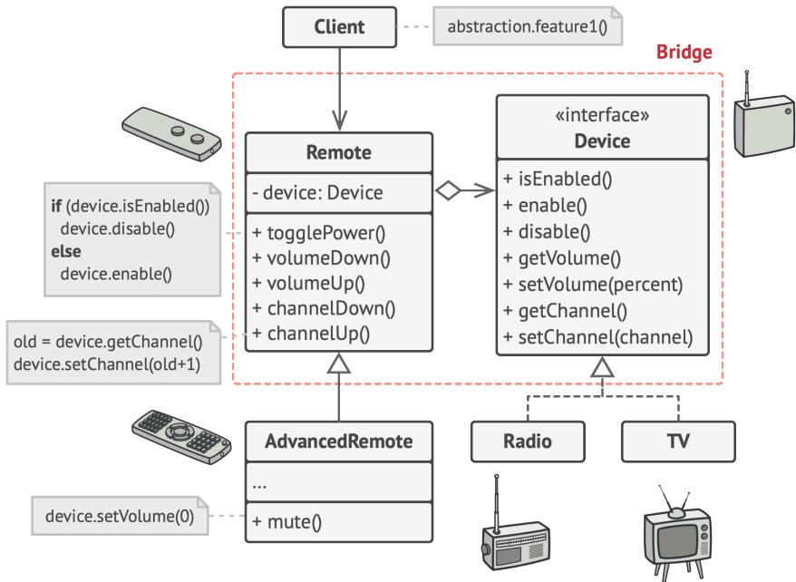  
The original class hierarchy is divided into two parts: devices and remote controls.

You can develop the remote control classes independently from the device classes. All that's needed is to create a new remote subclass. For example,a basic remote control might only have two buttons, but you could extend it with additional features,such as an extra battery or a touchscreen.

The client code links the desired type of remote control with a specific device object via the remote's constructor.

1 // The "abstraction" defines the interface for the "contr(   
2 // part of the two class hierarchies. It maintains a refel   
3 // to an object of the "implementation" hierarchy and dele   
4 // all of the real work to this object.   
5 class RemoteControl is   
6 protected field device: Device   
7 constructor RemoteControl(device: Device） is   
8 this.device $=$ device   
9 method togglePower(） is   
10 if (device.isEnabled $( )$ ） then   
11 device.disable()   
12 else   
13 device.enable()   
14 method volumeDown（） is   
15 device.setVolume(device.getVolume $( )$ - 10)   
16 method volumeUp $( )$ is   
17 device.setVolume(device.getVolume $( \mathbf { \Sigma } ) \ + \ \mathbf { \Sigma } 1 0$   
18 method channelDown $( )$ is   
19 device.setChannel(device.getChannel $( )$ - 1)   
20 method channelUp $( )$ is   
21 device.setChannel(device.getChannel $\mathrm { ~ ( ~ ) ~ } + \mathrm { ~ } 1 \mathrm { ) }$   
22   
23   
24 // You can extend classes from the abstraction hierarchy   
25 // independently from device classes.   
26 class AdvancedRemoteControl extends RemoteControl is   
27 method mute $( )$ is   
28 device.setVolume(0)   
29   
30   
31 // The "implementation" interface declares methods common   
32 // concrete implementation classes. It doesn't have to ma1   
33 // abstraction's interface. In fact， the t'   
34 // entirely different. Typically the implel   
35 // provides only primitive operations，whi   
36 // defines higher-level operations based o   
37 interface Device is   
38 method isEnabled $( )$   
39 method enable $( )$   
40 method disable $( )$   
41 method getVolume $( )$   
42 method setVolume(percent)   
43 method getChannel()   
44 method setChannel(channel)   
45   
46   
47 // All devices follow the same interface.   
48 class Tv implements Device is   
49 / ..   
50   
51 class Radio implements Device is   
52 / ..   
53   
54   
55 // Somewhere in client code.   
56 tv = new Tv()   
57 remote $=$ new RemoteControl(tv)   
58 remote.togglePower()   
59   
60 radio $=$ new Radio $( )$   
61 remote $=$ new AdvancedRemoteControl(radio)

# Applicability

Use the Bridge pattern when you want to divide and organize a monolithic class that has several variants of some functionality (for example, if the class can work with various database servers).

The bigger a class becomes,the harder it is to figure out how it works,and the longer it takes to make a change. The changes made to one of the variations of functionality may require making changes across the whole class,which often results in making errors or not addressing some critical side effects.

The Bridge pattern lets you split the monolithic class into several class hierarchies.After this,you can change the classes in each hierarchy independently of the classes in the others.This approach simplifies code maintenance and minimizes the risk of breaking existing code.

# Use the pattern when you need to extend a class in several orthogonal (independent) dimensions.

The Bridge suggests that you extract a separate class hierarchy for each of the dimensions.The original class delegates the related work to the objects belonging to those hierarchies instead of doing everything on its own.

Use the Bridge if you need to be able to switch implementations at runtime.

Although it's optional, the Bridge pattern lets you replace the implementation object inside the abstraction. It's as easy as assigning a new value to a field.

By the way, this last item is the main reason why so many people confuse the Bridge with the Strategy pattern. Remember that α pattern is more than just a certain way to structure your classes. It may also communicate intent and a problem being addressed.

# How to Implement

1.ldentify the orthogonal dimensions in your classes.These independent concepts could be: abstraction/platform, domain/ infrastructure, front-end/back-end,or interface/implementation.

2.See what operations the client needs and define them in the base abstraction class.

3.Determine the operations available on all platforms. Declare the ones that the abstraction needs in the general implementation interface.

4.For all platforms in your domain create concrete implementa-tion classes,but make sure they all follow the implementation interface.

5.Inside the abstraction class,add a reference field for the implementation type. The abstraction delegates most of the work to the implementation object that's referenced in that field.

6.If you have several variants of high-level logic, create refined abstractions for each variant by extending the base abstraction class.

7.The client code should pass an implementation object to the abstraction's constructor to associate one with the other. After that, the client can forget about the implementation and work only with the abstraction object.

# Pros and Cons

You can create platform-independent classes and apps.

The client code works with high-level abstractions. It isn't exposed to the platform details.

Open/Closed Principle. You can introduce new abstractions and implementations independently from each other.

Single Responsibility Principle. You can focus on high-level logic in the abstraction and on platform details in the implementation.

XYou might make the code more complicated by applying the pattern to a highly cohesive class.

# ← Relations with Other Patterns

Bridge is usually designed up-front, letting you develop parts of an application independently of each other. On the other hand,Adapter is commonly used with an existing app to make some otherwise-incompatible classes work together nicely.

Bridge, State, Strategy (and to some degree Adapter) have very similar structures. Indeed,all of these patterns are based on composition,which is delegating Work to other objects. However, they all solve different problems. A pattern isn't just a recipe for structuring your code in a specific way. It can also communicate to other developers the problem the pattern solves.

You can use Abstract Factory along with Bridge. This pairing is useful when some abstractions defined by Bridge can only work with specific implementations.In this case, Abstract Factory can encapsulate these relations and hide the complexity from the client code.

You can combine Builder with Bridge: the director class plays the role of the abstraction,while different builders act as implementations.

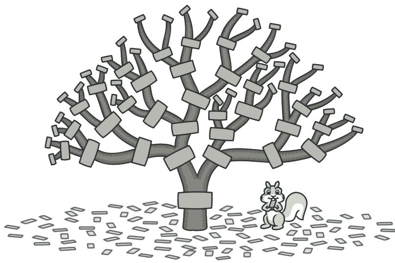

# COMPOSITE

Also known as: Object Tree

Composite is a structural design pattern that lets you compose objects into tree structures and then work with these structures as if they were individual objects.

# Problem

Using the Composite pattern makes sense only when the core model of your app can be represented as a tree.

For example,imagine that you have two types of objects: Products and Boxes ．A Box cancontain several Products as well as a number of smaller Boxes .These little Boxes can also hold some Products or even smaller Boxes ,and so on.

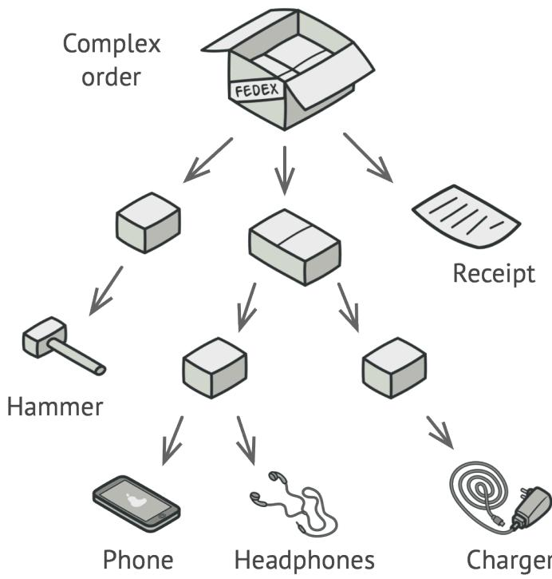

An order might comprise various products,packaged in boxes,which are packaged in bigger boxes and so on. The whole structure looks like an upside down tree.

Say you decide to create an ordering system that uses these classes. Orders could contain simple products without any wrapping,as well as boxes stuffed with products...and other boxes. How would you determine the total price of such an order?

You could try the direct approach: unwrap all the boxes, go over all the products and then calculate the total. That would be doable in the real world; but in a program,it's not as simple as running a loop. You have to know the classes of Products and Boxes you're going through, the nesting level of the boxes and other nasty details beforehand.All of this makes the direct approach either too awkward or even impossible.

# Solution

The Composite pattern suggests that you work with Products and Boxes through a common interface which declares a method for calculating the total price.

How would this method work? For a product, it'd simply return the product's price. For a box,it'd go over each item the box contains,ask its price and then return a total for this box. If one of these items were a smaller box, that box would also start going over its contents and so on, until the prices of all inner components were calculated.A box could even add some extra cost to the final price, such as packaging cost.

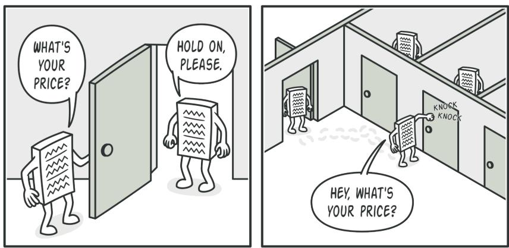  
The Composite pattern lets you run a behavior recursively over all components of an object tree.

The greatest benefit of this approach is that you don't need to care about the concrete classes of objects that compose the tree.You don't need to know whether an object is a simple product or a sophisticated box.You can treat them all the same via the common interface.When you call a method, the objects themselves pass the request down the tree.

# Real-World Analogy

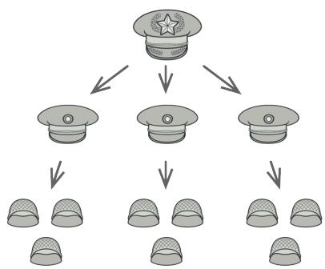

An example of a military structure.

Armies of most countries are structured as hierarchies. An army consists of several divisions； a division is a set of brigades,and a brigade consists of platoons,which can be broken down into squads. Finally, a squad is a small group of real soldiers. Orders are given at the top of the hierarchy and passed down onto each level until every soldier knows what needs to be done.

# Structure

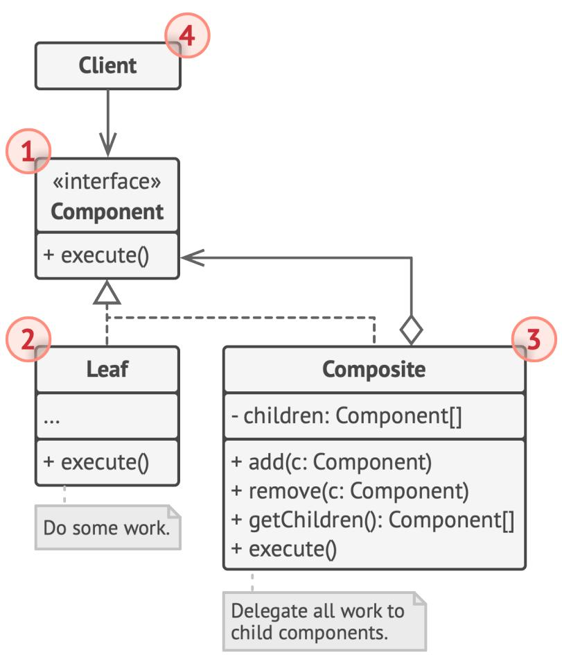

1.The Component interface describes operations that are common to both simple and complex elements of the tree.

2.The Leaf is a basic element of a tree that doesn't have sub-elements.

Usually, leaf components end up doing most of the real work, since they don't have anyone to delegate the work to.

3.The Container (aka composite) is an element that has sub-elements: leaves or other containers.A container doesn't know the concrete classes of its children. It works with all sub-elements only via the component interface.

Upon receiving a request,a container delegates the work to its sub-elements, processes intermediate results and then returns the final result to the client.

4.The Client works with all elements through the component interface. As a result, the client can work in the same way with both simple or complex elements of the tree.

# # Pseudocode

In this example, the Composite pattern lets you implement stacking of geometric shapes in a graphical editor.

<table><tr><td>《interface》 Graphic</td><td>N</td><td>ImageEditor</td></tr><tr><td>+ move(x, y) + draw0</td><td colspan="2"></td></tr><tr><td>A</td><td colspan="2"></td></tr><tr><td>A Dot</td><td colspan="2">A CompoundGraphic</td></tr><tr><td></td><td colspan="2">- chitdren: Graphic[]</td></tr><tr><td>x,y + Dot(x,y)</td><td colspan="2">+ add(child: Graphic)</td></tr><tr><td>+ move(x, y) + draw0</td><td colspan="2">+ remove(child: Graphic) + move(x,y) + draw0</td></tr><tr><td>全</td><td colspan="2"></td></tr><tr><td>Circle</td><td colspan="2"></td></tr><tr><td>radius + Circle(x, y, radius)</td><td colspan="2"></td></tr></table>

The geometric shapes editor example.

The CompoundGraphic class is a container that can comprise any number of sub-shapes,including other compound shapes. A compound shape has the same methods as a simple shape. However, instead of doing something on its own,a compound shape passes the request recursively to all its children and "sums up" the result.

The client code works with all shapes through the single interface common to all shape classes. Thus, the client doesn't know whether it's working with a simple shape or a compound one. The client can work with very complex object structures without being coupled to concrete classes that form that structure.

1 // The component interface declares common operations for both   
2 // simple and complex objects of a composition.   
3 interface Graphic is   
4 method move(x，y)   
5 method draw()   
6   
7 // The leaf class represents end objects of a composition. A   
8 // leaf object can't have any sub-objects. Usually， it's leaf   
9 // objects that do the actual work，while composite objects only   
10 // delegate to their sub-components.   
11 class Dot implements Graphic is   
12 field x， y   
13   
14 constructor Dot(x， y） { .. }   
15   
16 method move(x，y） is   
17 this.x $+ = \times$ ， this.y $+ = \textsf { y }$   
18   
19 method draw $( )$ is   
20 // Draw a dot at X and Y.   
21   
22 // All component classes can extend other components.   
23 class Circle extends Dot is   
24 field radius   
25   
26   
27 constructor Circle(x， y, radius）{ .\*. }   
28   
29 method draw $( )$ is   
30 // Draw a circle at X and Y with radius R.   
31   
32 // The composite class represents complex components that may   
33 // have children. Composite objects usually delegate the actui   
34 // work to their children and then "sum up" the result.   
35 class CompoundGraphic implements Graphic is   
36 field children: array of Graphic   
37   
38 // A composite object can add or remove other components   
39 // (both simple or complex) to or from its child list.   
40 method add(child: Graphic） is   
41 // Add a child to the array of children.   
42   
43 method remove(child: Graphic） is   
44 // Remove a child from the array of children.   
45   
46 method move(x，y） is   
47 foreach (child in children） do   
48 child.move(x，y)   
49   
50 // A composite executes its primary logic in a particular   
51 // way. It traverses recursively through all its children,   
52 // collecting and summing up their results. Since the   
53 // composite's children pass these calls to their own   
54 // children and so forth， the whole object tree is traverse(   
55 // as a result.   
56 method draw(） is   
57 // 1. For each child component:   
58 / - Draw the component.   
59 // - Update the bounding rectangle.   
60 // 2.Draw a dashed rectangle using the bounding   
61 // coordinates.   
62   
63   
64 // The client code works with all the components via their bas   
65 // interface. This way the client code can support simple leaf   
66 // components as well as complex composites.   
67 class ImageEditor is   
68 field all: CompoundGraphic   
69   
70 method load $( )$ is   
71 all $=$ new CompoundGraphic $( )$   
72 all.add(new Dot(1, 2))   
73 all.add(new Circle(5，3, 10))   
74 / .   
75   
76 // Combine selected components into one complex composite   
77 // component.   
78 method groupSelected(components: array of Graphic） is   
79 group $=$ new CompoundGraphic $( )$   
80 foreach （component in components） do   
81 group.add(component)   
82 all.remove(component)   
83 all.add(group)   
84 // All components will be drawn.   
85 all.draw()

# Applicability

Use the Composite pattern when you have to implement a tree-like object structure.

The Composite pattern provides you with two basic element types that share a common interface: simple leaves and complex containers.A container can be composed of both leaves and other containers.This lets you construct a nested recursive object structure that resembles a tree.

Use the pattern when you want the client code to treat both simple and complex elements uniformly.

Allelements defined by the Composite pattern share acommon interface. Using this interface, the client doesn't have to wory about the concrete class of the objects it works with.

# How to Implement

1.Make sure that the core model of your app can be represented as a tree structure. Try to break it down into simple elements and containers. Remember that containers must be able to contain both simple elements and other containers.

2.Declare the component interface with a list of methods that make sense for both simple and complex components.

3.Create a leaf class to represent simple elements. A program may have multiple different leaf classes.

4.Create a container class to represent complex elements. In this class, provide an array field for storing references to subelements. The array must be able to store both leaves and containers,so make sure it's declared with the component interface type.

While implementing the methods of the component interface, remember that a container is supposed to be delegating most of the work to sub-elements.

5.Finally， define the methods for adding and removal of child elements in the container.

Keep in mind that these operations can be declared in the component interface.This would violate the Interface Segregation Principle because the methods will be empty in the leaf class. However, the client will be able to treat all the elements equally, even when composing the tree.

# Pros and Cons

You can work with complex tree structures more conveniently: use polymorphism and recursion to your advantage.

Open/Closed Principle. You can introduce new element types into the app without breaking the existing code,which now works with the object tree.

XIt might be difficult to provide a common interface for classes whose functionality differs too much. In certain scenarios, you'd need to overgeneralize the component interface,making it harder to comprehend.

# ← Relations with Other Patterns

You can use Builder when creating complex Composite trees because you can program its construction steps to work recursively.

Chain of Responsibility is often used in conjunction with Composite.In this case,when a leaf component gets a request, it may pass it through the chain of all of the parent components down to the root of the object tree.

You can use Iterators to traverse Composite trees.

You can use Visitor to execute an operation over an entire Composite tree.

You can implement shared leaf nodes of the Composite tree as Flyweights to save some RAM.

Composite and Decorator have similar structure diagrams since both rely on recursive composition to organize an openended number of objects.

A Decorator is like a Composite but only has one child component. There's another significant difference: Decorator adds additional responsibilities to the wrapped object, while Composite just“sums up”its children's results.

However, the patterns can also cooperate: you can use Decorator to extend the behavior of a specific object in the Composite tree.

Designs that make heavy use of Composite and Decorator can often benefit from using Prototype. Applying the pattern lets you clone complex structures instead of re-constructing them from scratch.

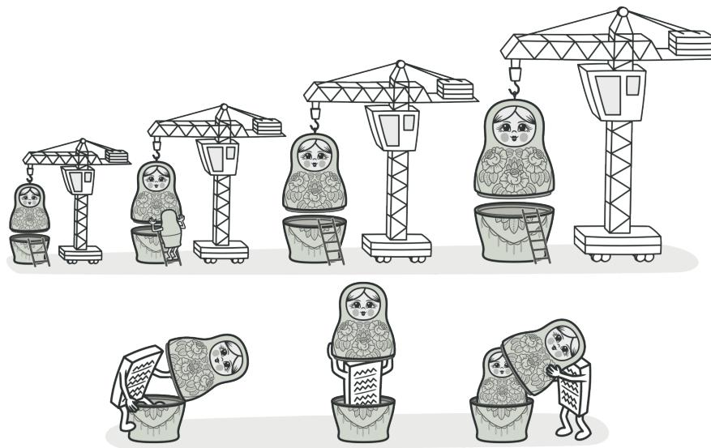

DECORATOR

Also known as: Wrapper

Decorator is a structural design pattern that lets you attach new behaviors to objects by placing these objects inside special wrapper objects that contain the behaviors.

# Problem

Imagine that you're working on a notification library which lets other programs notify their users about important events.

The initial version of the library was based on the Notifier class that had only a few fields,a constructor and a single send method.The method could accept a message argument from a client and send the message to a list of emails that were passed to the notifier via its constructor. A third-party app which acted as a client was supposed to create and configure the notifier object once,and then use it each time something important happened.

Notification Library

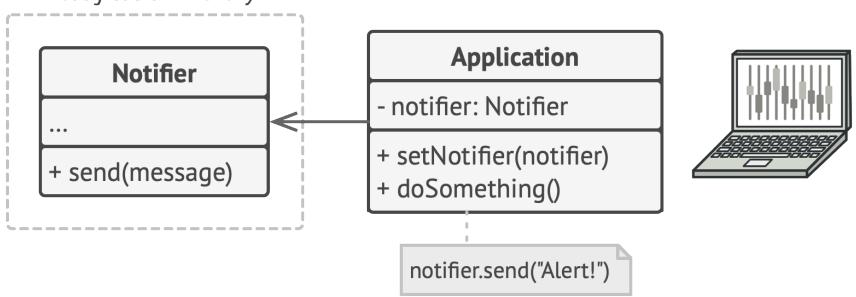  
A program could use the notifier class to send notifications about important events to α predefined set of emails.

At some point,you realize that users of the library expect more than just email notifications. Many of them Would like to receive an SMS about critical issues. Others would like to be notified on Facebook and,of course, the corporate users would love to get Slack notifications.

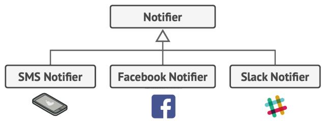  
Each notification type is implemented as a notifer's subclass.

How hard can that be? You extended the Notifier class and put the additional notification methods into new subclasses. Now the client was supposed to instantiate the desired notification class and use it for all further notifications.

But then someone reasonably asked you,“Why can't you use several notification types at once? If your house is on fire, you'd probably want to be informed through every channel."

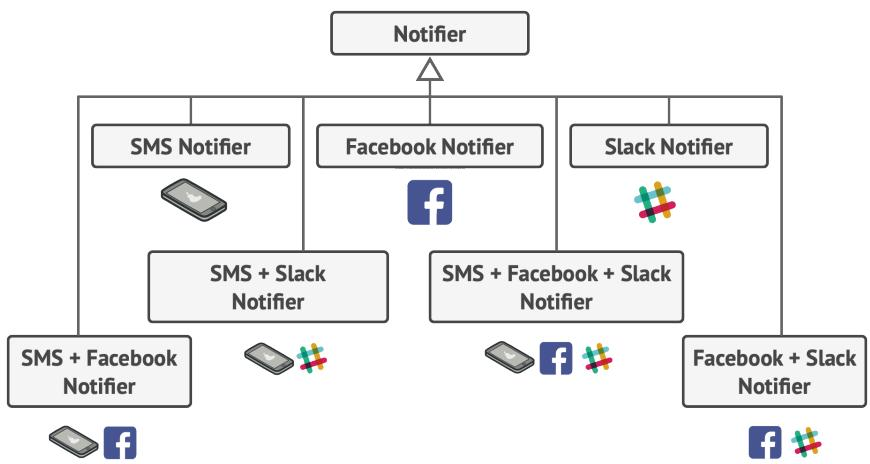  
Combinatorial explosion of subclasses.

You tried to address that problem by creating special subclasses which combined several notification methods within one class.However, it quickly became apparent that this approach would bloat the code immensely, not only the library code but the client code as well. You have to find some other way to structure notifications classes so that their number won't accidentally break some Guinness record.

# Solution

Extending a class is the first thing that comes to mind when you need to alter an object's behavior. However, inheritance has several serious caveats that you need to be aware of.

Inheritance is static.You can't alter the behavior of an existing object at runtime. You can only replace the whole object with another one that's created from a different subclass.

Subclasses can have just one parent class. In most languages, inheritance doesn't let a class inherit behaviors of multiple classes at the same time.

One of the ways to overcome these caveats is by using Aggregation or Composition1 instead of Inheritance. Both of the alternatives work almost the same way: one object has α reference to another and delegates it some work, whereas with inheritance,the object itself is able to do that work,inheriting the behavior from its superclass.

With this new approach you can easily substitute the linked “helper” object with another, changing the behavior of the container at runtime. An object can use the behavior of various classes, having references to multiple objects and delegating them all kinds of work. Aggregation/composition is the key principle behind many design patterns, including Decorator. On that note, let's return to the pattern discussion.

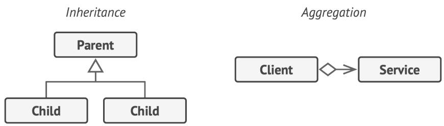  
Inheritance vs. Aggregation

“Wrapper” is the alternative nickname for the Decorator pattern that clearly expresses the main idea of the pattern.A wrapper is an object that can be linked with some target object. The wrapper contains the same set of methods as the target and delegates to it all requests it receives. However, the wrapper may alter the result by doing something either before or after it passes the request to the target.

When does a simple wrapper become the real decorator? As I mentioned, the wrapper implements the same interface as the wrapped object. That's why from the client's perspective these objects are identical. Make the wrapper's reference field accept any object that follows that interface. This will let you cover an object in multiple wrappers,adding the combined behavior of all the wrappers to it.

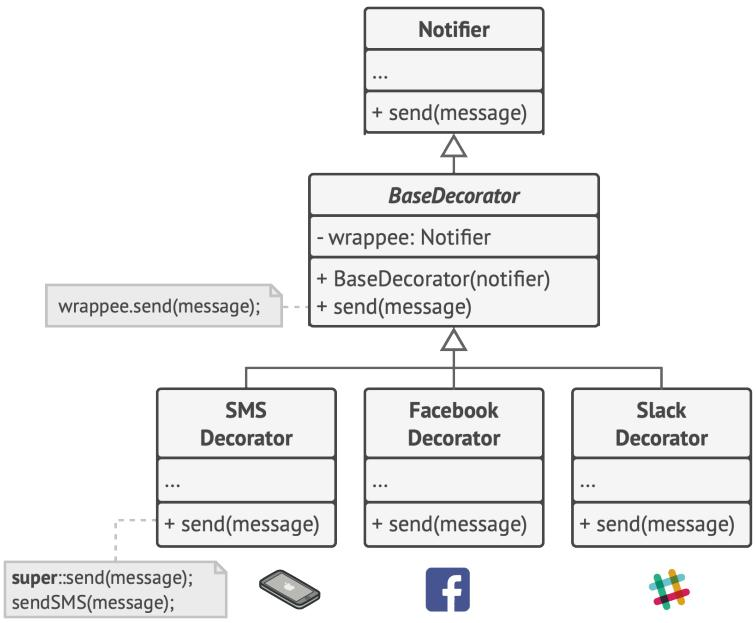  
Various notification methods become decorators.

In our notifications example, let's leave the simple email notification behavior inside the base Notifier class,but turn all other notification methods into decorators. The client code would need to wrap a basic notifier object into a set of decorators that match the client's preferences. The resulting objects will be structured as a stack.

The last decorator in the stack would be the object that the client actually works with. Since all decorators implement the same interface as the base notifier, the rest of the client code won't care whether it works with the“pure”notifier object or the decorated one.

stack $=$ new Notifier()   
if (facebookEnabled) stack $=$ new FacebookDecorator(stack)   
if (slackEnabled) stack $=$ new SlackDecorator(stack)   
app.setNotifier(stack) Application   
- notifier: Notifier   
$^ +$ setNotifier(notifier)   
+ doSomething0Q   
notifier.send("Alert!")   
// Email → Facebook→Slack

Apps might configure complex stacks of notification decorators.

We could apply the same approach to other behaviors such as formatting messages or composing the recipient list. The client can decorate the object with any custom decorators, as long as they follow the same interface as the others.

# Real-World Analogy

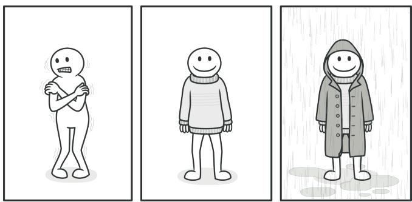

You get a combined effct from wearing multiple pieces ofclothing.

Wearing clothes is an example of using decorators. When you're cold, you wrap yourself in a sweater. If you're still cold with a sweater, you can wear a jacket on top. If it's raining, you can put on a raincoat.All of these garments“extend” your basic behavior but aren't part of you,and you can easily take off any piece of clothing whenever you don't need it.

# Structure

Client a $=$ new ConcComponent() Z ${ \mathfrak { b } } =$ ${ \mathfrak { c } } =$ new ConcDecorator2(b) new ConcDecorator1(a) 5 W c.execute()   
《interface》 //Decorator $\mathbf { \varepsilon } _ { - > }$ Decorator ${ } _ { - > }$ Component   
Component   
+ execute( A i   
2 3 Concrete Base Decorator   
Component - wrappee: Component   
+ BaseDecorator(c: Component)o wrappee = c   
+ execute() + execute) °- △ 1 wrappee.execute) Concrete Decorators ： + execute( o sxteriexecute) + extra0

1.The Component declares the common interface for both wrappers and wrapped objects.

2.Concrete Component is a class of objects being wrapped. It defines the basic behavior, which can be altered by decorators.

3.The Base Decorator class has a field for referencing a wrapped object. The field's type should be declared as the component interface so it can contain both concrete components and decorators. The base decorator delegates all operations to the wrapped object.

4.Concrete Decorators define extra behaviors that can be added to components dynamically. Concrete decorators override methods of the base decorator and execute their behavior either before or after calling the parent method.

5.The Client can wrap components in multiple layers of decorators,as long as it works with all objects via the component interface.

# # Pseudocode

In this example, the Decorator pattern lets you compress and encrypt sensitive data independently from the code that actually uses this data.

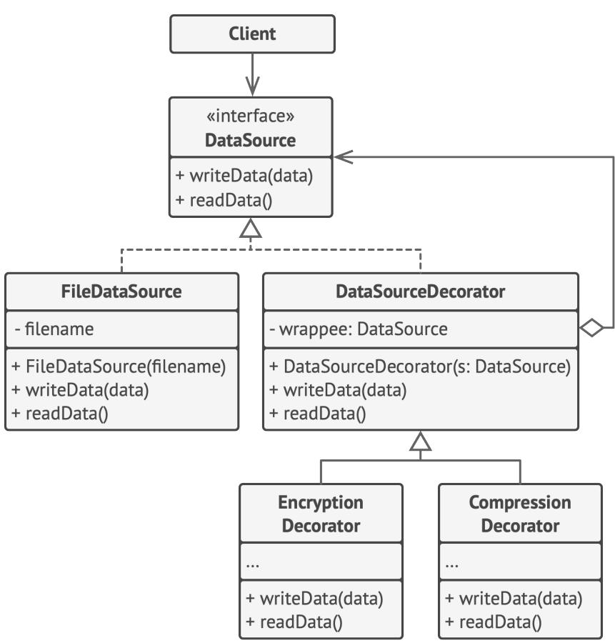

The encryption and compression decorators example.

The application wraps the data source object with a pair of decorators. Both wrappers change the way the data is written to and read from the disk:

Just before the data is written to disk, the decorators encrypt and compress it. The original class writes the encrypted and protected data to the file without knowing about the change.

Right after the data is read from disk, it goes through the same decorators,which decompress and decode it.

The decorators and the data source class implement the same interface，which makes them all interchangeable inthe client code.

1 // The component interface defines operations that can be   
2 // altered by decorators.   
3 interface DataSource is   
4 method writeData(data)   
5 method readData $( )$ :data   
6   
7 // Concrete components provide default implementations for the   
8 // operations. There might be several variations of these   
9 // classes in a program.   
10 class FileDataSource implements DataSource is   
11 constructor FileDataSource(filename） { .\*\* }   
12   
13 method writeData(data) is   
14 // Write data to file.   
15   
16 method readData $( )$ :data is   
17 // Read data from file.   
18   
19 // The base decorator class follows the same interface as the   
20 // other components. The primary purpose of this class is to   
21 // define the wrapping interface for all concrete decorators.   
22 // The default implementation of the wrapping code might includi   
23 // a field for storing a wrapped component and the means to   
24 // initialize it.   
25 class DataSourceDecorator implements DataSource is   
26 protected field wrappee: DataSource   
27   
28 constructor DataSourceDecorator(source: DataSource） is   
29 wrappee $=$ source   
30   
31 // The base decorator simply delegates all work to the   
32 // wrapped component. Extra behaviors can be added in   
33 // concrete decorators.   
34 method writeData(data） is   
35 wrappee.writeData(data)   
36   
37 // Concrete decorators may call the parent implementation of   
38 // the operation instead of calling the wrapped object   
39 // directly. This approach simplifies extension of decorator   
40 // classes.   
41 method readData $( )$ :data is   
42 return wrappee.readData $( )$   
43   
44 // Concrete decorators must call methods on the wrapped object,   
45 // but may add something of their own to the result. Decorators   
46 // can execute the added behavior either before or after the   
47 // call to a wrapped object.   
48 class EncryptionDecorator extends DataSourceDecorator is   
49 method writeData(data） is   
50 // 1. Encrypt passed data.   
51 // 2. Pass encrypted data to the wrappee's writeData   
52 // method.   
53 method readData $( )$ :data is   
54 // 1. Get data from the wrappee's readData method.   
55 // 2. Try to decrypt it if it's encrypted.   
56 // 3. Return the result.

// You can wrap objects in several layers of decorators.   
class CompressionDecorator extends DataSourceDecorator is method writeData(data) is // 1. Compress passed data. // 2. Pass compressed data to the wrappee's writeData // method.

64 6 68

method readData $( )$ :data is // 1. Get data from the wrappee's readData method. // 2. Try to decompress it if it's compressed. // 3. Return the result.

// Option 1. A simple example of a decorator assembly.   
class Application is method dumbUsageExample $( )$ is source $=$ new FileDataSource("somefile.dat") source.writeData(salaryRecords) // The target file has been written with plain data. source $=$ new CompressionDecorator(source)   
source.writeData(salaryRecords)   
// The target file has been written with compressed // data. source $=$ new EncryptionDecorator(source)   
// The source variable now contains this:   
// Encryption $>$ Compression $>$ FileDataSource source.writeData(salaryRecords)   
// The file has been written with compressed and // encrypted data.

89 // Option 2. Client code that uses an external data source,   
90 // SalaryManager objects neither know nor care about data   
91 // storage specifics. They work with a pre-configured data   
92 // source received from the app configurator.   
93 class SalaryManager is   
94 field source: DataSource   
95   
96 constructor SalaryManager(source: DataSource) { .\* }   
97   
98 method load $( )$ is   
99 return source.readData $( )$   
100   
101 method save $( )$ is   
102 source.writeData(salaryRecords)   
103 // ...Other useful methods...   
104   
105   
106 // The app can assemble different stacks of decorators at   
107 // runtime， depending on the configuration or environment.   
108 class ApplicationConfigurator is   
109 method configurationExample $( )$ is   
110 source $=$ new FileDataSource("salary.dat")   
111 if (enabledEncryption)   
112 source $=$ new EncryptionDecorator(source)   
113 if (enabledCompression)   
114 source $=$ new CompressionDecorator(source)   
115   
116 logger $=$ new SalaryManager(source)   
117 salary $=$ logger.load()   
118 / ..

# Applicability

Use the Decorator pattern when you need to be able to assign extra behaviors to objects at runtime without breaking the code that uses these objects.

The Decorator lets you structure your businesslogic into layers, create a decorator for each layer and compose objects with various combinations of this logic at runtime.The client code can treat all these objects in the same way, since they all follow a common interface.

: Use the pattern when it’s awkward or not possible to extend an object's behavior using inheritance.

Many programming languages have the final keyword that can be used to prevent further extension of a class. For a final class, the only way to reuse the existing behavior would be to wrap the class with your own wrapper, using the Decorator pattern.

# How to Implement

1.Make sure your business domain can be represented as a primary component with multiple optional layers over it.

2.Figure out what methods are common to both the primary component and the optional layers. Create a component interface and declare those methods there.

3.Create a concrete component class and define the base behavior in it.

4.Create a base decorator class. It should have a field for storing a reference to a wrapped object. The field should be declared with the component interface type to allow linking to concrete components as well as decorators.The base decorator must delegate all work to the wrapped object.

5.Make sure all classes implement the component interface.

6.Create concrete decorators by extending them from the base decorator. A concrete decorator must execute its behavior before or after the call to the parent method (which always delegates to the wrapped object).

7.The client code must be responsible for creating decorators and composing them in the way the client needs.

# Pros and Cons

You can extend an object's behavior without making a new subclass.

You can add or remove responsibilities from an object at runtime.

You can combine several behaviors by wrapping an object into multiple decorators.

Single Responsibility Principle.You can divide a monolithic class that implements many possible variants of behavior into several smaller classes.

<It's hard to remove a specific wrapper from the wrappers stack. <It's hard to implement a decorator in such a way that its behavior doesn't depend on the order in the decorators stack. 《The initial configuration code of layers might look prety ugly.

# Relations with Other Patterns

Adapter changes the interface of an existing object, while Decorator enhances an object without changing its interface. In addition, Decorator supports recursive composition,which isn't possible when you use Adapter.

Adapter provides a different interface to the wrapped object, Proxy provides it with the same interface,and Decorator provides it with an enhanced interface.

Chain of Responsibility and Decorator have very similar class structures. Both patterns rely on recursive composition to pass the execution through a series of objects. However, there are several crucial differences.

The CoR handlers can execute arbitrary operations independently of each other. They can also stop passing the request further at any point. On the other hand,various Decorators can extend the object's behavior while keeping it consistent with the base interface. In addition， decorators aren't allowed to break the flow of the request.

Composite and Decorator have similar structure diagrams since both rely on recursive composition to organize an openended number of objects.

A Decorator is like a Composite but only has one child component. There's another significant difference: Decorator adds additional responsibilities to the wrapped object, while Composite just“sums up”its children's results.

However, the patterns can also cooperate: you can use Decorator to extend the behavior of a specific object in the Composite tree.

Designs that make heavy use of Composite and Decorator can often benefit from using Prototype. Applying the pattern lets you clone complex structures instead of re-constructing them from scratch.

Decorator lets you change the skin of an object,while Strategy lets you change the guts.

Decorator and Proxy have similar structures, but very different intents. Both patterns are built on the composition principle, where one object is supposed to delegate some of the work to another. The difference is that a Proxy usually manages the life cycle of its service object on its own,whereas the composition of Decorators is always controlled by the client.

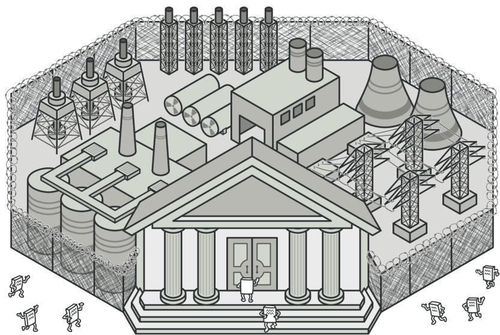  
FACADE

Facade is a structural design pattern that provides a simplified interface to a library, a framework, or any other complex set of classes.

# Problem

Imagine that you must make your code work with a broad set of objects that belong to a sophisticated library or framework. Ordinarily, you'd need to initialize all of those objects, keep track of dependencies, execute methods in the correct order, and so on.

As a result, the business logic of your classes would become tightly coupled to the implementation details of 3rd-party classes, making it hard to comprehend and maintain.

# Solution

A facade is a class that provides a simple interface to a complex subsystem which contains lots of moving parts.A facade might provide limited functionality in comparison to working with the subsystem directly. However, it includes only those features that clients really care about.

Having a facade is handy when you need to integrate your app with a sophisticated library that has dozens of features, but you just need a tiny bit of its functionality. For instance, an app that uploads short funny videos with cats to social media could potentially use a professional video conversion library. However, all that it really needs is a class with the single method encode(filename， format）.After creating such a class and connecting it with the video conversion library, you'll have your first facade.

# Real-World Analogy

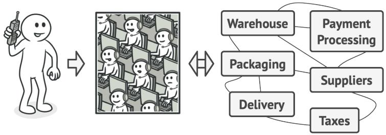  
Placing orders by phone.

When you call a shop to place a phone order,an operator is your facade to all services and departments of the shop. The operator provides you with a simple voice interface to the ordering system, payment gateways,and various delivery services.

# Structure

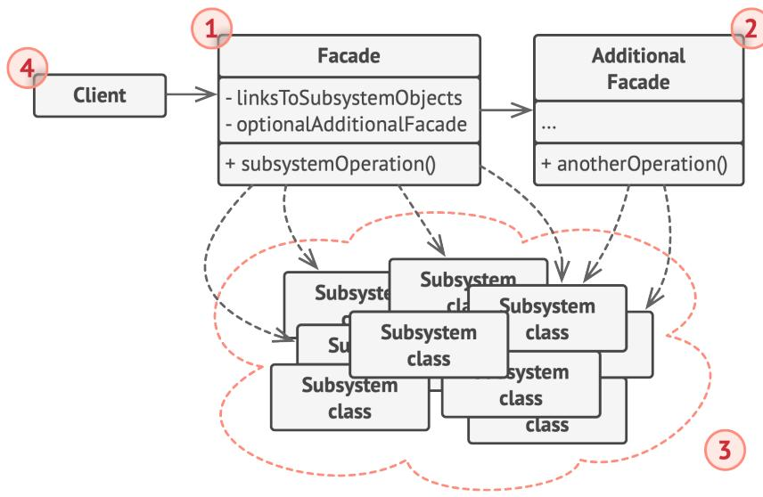

1. The Facade provides convenient access to a particular part of the subsystem's functionality. It knows where to direct the client's request and how to operate all the moving parts.

2.An Additional Facade class can be created to prevent polluting a single facade with unrelated features that might make it yet another complex structure. Additional facades can be used by both clients and other facades.

3.The Complex Subsystem consists of dozens of various objects. To make them all do something meaningful, you have to dive deep into the subsystem's implementation details, such as initializing objects in the correct order and supplying them with data in the proper format.

Subsystem classes aren't aware of the facade's existence. They operate within the system and work with each other directly.

4.The Client uses the facade instead of calling the subsystem objects directy.

# # Pseudocode

In this example, the Facade pattern simplifies interaction with a complex video conversion framework.

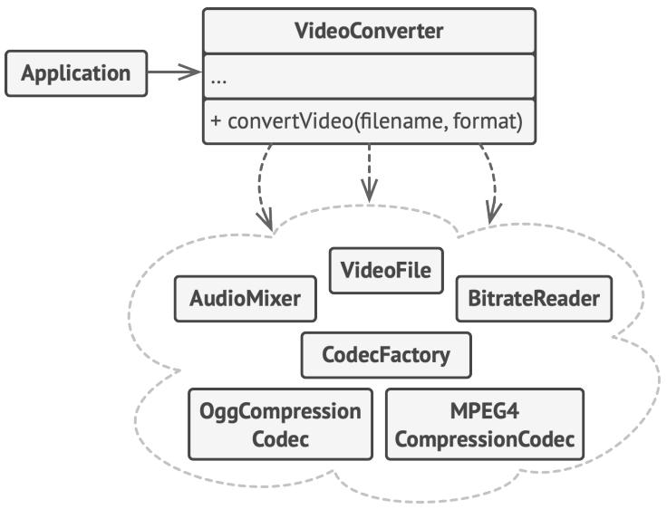  
An example of isolating multiple dependencies within a single facade class.

Instead of making your code work with dozens of the framework classes directly, you create a facade class which encapsulates that functionality and hides it from the rest of the code. This structure also helps you to minimize the effort of upgrading to future versions of the framework or replacing it with another one.The only thing you'd need to change in your app would be the implementation of the facade's methods.

/ class OggCompressionCodec   
8 / ...   
9   
10 class MPEG4CompressionCodec   
11 // ...   
12   
13 class CodecFactory   
14 / ...   
15   
16 class BitrateReader   
17 / ..   
18   
19 class AudioMixer   
20 / ..   
21   
22   
23 // We create a facade class to hide the framework's complexity   
24 // behind a simple interface. It's a trade-off between   
25 // functionality and simplicity.   
26 class VideoConverter is   
27 method convert(filename， format):File is   
28 file $=$ new VideoFile(filename)   
29 sourceCodec $=$ new CodecFactory.extract(file)   
30 if (format $= =$ "mp4")   
31 destinationCodec $=$ new MPEG4CompressionCodec $( )$   
else   
33 destinationCodec $=$ new OggCompressionCodec $( )$   
34 buffer $=$ BitrateReader.read(filename， sourceCodec)   
35 result $=$ BitrateReader.convert(buffer， destinationCodec)   
36 result $=$ (new AudioMixer()）.fix(result)   
37 return new File(result)   
38   
39 // Application classes don't depend on a billion classes   
40 // provided by the complex framework. Also，if you decide to   
41 // switch frameworks，you only need to rewrite the facade class.   
42 class Application is   
43 method main(） is   
44 convertor $=$ new VideoConverter $( )$   
45 $\mathsf { m p 4 ~ = ~ }$ convertor.convert("funny-cats-video.ogg","mp4")   
46 mp4.save()

# Applicability

Use the Facade pattern when you need to have a limited but straightforward interface to a complex subsystem.

Often,subsystems get more complex over time.Even applying design patterns typically leads to creating more classes. A subsystem may become more flexible and easier to reuse in various contexts, but the amount of configuration and boilerplate code it demands from a client grows ever larger. The Facade attempts to fix this problem by providing a shortcut to the most-used features of the subsystem which fit most client requirements.

# Use the Facade when you want to structure a subsystem into layers.

Create facades to define entry points to each level of a subsystem. You can reduce coupling between multiple subsystems by requiring them to communicate only through facades.

For example, let's return to our video conversion framework. It can be broken down into two layers: video- and audio-related. For each layer, you can create a facade and then make the classes of each layer communicate with each another via those facades. This approach looks very similar to the Mediator pattern.

# How to Implement

1.Check whether it's possible to provide a simpler interface than what an existing subsystem already provides. You're on the right track if this interface makes the client code independent from many of the subsystem's classes.

2.Declare and implement this interface in a new facade class. The facade should redirect the calls from the client code to appropriate objects of the subsystem.The facade should be responsible for initializing the subsystem and managing its further life cycle unless the client code already does this.

3.To get the full benefit from the pattern,make all the client code communicate with the subsystem only via the facade. Now the client code is protected from any changes in the subsystem code.For example,when a subsystem gets upgraded to a new version, you will only need to modify the code in the facade.

4.If the facade becomes too big, consider extracting part of its behavior to a new, refined facade class.

# Pros and Cons

You can isolate your code from the complexity of a subsystem.

A facade can become a god object coupled to all classes of an app.

# ← Relations with Other Patterns

Facade defines a new interface for existing objects,whereas Adapter tries to make the existing interface usable. Adapter usually wraps just one object,while Facade works with an entire subsystem of objects.

Abstract Factory can serve as an alternative to Facade when you only want to hide the way the subsystem objects are created from the client code.

Flyweight shows how to make lots of little objects, whereas Facade shows how to make a single object that represents an entire subsystem.

Facade and Mediator have similar jobs: they try to organize collaboration between lots of tightly coupled classes.

。Facade defines a simplified interface to a subsystem of objects, but it doesn't introduce any new functionality. The subsystem itself is unaware of the facade. Objects within the subsystem can communicate directly.

。Mediator centralizes communication between components of the system. The components only know about the mediator object and don't communicate directly.

A Facade class can often be transformed into a Singleton since a single facade object is sufficient in most cases.

Facade is similar to Proxy in that both buffer a complex entity and initialize it on its own. Unlike Facade, Proxy has the same interface as its service object, which makes them interchangeable.

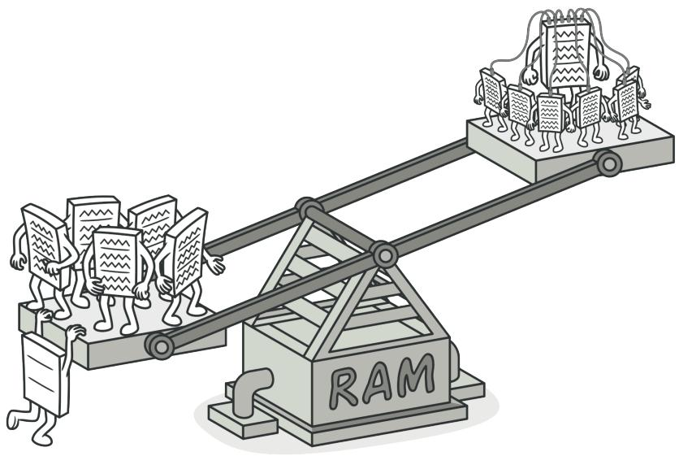

# FLYWEIGHT

Also known as: Cache

Flyweight is a structural design pattern that lets you fit more objects into the available amount of RAM by sharing common parts of state between multiple objects instead of keeping all of the data in each object.

# Problem

To have some fun after long working hours, you decided to create a simple video game: players would be moving around a map and shooting each other. You chose to implement a real-istic particle system and make it a distinctive feature of the game. Vast quantities of bullets,missiles,and shrapnel from explosions should fly all over the map and deliver a thrilling experience to the player.

Upon its completion, you pushed the last commit, built the game and sent it to your friend for a test drive. Although the game was running flawlessly on your machine,your friend wasn't able to play for long. On his computer, the game kept crashing after a few minutes of gameplay.

After spending several hours digging through debug logs, you discovered that the game crashed because of an insufficient amount of RAM. It turned out that your friend's rig Was much less powerful than your own computer, and that’s why the problem emerged so quickly on his machine.

Game Particle RAM cost   
foreach (p in particles) + particles: Particle[] + coords coords: 8B p.draw(canvas) + vector vector:16B + addParticle(particle) +speed speed:4B + draw(canvas) + color color: 4B   
${ \mathsf p } =$ nes rtictes 个 + sprite sprite:20KB $=$   
p.vector $=$ target.coords Unit + move0 \~21KB   
p.speed $=$ weaponPower + draw(canvas)   
p.color $=$ "red" $\times \ 1 , 0 0 0 , 0 0 0$   
p.sprite $=$ "bullet.jpeg"   
Game.addParticle(p) + fireAt(target: Unit) 21GB

The actual problem was related to your particle system. Each particle, such as a bullet, a missile or a piece of shrapnel was represented by a separate object containing plenty of data. At some point,when the carnage on a player's screen reached its climax, newly created particles no longer fit into the remaining RAM, so the program crashed.

# Solution

On closer inspection of the Particle class, you may notice that the color and sprite fields consume a lot more memory than other fields.What's worse is that these two fields store almost identical data across all particles. For example,all bullets have the same color and sprite.

Unique (extrinsic) state Repeating (intrinsic) state (mutable) (immutable) Particle MovingParticle Particle   
+ coords   
+vector - particle - color   
+speed - coords Lots - sprite   
+ color - vector $^ +$ Particle(color, sprite)   
+ sprite - speed Few+ move(coords,vectorspeed) + MovingParticle(..) + draw(coords,canvas)   
+ mraw(canvas) + mraw(canvas) . 4 particle.move( particle.draw( coords,vector,speed) coords,canvas)

Other parts of a particle's state, such as coordinates,movement vector and speed,are unique to each particle. After all, the values of these fields change over time. This data represents the always changing context in which the particle exists, while the color and sprite remain constant for each particle.

This constant data of an object is usually called the intrinsic state. It lives within the object; other objects can only read it, not change it.The rest of the object's state,often altered“from the outside”by other objects,is called the extrinsic state.

The Flyweight pattern suggests that you stop storing the extrinsic state inside the object. Instead, you should pass this state to specific methods which rely on it. Only the intrinsic state stays within the object, letting you reuse it in different contexts.

Game Particle   
F mps: MovingParticles[] -color   
: particles: Particle[] - sprite   
F addParticle(coords,vector, $^ +$ Particle(color, sprite)   
speed, color,sprite) + move(coords,vector,speed)   
draw(canvas) + draw(coords,canvas) Unit MovingParticle - particle ： - coords   
+ fireAt(target: Unit) -vector ： - speed Game.addParticle(coords, + MovingParticle(.) target.coords,weaponPower, + move() "red”,"bullet.jpeg") + draw(canvas) RAM cost coords: 8B vector: 16B ×1 color: 4B speed: 4B {'> × 1,000,000 sprite: 20KB particle: 4B 111 11 32MB \~ 21KB L> = 32B

As a result, you'd need fewer of these objects since they only differ in the intrinsic state,which has much fewer variations than the extrinsic.

Let's return to our game. Assuming that we had extracted the extrinsic state from our particle class,only three different objects would suffice to represent all particles in the game: a bullet,a missile,and a piece of shrapnel. As you've probably guessed by now, an object that only stores the intrinsic state is called a flyweight.

# Extrinsic state storage

Where does the extrinsic state move to? Some class should still store it, right? In most cases, it gets moved to the container object,which aggregates objects before we apply the pattern.

In our case, that's the main Game object that stores all particles in the particles field.To move the extrinsic state into this class, you need to create several array fields for storing coordinates,vectors,and speed of each individual particle. But that's not all. You need another array for storing references to a specific flyweight that represents a particle. These arrays must be in sync so that you can access all data of a particle using the same index.

Game Game Game + coords - particles: Particle[] +vectors -mps:Movinatatltes + addParticle(particle) + references + addParticle(coordsvector, + draw(canvas) + particles: Particle[] speed, color,sprite): Particle + addParticle(particle) + draw(canvas) + draw(canvas) foreach (p in mps) p.draw(canvas)   
1.Go over the particlesarrayand tryto find an existing particle with the given color and sprite.If there's none then create a new one.   
2. Create a moving particle with given data and the particle object from the first step.

A more elegant solution is to create a separate context class that would store the extrinsic state along with reference to the flyweight object. This approach would require having just a single array in the container class.

Wait a second! Won't we need to have as many of these con-textual objects as we had at the very beginning? Technically, yes.But the thing is, these objects are much smaller than before.The most memory-consuming fields have been moved to just a few flyweight objects. Now, a thousand small contextual objects can reuse a single heavy flyweight object instead of storing a thousand copies of its data.

# Flyweight and immutability

Since the same flyweight object can be used in different contexts,you have to make sure that its state can't be modified. A flyweight should initialize its state just once, via constructor

parameters. It shouldn't expose any setters or public fields to other objects.

# Flyweight factory

For more convenient access to various flyweights,you can create a factory method that manages a pool of existing flyweight objects. The method accepts the intrinsic state of the desired flyweight from a client,looks for an existing flyweight object matching this state,and returns it if it was found. If not, it creates a new flyweight and adds it to the pool.

There are several options where this method could be placed. The most obvious place is a flyweight container. Alternatively you could create a new factory class. Or you could make the factory method static and put it inside an actual flyweight class.

# Structure

FlyweightFactory Client ③   
- cache: Flyweight[]   
+ getFlyweight(repeatingState) 1 ③ if (cache[repeatingState] $= =$ null){ 4 Context cache[repeatingState] $=$ new Flyweight(repeatingState) -uniqueState } -flyweight return cache[repeatingState] +Context(repeatingState,uniqueState) + operation0 o ② = this.uniqueState $=$ uniqueState Flyweight this.flyweight $=$ factory.getFlyweight(repeatingState) ?   
- repeatingState   
+ operation(uniqueState) flyweight.operation(uniqueState)

1.The Flyweight pattern is merely an optimization. Before applying it,make sure your program does have the RAM consumption problem related to having a massive number of similar objects in memory at the same time.Make sure that this problem can't be solved in any other meaningful way.

2.The Flyweight class contains the portion of the original object's state that can be shared between multiple objects. The same flyweight object can be used in many different contexts. The state stored inside a flyweight is called intrinsic. The state passed to the flyweight's methods is called extrinsic.

3.The Context class contains the extrinsic state, unique across all original objects.When a context is paired with one of the flyweight objects,it represents the full state of the original object.

4.Usually, the behavior of the original object remains in the flyweight class. In this case,whoever calls a flyweight's method must also pass appropriate bits of the extrinsic state into the method's parameters. On the other hand, the behavior can be moved to the context class,which would use the linked flyweight merely as a data object.

5.The Client calculates or stores the extrinsic state of flyweights. From the client's perspective,a flyweight is a template object which can be configured at runtime by passing some contextual data into parameters of its methods.

6.The Flyweight Factory manages a pool of existing flyweights. With the factory， clients don't create flyweights directly. Instead, they call the factory， passing it bits of the intrinsic state of the desired flyweight. The factory looks over previously created flyweights and either returns an existing one that matches search criteria or creates a new one if nothing is found.

# # Pseudocode

In this example,the Flyweight pattern helps to reduce memory usage when rendering millions of tree objects on a canvas.

Forest TreeFactory + trees: Tree[] - tree Types: TreeType[] + plantTree(x,y, name, color, + getTreeType(name, color, texture) texture): Tree + draw(canvas) V TreeType Tree - name - color +x - texture +y + type: Tree Type $^ +$ TreeType(name, color,texture) + draw(canvas, x, y) + draw(canvas)

The pattern extracts the repeating intrinsic state from a main Tree class and moves it into the flyweight class TreeType .

Now instead of storing the same data in multiple objects, it's kept in just a few flyweight objects and linked to appropriate Tree objects which act as contexts.The client code creates new tree objects using the flyweight factory，which encapsulates the complexity of searching for the right object and reusing it if needed.

1 // The flyweight class contains a portion of the state of a   
2 // tree. These fields store values that are unique for each   
3 // particular tree. For instance， you won't find here the tree   
4 // coordinates. But the texture and colors shared between many   
5 // trees are here. Since this data is usually BIG， you'd waste a   
6 // lot of memory by keeping it in each tree object. Instead，we   
7 // can extract texture， color and other repeating data into a   
8 // separate object which lots of individual tree objects can   
9 // reference.   
10 class TreeType is   
11 field name   
12 field color   
13 field texture   
14 constructor TreeType(name， color， texture）{ .. }   
15 method draw(canvas，x， y） is   
16 // 1.Create a bitmap of a given type， color & texture.   
17 // 2. Draw the bitmap on the canvas at X and Y coords.   
18   
19 // Flyweight factory decides whether to re-use existing   
20 // flyweight or to create a new object.   
21 class TreeFactory is   
22 static field treeTypes: collection of tree types   
23 static method getTreeType(name，color， texture） is   
24 type $=$ treeTypes.find(name，color， texture)   
25 if ( $\mathtt { t y p e \ = = \ n u l l ) }$   
26 type $=$ new TreeType(name， color， texture)   
27 treeTypes.add(type)   
28 return type   
29   
30 // The contextual object contains the extrinsic part of the trei   
31 // state. An application can create billions of these since the!   
32 // are pretty small: just two integer coordinates and one   
33 // reference field.   
34 class Tree is   
35 field x,y   
36 field type: TreeType   
37 constructor Tree(x，y， type） { ... }   
38 method draw(canvas） is   
39 type.draw(canvas, this.x， this.y)   
40   
41 // The Tree and the Forest classes are the flyweight's clients.   
42 // You can merge them if you don't plan to develop the Tree   
43 // class any further.   
44 class Forest is   
45 field trees: collection of Trees   
46   
47 method plantTree $( \textsf { x } , \textsf { y }$ ，name，color，texture）is   
48 type $=$ TreeFactory.getTreeType(name， color， texture)   
49 tree $=$ new Tree(x，y， type)   
50 trees.add(tree)   
51   
52 method draw(canvas） is   
53 foreach (tree in trees） do   
54 tree.draw(canvas)

# Applicability

Use the Flyweight pattern only when your program must sup-port a huge number of objects which barely fit into available RAM.

The beneft of applying the pattern depends heavily on how and where it's used. It's most useful when:

an application needs to spawn a huge number of similar   
objects   
this drains all available RAM on a target device   
the objects contain duplicate states which can be extracted   
and shared between multiple objects

# How to Implement

1.Divide fields of a class that will become a flyweight into two parts:

。 the intrinsic state: the fields that contain unchanging data duplicated across many objects   
。 the extrinsic state: the fields that contain contextual data unique to each object

2.Leave the fields that represent the intrinsic state in the class, but make sure they're immutable. They should take their initial values only inside the constructor.

3.Go over methods that use fields of the extrinsic state.For each field used in the method, introduce a new parameter and use it instead of the field.

4.Optionally， create a factory class to manage the pool of flyweights. It should check for an existing flyweight before creating a new one.Once the factory is in place, clients must only request flyweights through it. They should describe the desired flyweight by passing its intrinsic state to the factory.

5.The client must store or calculate values of the extrinsic state (context) to be able to call methods of flyweight objects.For the sake of convenience, the extrinsic state along with the flyweight-referencing field may be moved to a separate context class.

# Pros and Cons

You can save lots of RAM,assuming your program has tons of similar objects.

You might be trading RAM over CPU cycles when some of the context data needs to be recalculated each time somebody calls a flyweight method.

XThe code becomes much more complicated. New team members will always be wondering why the state of an entity was separated in such a way.

# ← Relations with Other Patterns

You can implement shared leaf nodes of the Composite tree as Flyweights to save some RAM.

Flyweight shows how to make lots of litte objects, whereas Facade shows how to make a single object that represents an entire subsystem.

Flyweight would resemble Singleton if you somehow managed to reduce all shared states of the objects to just one flyweight object. But there are two fundamental differences between these patterns:

1. There should be only one Singleton instance,whereas a Flyweight class can have multiple instances with different intrinsic states.

2.The Singleton object can be mutable. Flyweight objects are immutable.

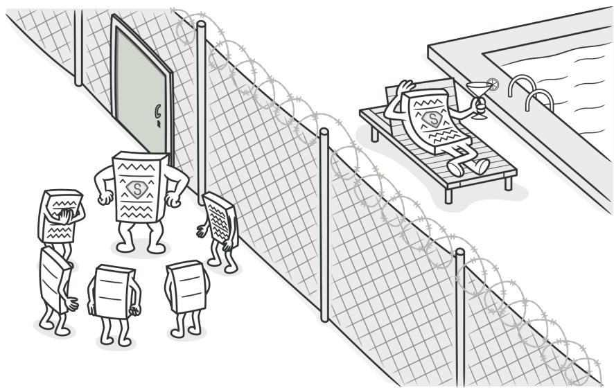  
PROXY

Proxy is a structural design pattern that lets you provide a substitute or placeholder for another object. A proxy controls access to the original object，allowing you to perform Something either before or after the request gets through to the original object.

# Problem

Why would you want to control access to an object? Here is an example: you have a massive object that consumes a vast amount of system resources. You need it from time to time, but not always.

$$
\frac { \frac { ( C l i e n t ) } { C l i e n t } \sim N M \sim N M N } { C l i e n t } \sim \frac { \frac { C l . 0 A l s t s } { D l i e n t } } { C l i e n t }
$$

Database queries can be really slow.

You could implement lazy initialization: create this object only when it's actually needed. All of the object's clients would need to execute some deferred initialization code. Unfortunately, this would probably cause a lot of code duplication.

In an ideal world, we'd want to put this code directly into our object's class,but that isn't always possible.For instance, the class may be part of a closed 3rd-party library.

# Solution

The Proxy pattern suggests that you create a new proxy class with the same interface as an original service object. Then you update your app so that it passes the proxy object to all of the

original object's clients. Upon receiving a request from a client, the proxy creates a real service object and delegates all the work to it.

$$
\frac { \frac { 1 \div \cdots - 3 } { a } } { \frac { c ( 1 + n + 1 ) } { c ( 1 + n + 1 ) } } \Leftrightarrow \frac { 1 } { 1 } \Rightarrow \frac { 1 } { 1 } \langle M \rangle > \frac { \displaystyle \sum \limits _ { i = 1 } ^ { \infty } \frac { 1 } { \equiv a } } { \equiv \equiv \frac { 1 } { \equiv a } }
$$

The proxy disguises itself as a database object. It can handle lazy initialization and result caching without the client or the real database object even knowing.

But what's the benefit? If you need to execute something either before or after the primary logic of the class,the proxy lets you do this without changing that class. Since the proxy implements the same interface as the original class,it can be passed to any client that expects a real service object.

# Real-World Analogy

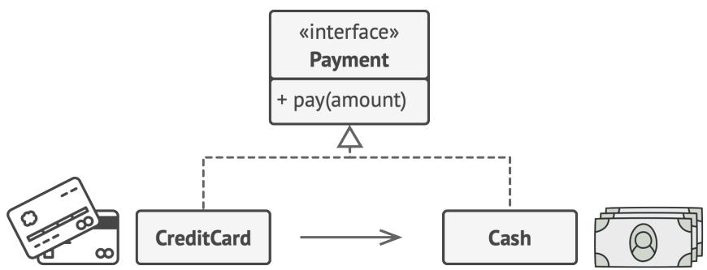

Credit cards can be used for payments just the same as cash.

A credit card is a proxy for a bank account,which is a proxy for a bundle of cash. Both implement the same interface: they can be used for making a payment. A consumer feels great because there's no need to carry loads of cash around. A shop owner is also happy since the income from a transaction gets added electronically to the shop's bank account without the risk of losing the deposit or getting robbed on the way to the bank.

# Structure

4 《interface> ① Client Servicelnterface + operation0 4   
③ ② Proxy Service - realService: Service   
+ Proxy(s: Service) 。 + operation0   
+ checkAccess()   
+ operation0 realService = s   
if (checkAccess0){ realService.operation()   
}

1.The Service Interface declares the interface of the Service. The proxy must follow this interface to be able to disguise itself as a service object.

2.The Service is a class that provides some useful business logic.

3.The Proxy class has a reference field that points to a service object. After the proxy finishes its processing (e.g.， lazy initialization, logging,access control, caching,etc.), it passes the request to the service object. Usually, proxies manage the full lifecycle of their service objects.

4.The Client should work with both services and proxies via the same interface.This way you can pass a proxy into any code that expects a service object.

# # Pseudocode

This example illustrates how the Proxy pattern can help to introduce lazy initialization and caching to a 3rd-party YouTube integration library.

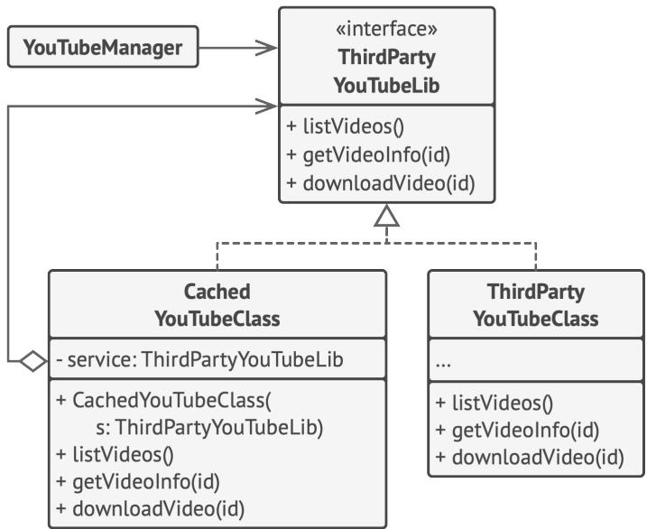  
Caching results of a service with a proxy.

The library provides us with the video downloading class. However, it's very inefficient. If the client application requests the same video multiple times, the library just downloads it over and over, instead of caching and reusing the first downloaded file.

The proxy class implements the same interface as the original downloader and delegates it all the work. However, it keeps track of the downloaded files and returns the cached result when the app requests the same video multiple times.

1 // The interface of a remote service. 2 interface ThirdPartyYouTubeLib is 3 method listVideos() 4 method getVideoInfo(id) 5 method downloadVideo(id) 6 7 // The concrete implementation of a service connector. Methods   
8 // of this class can request information from YouTube. The speed   
9 // of the request depends on a user's internet connection as   
10 // well as YouTube's. The application will slow down if a lot of   
11 // requests are fired at the same time，even if they all request   
12 // the same information.   
13 class ThirdPartyYouTubeClass implements ThirdPartyYouTubeLib is   
14 method listVideos(） is   
15 // Send an API request to YouTube.   
16   
17 method getVideoInfo(id） is   
18 // Get metadata about some video.   
19

20 method downloadVideo(id） is   
21 // Download a video file from YouTube.   
22   
23 // To save some bandwidth，we can cache request results and keep   
24 // them for some time. But it may be impossible to put such code   
25 // directly into the service class. For example，it could have   
26 // been provided as part of a third party library and/or defined   
27 // as \`final\`. That's why we put the caching code into a new   
28 // proxy class which implements the same interface as the   
29 // service class. It delegates to the service object only when   
30 // the real requests have to be sent.   
class CachedYouTubeClass implements ThirdPartyYouTubeLib is   
32 private field service: ThirdPartyYouTubeLib   
33 private field listCache，videoCache   
34 field needReset   
35   
36 constructor CachedYouTubeClass(service: ThirdPartyYouTubeLib） is   
37 this.service $=$ service   
39 method listVideos(） is   
40 if （listCache $= =$ null |l needReset)   
41 listCache $=$ service.listVideos()   
42 return listCache   
43   
44 method getVideoInfo(id） is   
45 if (videoCache $= =$ null |l needReset)   
46 videoCache $=$ service.getVideoInfo(id)   
47 return videoCache   
48   
49 method downloadVideo(id） is   
50 if（!downloadExists(id） Il needReset)   
51 service.downloadVideo(id)   
52 // The GUI class，which used to work directly with a service   
53 // object， stays unchanged as long as it works with the servii   
54 // object through an interface.We can safely pass a proxy   
55 // object instead of a real service object since they both   
56 // implement the same interface.   
57 class YouTubeManager is   
58 protected field service: ThirdPartyYouTubeLib   
59   
60 constructor YouTubeManager(service: ThirdPartyYouTubeLib) i！   
61 this.service $=$ service   
62   
63 method renderVideoPage(id） is   
64 info $=$ service.getVideoInfo(id)   
65 // Render the video page.   
66   
67 method renderListPanel $( )$ is   
68 list $=$ service.listVideos $( )$   
69 // Render the list of video thumbnails.   
70   
71 method reactOnUserInput $( )$ is   
72 renderVideoPage()   
73 renderListPanel()   
74   
75 // The application can configure proxies on the fly.   
76 class Application is   
77 method init(） is   
78 aYouTubeService $=$ new ThirdPartyYouTubeClass $( )$   
79 aYouTubeProxy $=$ new CachedYouTubeClass(aYouTubeService)   
80 manager $=$ new YouTubeManager(aYouTubeProxy)   
81 manager.reactonUserInput()

# Applicability

There are dozens of ways to utilize the Proxy pattern. Let's go over the most popular uses.

Lazy initialization (virtual proxy).This is when you have a heavyweight service object that wastes system resources by being always up,even though you only need it from time to time.

Instead of creating the object when the app launches, you can delay the object's initialization to a time when it's really needed.

Acces control (protection proxy).This is when you want only specific clients to be able to use the service object; for instance, when your objects are crucial parts of an operating system and clients are various launched applications (including malicious ones).

Theproxycanpasstherequesttotheserviceobjectonlyifthe client's credentials match some criteria.

Local execution of a remote service (remote proxy). This is when the service object is located on a remote server.

In this case,the proxypasses theclient request over the network,handling all of the nasty details of working with the network.

Logging requests (logging proxy). This is when you want to keep a history of requests to the service object.

The proxy can log each request before passing it to the service.

Caching request results (caching proxy).This is when you need to cache results of client requests and manage the life cycle of this cache, especially if results are quite large.

The proxy can implement caching for recuring requests that always yield the same results. The proxy may use the parameters of requests as the cache keys.

Smart reference. This is when you need to be able to dismiss a heavyweight object once there are no clients that use it.

The proxy can keep track of clients that obtained a reference to the service object or its results.From time to time, the proxy may go over the clients and check whether they are still active. If the client list gets empty,the proxy might dismiss the service object and free the underlying system resources.

The proxy can also track whether the client had modified the service object.Then the unchanged objects may be reused by other clients.

# How to Implement

1.If there's no pre-existing service interface, create one to make proxy and service objects interchangeable. Extracting the interface from the service class isn't always possible, because you'd need to change all of the service's clients to use that interface. Plan B is to make the proxy a subclass of the service class,and this way it'll inherit the interface of the service.

2.Create the proxy class. It should have a field for storing a reference to the service. Usually, proxies create and manage the whole life cycle of their services. On rare occasions,a service is passed to the proxy via a constructor by the client.

3.Implement the proxy methods according to their purposes. In most cases,after doing some work, the proxy should delegate the work to the service object.

4.Consider introducing a creation method that decides whether the client gets a proxy or a real service. This can be a simple static method in the proxy class or a full-blown factory method.

5.Consider implementing lazy initialization for the service object.

# Pros and Cons

You can control the service object without clients knowing about it.

You can manage the lifecycle of the service object when clients don't care about it.

The proxy works even if the service object isn't ready or is not available.

Open/Closed Principle.You can introduce new proxies without changing the service or clients.

The code may become more complicated since you need to introduce a lot of new classes.

XThe response from the service might get delayed.

# Relations with Other Patterns

Adapter provides a different interface to the wrapped object, Proxy provides it with the same interface,and Decorator provides it with an enhanced interface.

Facade is similar to Proxy in that both buffer a complex entity and initialize it on its own. Unlike Facade, Proxy has the same interface as its service object, which makes them interchangeable.

Decorator and Proxy have similar structures,but very different intents.Both patterns are built on the composition principle, where one object is supposed to delegate some of the work to another. The difference is that a Proxy usually manages the life cycle of its service object on its own,whereas the composition of Decorators is always controlled by the client.

# Behavioral Design Patterns

Behavioral patterns are concerned with algorithms and the assignment of responsibilities between objects.

# Chain of CIHIO Responsibility

Lets you pass requests along a chain of handlers. Upon receiving a request,each handler decides either to process the request or to pass it to the next handler in the chain.

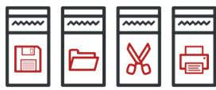

# Command

Turns a request into a stand-alone object that contains all information about the request. This transformation lets you pass requests as a method arguments, delay or queue a request's execution,and support undoable operations.

# Iterator

Lets you traverse elements of a collection without exposing its underlying representation (list, stack, tree, etc.).

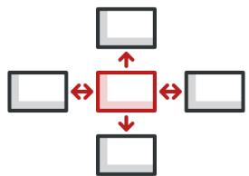

# Mediator

Lets you reduce chaotic dependencies between objects.The pattern restricts direct communications between the objects and forces them to collaborate only via a mediator object.

日

# Memento

Lets you save and restore the previous state of an object without revealing the details of its implementation.

# Observer

Lets you define a subscription mechanism to notify multiple objects about any events that happen to the object they're observing.

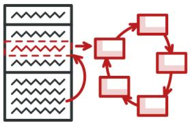

# State

Lets an object alter its behavior when its internal state changes.   
It appears as if the object changed its class.

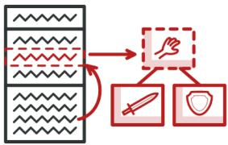

Strategy

Lets you define a family of algorithms,put each of them into a separate class,and make their objects interchangeable.

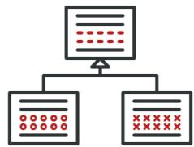

# Template Method

Defines the skeleton of an algorithm in the superclass but lets subclasses override specific steps of the algorithm without changing its structure.

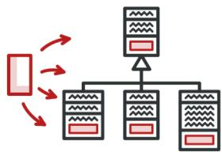

# Visitor

Lets you separate algorithms from the objects on which they operate.

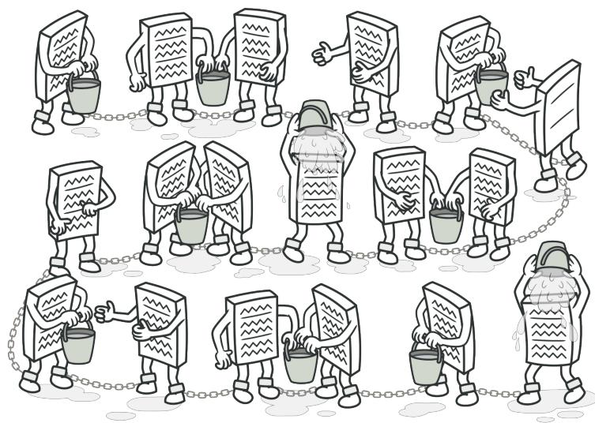

# CHAIN OF RESPONSIBILITY

Also known as: CoR, Chain of Command

Chain of Responsibility is a behavioral design pattern that lets you pass requests along a chain of handlers. Upon receiving a request, each handler decides either to process the request or to pass it to the next handler in the chain.

# Problem

Imagine that you're working on an online ordering system. You want to restrict access to the system so only authenticated users can create orders.Also,users who have administrative permissions must have full access to all orders.

After a bit of planning,you realized that these checks must be performed sequentially. The application can attempt to authenticate a user to the system whenever it receives a request that contains the user's credentials. However, if those credentials aren't correct and authentication fails, there's no reason to proceed with any other checks.

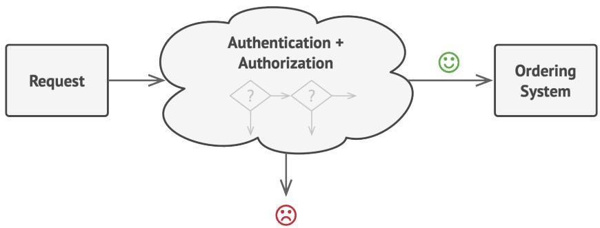

The request must pass a series of checks before the ordering system itself can handle it.

During the next few months, you implemented several more of those sequential checks.

One of your colleagues suggested that it's unsafe to pass raw data straight to the ordering system. So you added an extra validation step to sanitize the data in a request.

Later, somebody noticed that the system is vulnerable to brute force password cracking. To negate this,you promptly added a check that filters repeated failed requests coming from the same IP address.

Someone else suggested that you could speed up the system by returning cached results on repeated requests containing the same data. Hence, you added another check which lets the request pass through to the system only if there's no suitable cached response.

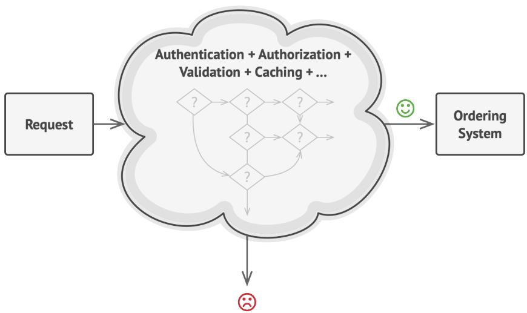  
The bigger the code grew, the messier it became.

The code of the checks,which had already looked like a mess, became more and more bloated as you added each new feature. Changing one check sometimes affected the others. Worst of all, when you tried to reuse the checks to protect other components of the system, you had to duplicate some of the code since those components required some of the checks, but not all of them.

The system became very hard to comprehend and expensive to maintain. You struggled with the code for a while,until one day you decided to refactor the whole thing.

# Solution

Like many other behavioral design patterns, the Chain of Responsibility relies on transforming particular behaviors into stand-alone objects called handlers. In our case,each check should be extracted to its own class with a single method that performs the check.The request,along with its data, is passed to this method as an argument.

The pattern suggests that you link these handlers into a chain. Each linked handler has a field for storing a reference to the next handler in the chain.In addition to processing a request, handlers pass the request further along the chain. The request travels along the chain until all handlers have had a chance to process it.

Here's the best part: a handler can decide not to pass the request further down the chain and effectively stop any further processing.

In our example with ordering systems,a handler performs the processing and then decides whether to pass the request further down the chain. Assuming the request contains the right data,all the handlers can execute their primary behavior, whether it's authentication checks or caching.

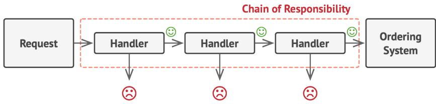  
Handlers are lined up one by one,forming a chain.

However, there's a slightly different approach (and it's a bit more canonical) in which,upon receiving a request,a handler decides whether it can process it. If it can, it doesn't pass the request any further. So it's either only one handler that processes the request or none at all. This approach is very common when dealing with events in stacks of elements within a graphical user interface.

For instance, when a user clicks a button,the event propagates through the chain of GUl elements that starts with the button, goes along its containers (like forms or panels),and ends up with the main application window. The event is processed by the first element in the chain that's capable of handling it.This example is also noteworthy because it shows that a chain can always be extracted from an object tree.

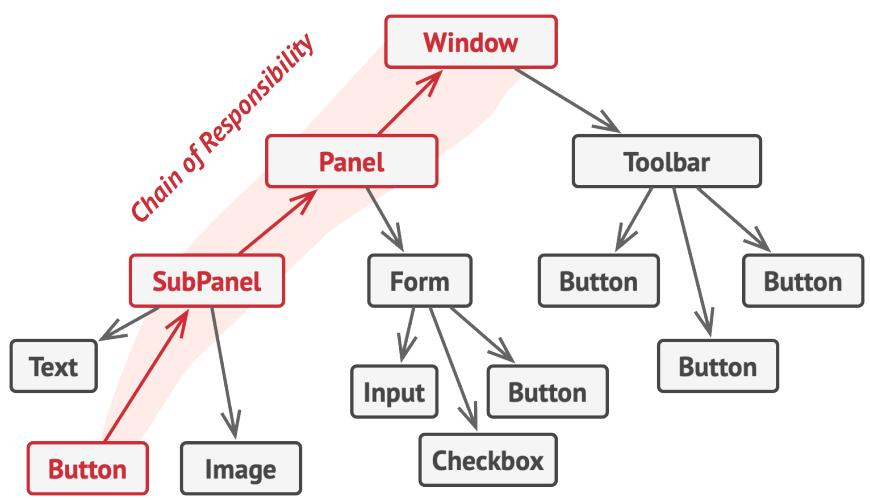  
A chain can be formed from a branch of an object tree.

It's crucial that all handler classes implement the same interface.Each concrete handler should only care about the following one having the execute method. This way you can compose chains at runtime,using various handlers without coupling your code to their concrete classes.

# Real-World Analogy

You've just bought and installed a new piece of hardware on your computer. Since you're a geek, the computer has several operating systems installed. You try to boot all of them to see whether the hardware is supported.Windows detects and enables the hardware automatically. However, your beloved Linux refuses to work with the new hardware.With a small flicker of hope，you decide to call the tech-support phone number written on the box.

The first thing you hear is the robotic voice of the autoresponder. It suggests nine popular solutions to various problems, none of which are relevant to your case.After a while,the robot connects you to a live operator.

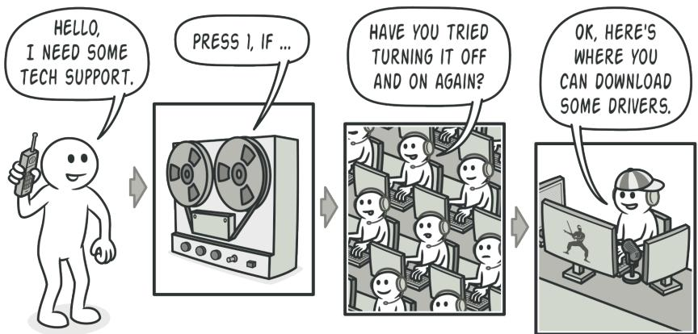  
A call to tech support can go through multiple operators.

Alas, the operator isn't able to suggest anything specific either. He keeps quoting lengthy excerpts from the manual, refusing to listen to your comments. After hearing the phrase“have you tried turning the computer off and on again?” for the 10th time, you demand to be connected to a proper engineer.

Eventually, the operator passes your call to one of the engineers,who had probably longed for a live human chat for hours as he sat in his lonely server room in the dark basement of some office building.The engineer tells you where to download proper drivers for your new hardware and how to install them on Linux. Finally, the solution! You end the call,bursting with joy.

# Structure

4 《interface》 Client Handler + setNext(h: Handler) $\mathsf { h } \mathsf { 1 } =$ new HandlerA( + handle(request) ${ \mathsf { h } } 2 =$ new HandlerB( △ $\mathsf { h } \mathsf { 3 } =$ new HandlerC( 2 h1.setNext(h2) h2.setNext(h3) BaseHandler //... □ - next: Handler h1.handle(request) $^ +$ setNext(h: Handler) if (next != nult) + handle(request) o- - next.handle(request) 3 全 ConcreteHandlers if (canHandle(request)) { //.. }else { + handle(request) parent:handle(request) }

1.The Handler declares the interface,common for all concrete handlers. It usually contains just a single method for handling requests, but sometimes it may also have another method for setting the next handler on the chain.

2.The Base Handler is an optional class where you can put the boilerplate code that's common to all handler classes.

Usually, this class defines a field for storing a reference to the next handler. The clients can build a chain by passing a handler to the constructor or setter of the previous handler. The class may also implement the default handling behavior: it can pass execution to the next handler after checking for its existence.

3. Concrete Handlers contain the actual code for processing requests. Upon receiving a request, each handler must decide whether to process it and,additionally， whether to pass it along the chain.

Handlers are usually self-contained and immutable,accepting all necessary data just once via the constructor.

4.The Client may compose chains just once or compose them dynamically, depending on the application's logic. Note that a request can be sent to any handler in the chain-it doesn't have to be the first one.

# # Pseudocode

In this example, the Chain of Responsibility pattern is responsible for displaying contextual help information for active GUl elements.

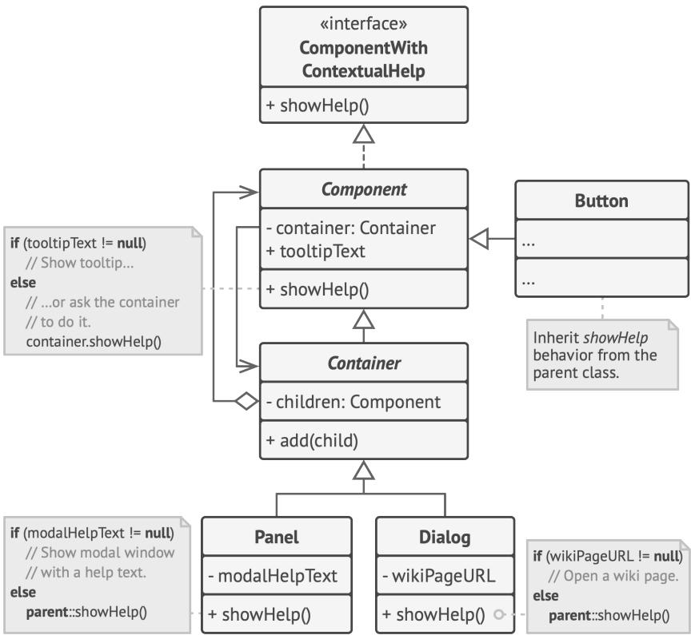  
The GUl classes are built with the Composite pattern. Each element is linked to its container element. At any point, you can build a chain of elements that starts with the element itself and goes through all of its containerelements.

The application's GUl is usually structured as an object tree. For example, the Dialog class,which renders the main window of the app, would be the root of the object tree. The dialog contains Panels ，which might contain other panels or Simple low-level elements like Buttons and TextFields .

A simple component can show brief contextual tooltips,as long as the component has some help text assigned. But more complex components define their own way of showing contextual help, such as showing an excerpt from the manual or opening a page in a browser.

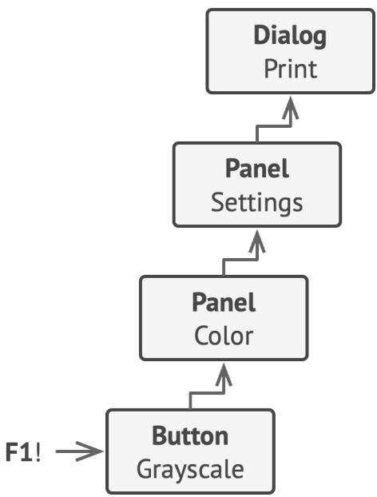  
That's how a help request traverses GUl objects.

When a user points the mouse cursor at an element and presses the F1 key, the application detects the component under the pointer and sends it a help request. The request bubbles up through all the element's containers until it reaches the element that's capable of displaying the help information.

1 // The handler interface declares a method for building a cl   
2 // of handlers. It also declares a method for executing a   
3 // request.   
4 interface ComponentWithContextualHelp is   
5 method showHelp $( )$   
6   
7   
8 // The base class for simple components.   
9 abstract class Component implements ComponentWithContextuall   
10 field tooltipText: string   
11   
12 // The component's container acts as the next link in the   
13 // chain of handlers.   
14 protected field container: Container   
15   
16 // The component shows a tooltip if there's help text   
17 // assigned to it. Otherwise it forwards the call to the   
18 // container，if it exists.   
19 method showHelp $( )$ is   
20 if （tooltipText $! =$ nult)   
21 // Show tooltip.   
22 else   
23 container.showHelp $( )$   
24   
25   
26 // Containers can contain both simple components and other   
27 // containers as children. The chain relationships are   
28 // established here. The class inherits showHelp behavior fi   
29 // its parent.   
30 abstract class Container extends Component is   
31 protected field children: array of Component   
32   
33 method add(child） is   
34 children.add(child)   
35 child.container $=$ this   
36   
37   
38 // Primitive components may be fine with default help   
39 // implementation...   
40 class Button extends Component is   
41 / .   
42   
43 // But complex components may override the default   
44 // implementation. If the help text can't be provided in a new   
45 // way， the component can always call the base implementation   
46 // (see Component class).   
47 class Panel extends Container is   
48 field modalHelpText: string   
49   
50 method showHelp $( )$ is   
51 if （modalHelpText $! =$ null)   
52 // Show a modal window with the help text.   
53 else   
54 super.showHelp()   
55   
56 // ...same as above...   
57 class Dialog extends Container is   
58 field wikiPageURL: string   
59   
60 method showHelp $( )$ is   
61 if (wikiPageURL $\overset { \vartriangle } { \cdot } =$ null)   
62 // Open the wiki help page.   
63 else   
64 super.showHelp()   
65 // Client code.   
66 class Application is   
67 // Every application configures the chain different   
68 method createUI(） is   
69 dialog $=$ new Dialog("Budget Reports")   
70 dialog.wikiPageURL $=$ "http://..."   
71 panel $=$ new Panel(0，0，400，800)   
72 panel.modalHelpText $=$ "This panel does...   
73 ok $=$ new Button(250，760，50，20，"0K")   
74 ok.tooltipText $=$ "This is an OK button that..."   
75 cancel $=$ new Button(320，760，50，20，"Cancel")   
76 /   
77 panel.add(ok)   
78 panel.add(cancel)   
79 dialog.add(panel)   
80   
81 // Imagine what happens here.   
82 method onF1KeyPress $( )$ is   
83 component $=$ this.getComponentAtMouseCoords $( )$   
84 component.showHelp $( )$

# Applicability

Use the Chain of Responsibility pattern when your program is expected to process different kinds of requests in various ways, but the exact types of requests and their sequences are unknown beforehand.

The pattern lets youlink several handlers intoone chain and, upon receiving a request,“ask”each handler whether it can process it. This way all handlers get a chance to process the request.

Use the pattern when it's essential to execute several handlers in a particular order.

Since youcanlinkthe handlers in thechain inanyorder,all requests will get through the chain exactly as you planned.

Use the CoR pattern when the set of handlers and their order are supposed to change at runtime.

If you provide setters for areference field inside the handler classes, you'll be able to insert,remove or reorder handlers dynamically.

# How to Implement

1.Declare the handler interface and describe the signature of a method for handling requests.

Decide how the client will pass the request data into the method. The most flexible way is to convert the request into an object and pass it to the handling method as an argument.

2.To eliminate duplicate boilerplate code in concrete handlers, it might be worth creating an abstract base handler class, derived from the handler interface.

This class should have a field for storing a reference to the next handler in the chain. Consider making the class immutable. However, if you plan to modify chains at runtime, you need to define a setter for altering the value of the reference field.

You can also implement the convenient default behavior for the handling method,which is to forward the request to the next object unless there's none left. Concrete handlers will be able to use this behavior by calling the parent method.

3.One by one create concrete handler subclasses and implement their handling methods. Each handler should make two decisions when receiving a request:

。 Whether it'll process the request.   
。 Whether it'll pass the request along the chain.

4.The client may either assemble chains on its own or receive pre-built chains from other objects.In the latter case,you must implement some factory classes to build chains according to the configuration or environment settings.

5.The client may trigger any handler in the chain, not just the first one. The request will be passed along the chain until some handler refuses to pass it further or until it reaches the end of the chain.

6.Due to the dynamic nature of the chain,the client should be ready to handle the following scenarios:

。The chain may consist of a single link.   
。 Some requests may not reach the end of the chain.   
。 Others may reach the end of the chain unhandled.

# Pros and Cons

You can control the order of request handling.

Single Responsibility Principle. You can decouple classes that invoke operations from classes that perform operations.

Open/Closed Principle. You can introduce new handlers into the app without breaking the existing client code.

XSome requests may end up unhandled.

# Relations with Other Patterns

Chain of Responsibility， Command， Mediator and Observer address various ways of connecting senders and receivers of requests:

。 Chain of Responsibility passes a request sequentially along a dynamic chain of potential receivers until one of them handles it.

。Command establishes unidirectional connections between senders and receivers.

。Mediator eliminates direct connections between senders and receivers, forcing them to communicate indirectly via a mediator object.

。Observer lets receivers dynamically subscribe to and unsubscribe from receiving requests.

Chain of Responsibility is often used in conjunction with Composite. In this case,when a leaf component gets a request, it may pass it through the chain of all of the parent components down to the root of the object tree.

Handlers in Chain of Responsibility can be implemented as Commands. In this case,you can execute a lot of different operations over the same context object,represented by a request.

However, there's another approach,where the request itself is a Command object.In this case,you can execute the same operation in a series of different contexts linked into a chain.

Chain of Responsibility and Decorator have very similar class structures. Both patterns rely on recursive composition to pass the execution through a series of objects. However, there are several crucial differences.

The CoR handlers can execute arbitrary operations independently of each other. They can also stop passing the request further at any point. On the other hand,various Decorators can extend the object's behavior while keeping it consistent with the base interface. In addition, decorators aren't allowed to break the flow of the request.

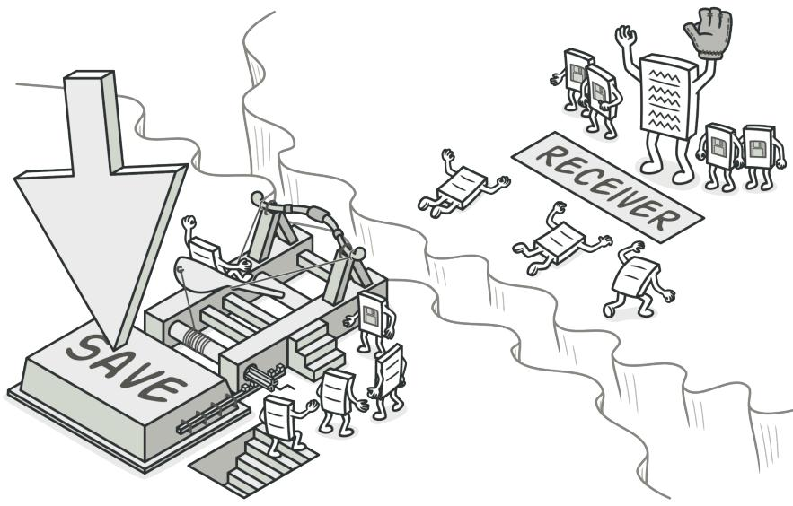

COMMAND

Also known as:Action,Transaction

Command is a behavioral design pattern that turns a request into a stand-alone object that contains all information about the request. This transformation lets you pass requests as a method arguments, delay or queue a request's execution,and support undoable operations.

Imagine that you're working on a new text-editor app. Your current task is to create a toolbar with a bunch of buttons for various operations of the editor. You created a very neat Button class that can be used for buttons on the toolbar, as well as for generic buttons in various dialogs.

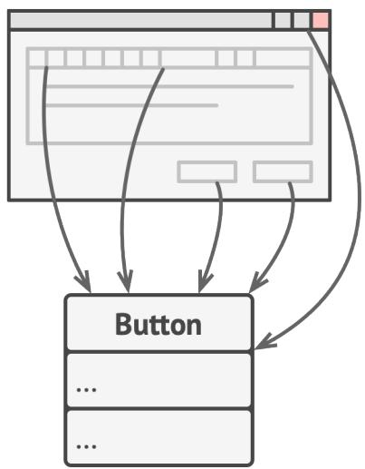  
All buttons of the app are derived from the same class.

While all of these buttons look similar, they're all supposed to do different things.Where would you put the code for the various click handlers of these buttons? The simplest solution is to create tons of subclasses for each place where the button is used. These subclasses would contain the code that would have to be executed on a button click.

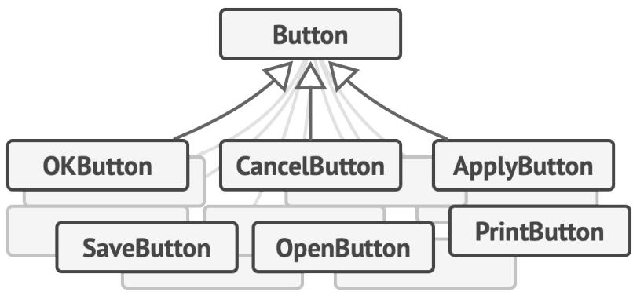  
Lots of button subclasses. What can go wrong?

Before long,you realize that this approach is deeply flawed. First,you have an enormous number of subclasses,and that Would be okay if you weren't risking breaking the code in these Subclasses each time you modify the base Button class. Put simply,your GUl code has become awkwardly dependent on the volatile code of the business logic.

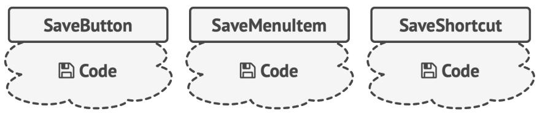  
Several classes implement the same functionality.

And here's the ugliest part. Some operations, such as copying/ pasting text, would need to be invoked from multiple places. For example,a user could click a small “Copy”button on the toolbar, or copy something via the context menu,or just hit $c \pm r c \mathsf { 1 + C }$ on the keyboard.

Initially, when our app only had the toolbar, it was okay to place the implementation of various operations into the button subclasses. In other words, having the code for copying text inside the CopyButton subclass was fine. But then, when you implement context menus, shortcuts,and other stuff, you have to either duplicate the operation's code in many classes or make menus dependent on buttons,which is an even worse option.

# Solution

Good software design is often based on the principle of separation of concerns,which usually results in breaking an app into layers. The most common example: a layer for the graphical user interface and another layer for the business logic. The GUl layer is responsible for rendering a beautiful picture on the screen, capturing any input and showing results of what the user and the app are doing. However, when it comes to doing something important, like calculating the trajectory of the moon or composing an annual report, the GUl layer delegates the work to the underlying layer of business logic.

In the code it might look like this: a GUl object calls a method of a business logic object, passing it some arguments. This process is usually described as one object sending another a request.

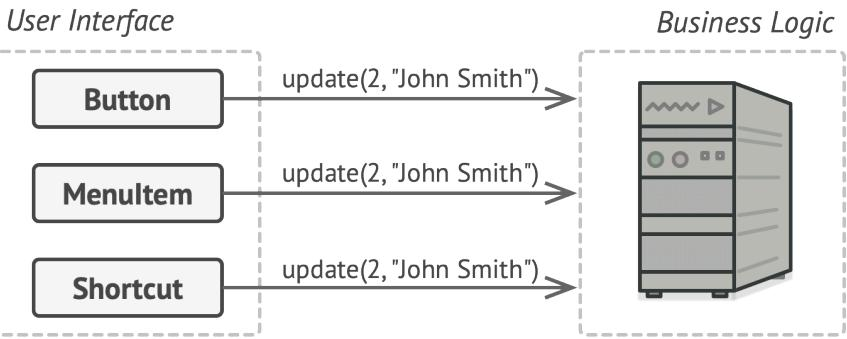

The GUl objects may access the business logic objects directly.

The Command pattern suggests that GUl objects shouldn't send these requests directly. Instead, you should extract all of the request details, such as the object being called, the name of the method and the list of arguments into a separate command class with a single method that triggers this request.

Command objects serve as links between various GUl and business logic objects. From now on, the GUl object doesn't need to know what business logic object will receive the request and how it'll be processed. The GUl object just triggers the command, which handles all the details.

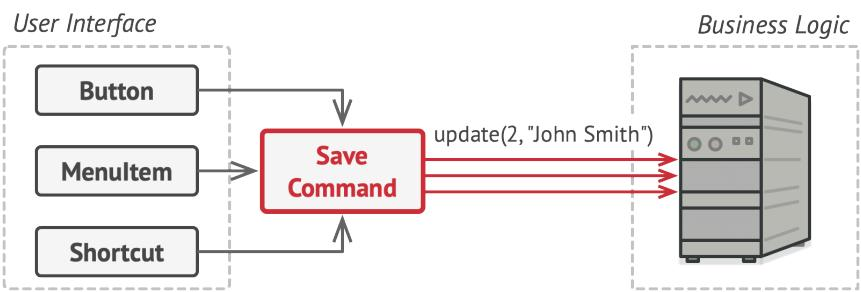  
Accessing the business logic layer via a command.

The next step is to make your commands implement the same interface. Usually it has just a single execution method that takes no parameters.This interface lets you use various commands with the same request sender, without coupling it to concrete classes of commands.As a bonus, now you can switch command objects linked to the sender, effectively changing the sender's behavior at runtime.

You might have noticed one missing piece of the puzzle, which is the request parameters. A GUl object might have supplied the business-layer object with some parameters. Since the command execution method doesn't have any parameters, how would we pass the request details to the receiver? It turns out the command should be either pre-configured with this data, or capable of getting it on its own.

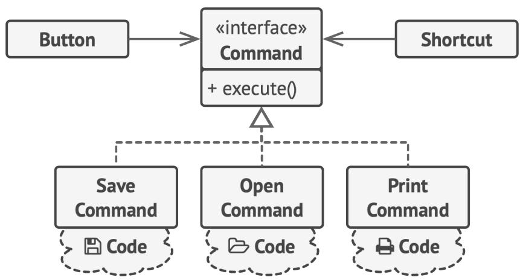  
The GUl objects delegate the work to commands.

Let's get back to our text editor. After we apply the Command pattern，we no longer need all those button subclasses to implement various click behaviors. It's enough to put a single field into the base Button class that stores a reference to a command object and make the button execute that command on a click.

You'll implement a bunch of command classes for every possible operation and link them with particular buttons,depending on the buttons' intended behavior.

Other GUl elements,such as menus,shortcuts or entire dialogs,can be implemented in the same way. They'llbe linked to a command which gets executed when a user interacts with the GUl element. As you've probably guessed by now, the elements related to the same operations will be linked to the same commands, preventing any code duplication.

As a result, commands become a convenient middle layer that reduces coupling between the GUl and business logic layers. And that's only a fraction of the benefits that the Command pattern can offer!

# Real-World Analogy

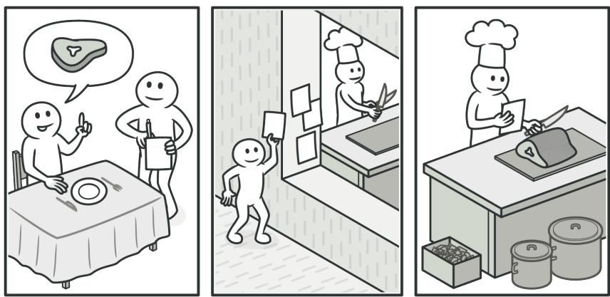  
Making an order in α restaurant.

After a long walk through the city, you get to a nice restaurant and sit at the table by the window. A friendly waiter approaches you and quickly takes your order, writing it down on a piece of paper. The waiter goes to the kitchen and sticks the order on the wall. After a while, the order gets to the chef, who reads it and cooks the meal accordingly. The cook places the meal on a tray along with the order. The waiter discovers the tray, checks the order to make sure everything is as you wanted it, and brings everything to your table.

The paper order serves as a command. It remains in a queue until the chef is ready to serve it. The order contains all the relevant information required to cook the meal. It allows the chef to start cooking right away instead of running around clarifying the order details from you directly.

① cut $=$ new.opyComand(etar Invoker ② ⑤ Client + setCommand(command) - command sitrfae + executeCommand() + execute) 全 1 = ④ V Command1 Command2 Receiver - receiver - params + execute() + operation(a,b,c) 个 +Comand1receive ara ③ receiver.operation(params)

1.The Sender class (aka invoker) is responsible for initiating requests. This class must have a field for storing a reference to a command object. The sender triggers that command instead of sending the request directly to the receiver. Note that the sender isn't responsible for creating the command object. Usually,it gets a pre-created command from the client via the constructor.

2.The Command interface usually declares just a single method for executing the command.

3. Concrete Commands implement various kinds of requests. A concrete command isn't supposed to perform the work on its own,but rather to pass the call to one of the business logic objects. However, for the sake of simplifying the code, these classes can be merged.

Parameters required to execute a method on a receiving object can be declared as fields in the concrete command. You can make command objects immutable by only allowing the initialization of these fields via the constructor.

4.The Receiver class contains some business logic. Almost any object may act as a receiver. Most commands only handle the details of how a request is passed to the receiver, while the receiver itself does the actual work.

5.The Client creates and configures concrete command objects. The client must pass all of the request parameters, including a receiver instance, into the command's constructor. After that, the resulting command may be associated with one or multiple senders.

# # Pseudocode

In this example, the Command pattern helps to track the history of executed operations and makes it possible to revert an operation if needed.

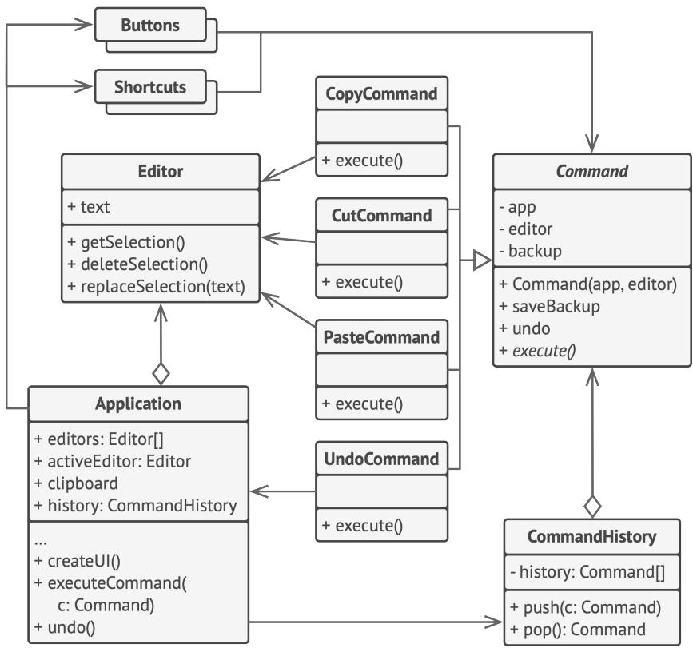  
Undoable operations in a text editor.

Commands which result in changing the state of the editor (e.g.,cutting and pasting) make a backup copy of the editor's state before executing an operation associated with the command.After a command is executed, it's placed into the command history (a stack of command objects) along with the backup copy of the editor's state at that point. Later, if the user needs to revert an operation, the app can take the most recent command from the history, read the associated backup of the editor's state, and restore it.

The client code (GUl elements,command history，etc.） isn't coupled to concrete command classes because it works with commands via the command interface. This approach lets you introduce new commands into the app without breaking any existing code.

1 // The base command class defines the common interface for ä   
2 // concrete commands.   
3 abstract class Command is   
4 protected field app: Application   
5 protected field editor: Editor   
6 protected field backup: text   
7   
8 constructor Command(app: Application， editor: Editor） is   
9 this.app $=$ app   
10 this.editor $=$ editor   
11   
12 // Make a backup of the editor's state.   
13 method saveBackup $( )$ is   
14 backup $=$ editor.text   
15   
16 // Restore the editor's state.   
17 method undo $( )$ is   
18 editor.text $=$ backup   
19   
20 // The execution method is declared abstract to force all   
21 // concrete commands to provide their own implementations.   
22 // The method must return true or false depending on wheth   
23 // the command changes the editor's state.   
24 abstract method execute $( )$   
25   
26 // The concrete commands go here.   
27 class CopyCommand extends Command is   
28 // The copy command isn't saved to the history since it   
29 // doesn't change the editor's state.   
30 method execute $( )$ is   
31 app.clipboard $=$ editor.getSelection $( )$   
32 return false   
33   
34 class CutCommand extends Command is   
35 // The cut command does change the editor's state， therefore   
36 // it must be saved to the history. And it'll be saved as   
37 // long as the method returns true.   
38 method execute $( )$ is   
39 saveBackup()   
40 app.clipboard $=$ editor.getSelection $( )$   
41 editor.deleteSelection()   
42 return true   
43   
44 class PasteCommand extends Command is   
45 method execute $( )$ is   
46 saveBackup()   
47 editor.replaceSelection(app.clipboard)   
48 return true   
49   
50 // The undo operation is also a command.   
51 class UndoCommand extends Command is   
52 method execute $( )$ is   
53 app.undo()   
54 return false   
55   
56   
57 // The global command history is just a stack.   
58 class CommandHistory is   
59 private field history: array of Command   
60   
61 // Last in...   
62 method push(c: Command） is   
63 // Push the command to the end of the history array.   
64   
65 // ...first out   
66 method pop $( )$ : Command is   
67 // Get the most recent command from the history.   
68   
69   
70 // The editor class has actual text editing operations. It plays   
71 // the role of a receiver: all commands end up delegating   
72 // execution to the editor's methods.   
73 class Editor is   
74 field text: string   
75   
76 method getSelection $( )$ is   
77 // Return selected text.   
78   
79 method deleteSelection $( )$ is   
80 // Delete selected text.   
81   
82 method replaceSelection(text） is   
83 // Insert the clipboard's contents at the current   
84 // position.   
85   
86   
87 // The application class sets up object relations. It acts as a   
88 // sender: when something needs to be done，it creates a command   
89 // object and executes it.

class Application is field clipboard: string field editors: array of Editors field activeEditor: Editor field history: CommandHistory // The code which assigns commands to UI objects may look // like this.

method createUI $( )$ is / copy $=$ function $( )$ {executeCommand( new CopyCommand(this，activeEditor)）} copyButton.setCommand(copy) shortcuts.onKeyPress("Ctrl+C",copy)

cut $=$ function $( )$ {executeCommand( new CutCommand(this，activeEditor)）} cutButton.setCommand(cut) shortcuts.onKeyPress("Ctrl+X", cut)

12 114 115

paste $=$ function $( )$ {executeCommand( new PasteCommand(this，activeEditor)）} pasteButton.setCommand(paste) shortcuts.onkeyPress("Ctrl+V"， paste)

undo $=$ function $( )$ {executeCommand( new UndoCommand(this，activeEditor)） undoButton.setCommand(undo) shortcuts.onkeyPress $( " ) C \pm r Z + Z ^ { 1 1 }$ ，undo)

// Execute a command and check whether it has to be added to // the history.

122 method executeCommand(command） is   
123 if (command.execute)   
124 history.push(command)   
125   
126 // Take the most recent command from the history and run its   
127 // undo method. Note that we don't know the class of that   
128 // command. But we don't have to， since the command knows   
129 // how to undo its own action.   
130 method undo(） is   
131 command $=$ history.pop()   
132 if（command $\therefore =$ null)   
133 command.undo()

# Applicabiity

Use the Command pattern when you want to parametrize objects with operations.

The Command pattern can turn a specific method ca into a stand-alone object. This change opens up a lot of interesting uses: you can pass commands as method arguments, store them inside other objects,switch linked commands at runtime, etc.

Here's an example: you're developing a GUl component such as a context menu, and you want your users to be able to configure menu items that trigger operations when an end user clicks an item.

# Use the Command pattern when you want to queue operations, schedule their execution, or execute them remotely.

As with any other object,a command can be serialized, which means converting it to a string that can be easily written to a file or a database.Later, the string can be restored as the initial command object. Thus,you can delay and schedule command execution. But there's even more! In the same way, you can queue,log or send commands over the network.

# Use the Command pattern when you want to implement reversible operations.

Although there are many ways to implement undo/redo, the Command pattern is perhaps the most popular of all.

To be able to revert operations, you need to implement the history of performed operations.The command history is a stack that contains all executed command objects along with related backups of the application's state.

This method has two drawbacks. First, it isn't that easy to save an application's state because some of it can be private. This problem can be mitigated with the Memento pattern.

Second, the state backups may consume quite a lot of RAM. Therefore, sometimes you can resort to an alternative implementation: instead of restoring the past state, the command performs the inverse operation. The reverse operation also has a price: it may turn out to be hard or even impossible to implement.

# How to Implement

1.Declare the command interface with a single execution method.

2.Start extracting requests into concrete command classes that implement the command interface. Each class must have a set of fields for storing the request arguments along with a reference to the actual receiver object. All these values must be initialized via the command's constructor.

3.Identify classes that will act as senders.Add the fields for storing commands into these classes. Senders should communicate with their commands only via the command interface. Senders usually don't create command objects on their own, but rather get them from the client code.

4.Change the senders so they execute the command instead of sending a request to the receiver directly.

5.The client should initialize objects in the following order:

。 Create receivers.   
。 Create commands,and associate them with receivers if needed.

。Create senders，and associate them with specific commands.

# Pros and Cons

Single Responsibility Principle. You can decouple classes that invoke operations from classes that perform these operations.

Open/Closed Principle. You can introduce new commands into the app without breaking existing client code.

You can implement undo/redo.

You can implement deferred execution of operations.

You can assemble a set of simple commands into a complex one.

The code may become more complicated since you're introducing a whole new layer between senders and receivers.

# Relations with Other Patterns

Chain of Responsibility， Command， Mediator and Observer address various ways of connecting senders and receivers of requests:

。 Chain of Responsibility passes a request sequentially along a dynamic chain of potential receivers until one of them handles it.

。Command establishes unidirectional connections between senders and receivers.

。Mediator eliminates direct connections between senders and receivers, forcing them to communicate indirectly via a mediator object.

。Observer lets receivers dynamically subscribe to and unsubscribe from receiving requests.

Handlers in Chain of Responsibility can be implemented as Commands. In this case,you can execute a lot of different operations over the same context object,represented by a request.

However, there's another approach,where the request itself is a Command object. In this case, you can execute the same operation in a series of different contexts linked into a chain.

You can use Command and Memento together when implementing “undo". In this case,commands are responsible for performing various operations over a target object,while mementos save the state of that object just before a command gets executed.

Command and Strategy may look similar because you can use both to parameterize an object with some action. However, they have very different intents.

。 You can use Command to convert any operation into an object.The operation's parameters become fields of that object. The conversion lets you defer execution of the operation,queue it, store the history of commands, send commands to remote services, etc.

。 On the other hand, Strategy usually describes different ways of doing the same thing, letting you swap these algorithms within a single context class.

Prototype can help when you need to save copies of Commands into history.

You can treat Visitor as a powerful version of the Command pattern.Its objects can execute operations over various objects of different classes.

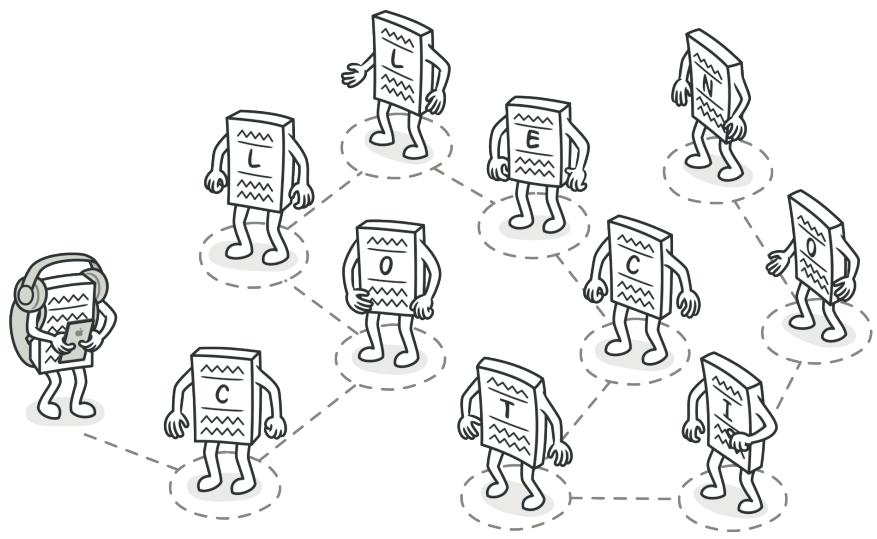

# ITERATOR

Iterator is a behavioral design pattern that lets you traverse elements of a collection without exposing its underlying representation (list, stack, tree, etc.).

# Problem

Collections are one of the most used data types in programming. Nonetheless, a collection is just a container for a group of objects.

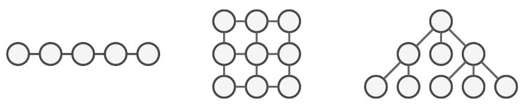  
Various types of collections.

Most collections store their elements in simple lists. However, some of them are based on stacks, trees, graphs and other complex data structures.

But no matter how a collection is structured, it must provide some way of accessing its elements so that other code can use these elements. There should be a way to go through each element of the collection without accessing the same elements over and over.

This may sound like an easy job if you have a collection based on a list. You just loop over all of the elements. But how do you sequentially traverse elements of a complex data structure, Such as a tree? For example, one day you might be just fine with depth-first traversal of a tree. Yet the next day you might require breadth-first traversal. And the next week, you might need something else, like random access to the tree elements.

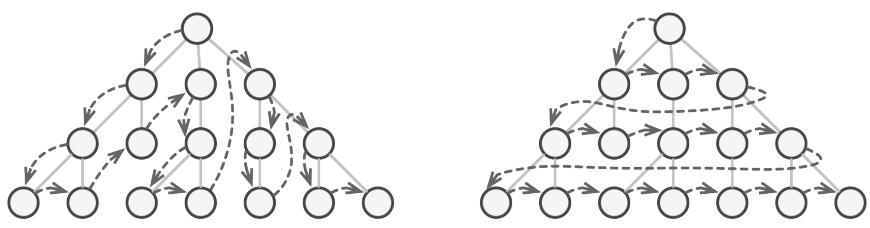

The same collection can be traversed in several different ways.

Adding more and more traversal algorithms to the collection gradually blurs its primary responsibility,which is efficient data storage.Additionally, some algorithms might be tailored for a specific application, so including them into a generic collection class would be weird.

On the other hand, the client code that's supposed to work with various collections may not even care how they store their elements. However, since collections all provide different ways of accessing their elements,you have no option other than to couple your code to the specific collection classes.

# Solution

The main idea of the Iterator pattern is to extract the traversal behavior of a collection into a separate object called an iterator.

In addition to implementing the algorithm itself,an iterator object encapsulates all of the traversal details, such as the current position and how many elements are left till the end.

Because of this, several iterators can go through the same collection at the same time,independently of each other.

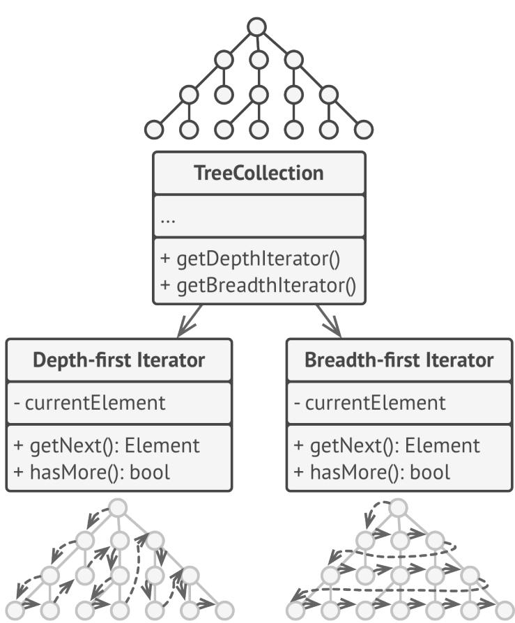  
Iterators implement various traversal algorithms.Several iterator objects can traverse the same collection at the same time.

Usually, iterators provide one primary method for fetching elements of the collection.The client can keep running this method until it doesn't return anything,which means that the iterator has traversed all of the elements.

All iterators must implement the same interface. This makes the client code compatible with any collection type or any traversal algorithm as long as there's a proper iterator. If you need a special way to traverse a collection, you just create a new iterator class,without having to change the collection or the client.

# Real-World Analogy

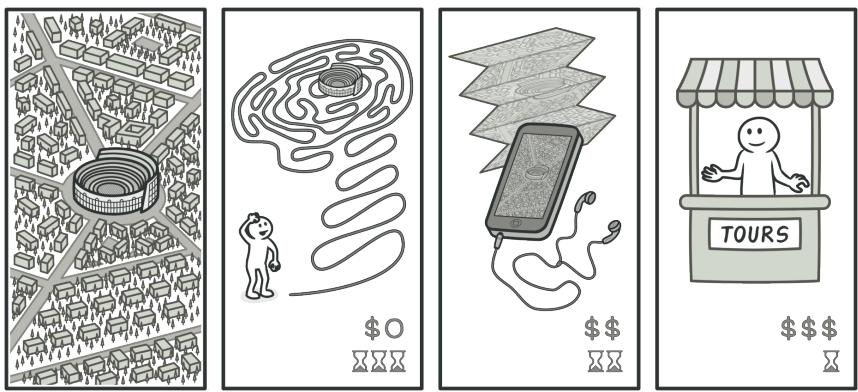  
Various ways to walk around Rome.

You plan to visit Rome for a few days and visit all of its main sights and attractions. But once there,you could waste a lot of time walking in circles, unable to find even the Colosseum.

On the other hand, you could buy a virtual guide app for your smartphone and use it for navigation.It's smart and inexpensive,and you could be staying at some interesting places for as long as you want. Another alternative is that you could spend some of the trip's budget and hire a local guide who knows the city like the back of his hand.The guide would be able to tailor the tour to your likings, show you every attraction and tell a lot of exciting stories. That'll be even more fun; but, alas, more expensive, too.

All of these options-the random directions born in your head, the smartphone navigator or the human guide-act as iterators over the vast collection of sights and attractions located in Rome.

# Structure

Client ① ⑤ ③ 《interface》 《interface> Iterator IterableCollection + getNext( + createlterator(): Iterator + hasMore(): bool A 全 ！ 1 ② i ④ Concretelterator ConcreteCollection collection: ConcreteCollection V . - iterationState $^ +$ Concretelterator( + createlterator(): Iterator c: ConcreteCollection) + getNext( + hasMore(): bool

1.The Iterator interface declares the operations required for traversing a collection: fetching the next element,retrieving the current position,restarting iteration, etc.

2.Concrete Iterators implement specific algorithms for traversing a collection. The iterator object should track the traversal progress on its own. This allows several iterators to traverse the same collection independently of each other.

3.The Collection interface declares one or multiple methods for getting iterators compatible with the collection.Note that the return type of the methods must be declared as the iterator interface so that the concrete collections can return various kinds of iterators.

4.Concrete Collections return new instances of a particular concrete iterator class each time the client requests one.You might be wondering,where's the rest of the collection's code? Don't worry, it should be in the same class. It's just that these details aren't crucial to the actual pattern, so we're omitting them.

5.The Client works with both collections and iterators via their interfaces.This way the client isn't coupled to concrete classes,allowing you to use various collections and iterators with the same client code.

Typically， clients don't create iterators on their own，but instead get them from collections. Yet,in certain cases, the client can create one directly; for example,when the client defines its own special iterator.

# # Pseudocode

In this example, the Iterator pattern is used to walk through a special kind of collection which encapsulates access to Facebook's social graph. The collection provides several iterators that can traverse profiles in various ways.

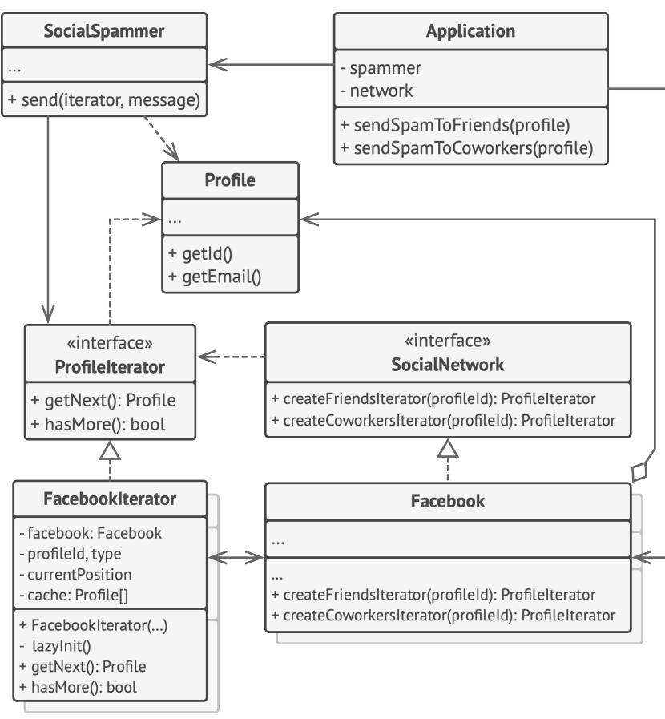  
Example of iterating over social profiles.

The ‘friends’ iterator can be used to go over the friends of a given profile. The ‘colleagues' iterator does the same, except it omits friends who don't work at the same company as a target person. Both iterators implement a common interface which allows clients to fetch profiles without diving into implementation details such as authentication and sending REST requests.

The client code isn't coupled to concrete classes because it works with collections and iterators only through interfaces. If you decide to connect your app to a new social network, you simply need to provide new collection and iterator classes without changing the existing code.

1 // The collection interface must declare a factory method for   
2 // producing iterators. You can declare several methods if there   
3 // are different kinds of iteration available in your program.   
4 interface SocialNetwork is   
5 method createFriendsIterator(profileId):ProfileIterator   
6 method createCoworkersIterator(profileId):ProfileIterator   
7   
8 // Each concrete collection is coupled to a set of concrete   
9 // iterator classes it returns. But the client isn't， since the   
10 // signature of these methods returns iterator interfaces.   
11 class Facebook implements SocialNetwork is   
12 // ... The bulk of the collection's code should go here   
13   
14 // Iterator creation code.   
15 method createFriendsIterator(profileId) is   
16 return new FacebookIterator(this, profileId， "friends")   
17 method createCoworkersIterator(profileId） is   
18 return new FacebookIterator(this， profileId， "coworkers")   
19 // The common interface for all iterators.   
20 interface ProfileIterator is   
21 method getNext $( )$ : Profile   
22 method hasMore $( )$ : bool   
23   
24   
25 // The concrete iterator class.   
26 class FacebookIterator implements ProfileIterator is   
27 // The iterator needs a reference to the collection that it   
28 // traverses.   
29 private field facebook: Facebook   
30 private field profileId, type: string   
31   
32 // An iterator object traverses the collection independently   
33 // from other iterators. Therefore it has to store the   
34 // iteration state.   
35 private field currentPosition   
36 private field cache: array of Profile   
37   
38 constructor FacebookIterator(facebook， profileId， type） is   
39 this.facebook $=$ facebook   
40 this.profileId $=$ profileId   
41 this.type $=$ type   
42   
43 private method lazyInit $( )$ is   
44 if (cache $= =$ null)   
45 cache $=$ facebook.socialGraphRequest(profileId， type)   
46   
47 // Each concrete iterator class has its own implementation   
48 // of the common iterator interface.   
49 method getNext $( )$ is   
50 if (hasMore())   
51 currentPosition++   
52 return cache[currentPosition]   
53   
54 method hasMore $( )$ is   
55 lazyInit()   
56 return currentPosition $<$ cache.length   
57   
58   
59 // Here is another useful trick: you can pass an iterator to a   
60 // client class instead of giving it access to a whole   
61 // collection. This way，you don't expose the collection to the   
62 // client.   
63 //   
64 // And there's another benefit: you can change the way the   
65 // client works with the collection at runtime by passing it a   
66 // different iterator. This is possible because the client code   
67 // isn't coupled to concrete iterator classes.   
68 class SocialSpammer is   
69 method send(iterator: ProfileIterator, message: string) is   
70 while (iterator.hasMore())   
71 profile $=$ iterator.getNext $( )$   
72 System.sendEmail(profile.getEmail()， message)   
73   
74 // The application class configures collections and iterators   
75 // and then passes them to the client code.   
76 class Application is   
77 field network: SocialNetwork   
78 field spammer: SocialSpammer   
79   
80 method config $( )$ is   
81 if working with Facebook   
82 this.network $=$ new Facebook $( )$   
83 if working with LinkedIn   
84 this.network $=$ new LinkedIn $( )$   
85 this.spammer $=$ new SocialSpammer()   
87 method sendSpamToFriends(profile） is   
88 iterator $=$ network.createFriendsIterator(profile.getId ${ \bf ( ) ) ) }$   
89 spammer.send(iterator，"Very important message")   
91 method sendSpamToCoworkers(profile） is   
92 iterator $=$ network.createCoworkersIterator(profile.getId $( )$ ）   
93 spammer.send(iterator，"Very important message")

# Applicability

Use the Iterator pattern when your collection has a complex data structure under the hood, but you want to hide its complexity from clients (either for convenience or security reasons).

The iterator encapsulates the details of working with acomplex data structure,providing the client with several simple methods of accessing the collection elements.While this approach is very convenient for the client,it also protects the collection from careless or malicious actions which the client would be able to perform if working with the collection directly.

Use the pattern to reduce duplication of the traversal code across your app.

The code of non-trivial iteration algorithms tends to be very bulky. When placed within the business logic of an app, it may blur the responsibility of the original code and make it less maintainable. Moving the traversal code to designated iterators can help you make the code of the application more lean and clean.

Use the Iterator when you want your code to be able to traverse different data structures or when types of these structures are unknown beforehand.

The patern provides a couple of generic interfaces for both collections and iterators. Given that your code now uses these interfaces, it'll still work if you pass it various kinds of collections and iterators that implement these interfaces.

# How to Implement

1.Declare the iterator interface. At the very least, it must have a method for fetching the next element from a collection. But for the sake of convenience you can add a couple of other methods,such as fetching the previous element, tracking the current position,and checking the end of the iteration.

2.Declare the collection interface and describe a method for fetching iterators. The return type should be equal to that of the iterator interface. You may declare similar methods if you plan to have several distinct groups of iterators.

3.Implement concrete iterator classes for the collections that you want to be traversable with iterators.An iterator object must be linked with a single collection instance. Usually, this link is established via the iterator's constructor.

4.Implement the collection interface in your collection classes. The main idea is to provide the client with a shortcut for creating iterators, tailored for a particular collection class. The collection object must pass itself to the iterator's constructor to establish a link between them.

5.Go over the client code to replace all of the collection traversal code with the use of iterators. The client fetches a new iterator object each time it needs to iterate over the collection elements.

# Pros and Cons

Single Responsibility Principle. You can clean up the client code and the collections by extracting bulky traversal algorithms into separate classes.

Open/Closed Principle. You can implement new types of collections and iterators and pass them to existing code without breaking anything.

You can iterate over the same collection in parallel because each iterator object contains its own iteration state.

For the same reason, you can delay an iteration and continue it when needed.

Applying the pattern can be an overkill if your app only works with simple collections.

Using an iterator may be less efficient than going through elements of some specialized collections directly.

# ← Relations with Other Patterns

You can use Iterators to traverse Composite trees.

You can use Factory Method along with Iterator to let collec-tion subclasses return different types of iterators that are compatible with the collections.

You can use Memento along with Iterator to capture the current iteration state and roll it back if necessary.

You can use Visitor along with Iterator to traverse a complex data structure and execute some operation over its elements, even if they all have different classes.

本

MEDIATOR

Also known as: Intermediary, Controller

Mediator is a behavioral design pattern that lets you reduce chaotic dependencies between objects. The pattern restricts direct communications between the objects and forces them to collaborate only via a mediator object.

# Problem

Say you have a dialog for creating and editing customer profiles.It consists of various form controls such as text fields, checkboxes, buttons, etc.

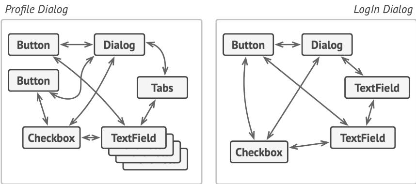  
Relations between elements of the user interface can become chaotic as the application evolves.

Some of the form elements may interact with others. For instance, selecting the“l have a dog” checkbox may reveal a hidden text field for entering the dog's name. Another example is the submit button that has to validate values of all fields before saving the data.

Checkbox if (dialog.name $= =$ "profile_form") -dialog if (dialog.mame $= =$ "logi fom) + onCheck0 //..

Elements can have lots of relations with other elements. Hence,changes to some elements may affect the others.

By having this logic implemented directly inside the code of the form elements you make these elements' classes much harder to reuse in other forms of the app. For example,you won't be able to use that checkbox class inside another form, because it's coupled to the dog's text field. You can use either all the classes involved in rendering the profile form,or none at all.

# Solution

The Mediator pattern suggests that you should cease all direct communication between the components which you want to make independent of each other. Instead, these components must collaborate indirectly， by calling a special mediator object that redirects the calls to appropriate components. As a result, the components depend only on a single mediator class instead of being coupled to dozens of their colleagues.

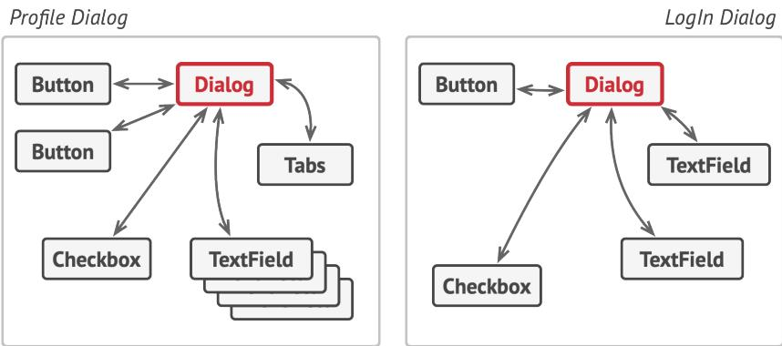  
Ul elements should communicate indirectly, via the mediator object.

In our example with the profile editing form, the dialog class itself may act as the mediator. Most likely, the dialog class is already aware of all of its sub-elements, so you won't even need to introduce new dependencies into this class.

The most significant change happens to the actual form elements. Let's consider the submit button. Previously, each time a user clicked the button, it had to validate the values of all individual form elements. Now its single job is to notify the dialog about the click. Upon receiving this notification, the dialog itself performs the validations or passes the task to the individual elements. Thus, instead of being tied to a dozen form elements, the button is only dependent on the dialog class.

You can go further and make the dependency even looser by extracting the common interface for all types of dialogs. The interface would declare the notification method which all form elements can use to notify the dialog about events happening to those elements. Thus, our submit button should now be able to work with any dialog that implements that interface.

This way, the Mediator pattern lets you encapsulate a complex web of relations between various objects inside a single mediator object. The fewer dependencies a class has, the easier it becomes to modify, extend or reuse that class.

# Real-World Analogy

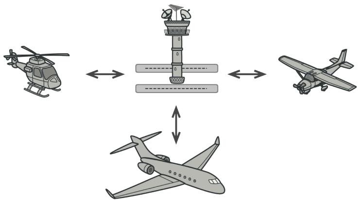

Aircraft pilots don't talk to each other directly when deciding who gets to land their plane next.All communication goes through the control tower.

Pilots of aircraft that approach or depart the airport control area don't communicate directly with each other. Instead, they speak to an air traffic controller, who sits in a tall tower somewhere near the airstrip.Without the air traffic controller, pilots would need to be aware of every plane in the vicinity of the airport, discussing landing priorities with a committee of dozens of other pilots.That would probably skyrocket the airplane crash statistics.

The tower doesn't need to control the whole flight. It exists only to enforce constraints in the terminal area because the number of involved actors there might be overwhelming to a pilot.

ComponentA ComponentB - m: Mediator - m: Mediator + operationA0 《interface》 + operationB0 ① Mediator ① Componentc + notify(sender) ComponentD ≥- m: Mediator 全 - m: Mediator + operationC( ConcreteMediator + operationD( - componentA 1 - componentB m.notify(this) - componentC 4 - componentD + notify(sender) o if (sender $= =$ componentA) + reactOnA( reactOnA0 + reactOnB( + reactOnC() + reactOnD0

1. Components are various classes that contain some business logic.Each component has a reference to a mediator, declared with the type of the mediator interface. The component isn't aware of the actual class of the mediator, so you can reuse the component in other programs by linking it to a different mediator.

2.The Mediator interface declares methods of communication with components,which usually include just a single notification method. Components may pass any context as arguments of this method, including their own objects, but only in such a way that no coupling occurs between a receiving component and the sender's class.

3. Concrete Mediators encapsulate relations between various components. Concrete mediators often keep references to all components they manage and sometimes even manage their lifecycle.

4． Components must not be aware of other components.If something important happens within or to a component,it must only notify the mediator. When the mediator receives the notification,it can easily identify the sender, which might be just enough to decide what component should be triggered in return.

From a component's perspective, it all looks like a total black box.The sender doesn't know who'll end up handling its request,and the receiver doesn't know who sent the request in the first place.

# # Pseudocode

In this example, the Mediator pattern helps you eliminate mutual dependencies between various Ul classes: buttons, checkboxes and text labels.

An element, triggered by a user, doesn't communicate with other elements directly， even if it looks like it's supposed to. Instead, the element only needs to let its mediator know about the event, passing any contextual info along with that notification.

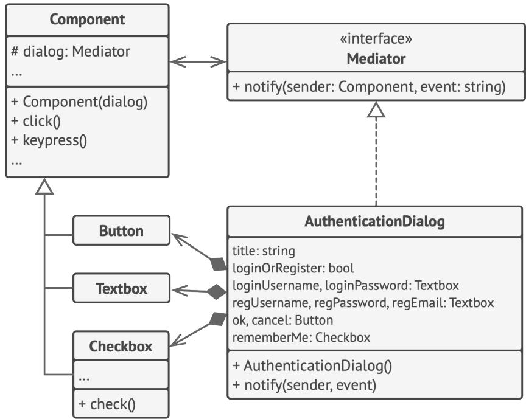  
Structure of the Ul dialog classes.

In this example, the whole authentication dialog acts as the mediator. It knows how concrete elements are supposed to collaborate and facilitates their indirect communication. Upon receiving a notification about an event, the dialog decides what element should address the event and redirects the call accordingly.

1 // The mediator interface declares a method used by components   
2 // to notify the mediator about various events. The mediator ma   
3 // react to these events and pass the execution to other   
4 // components.   
5 interface Mediator is   
6 method notify(sender: Component， event: string)   
7   
8   
9 // The concrete mediator class. The intertwined web of   
10 // connections between individual components has been untanglec   
11 // and moved into the mediator.   
12 class AuthenticationDialog implements Mediator is   
13 private field title: string   
14 private field login0rRegisterChkBx: Checkbox   
15 private field loginUsername， loginPassword: Textbox   
16 private field registrationUsername， registrationPassword,   
17 registrationEmail: Textbox   
18 private field okBtn， cancelBtn: Button   
19   
20 constructor AuthenticationDialog $( )$ is   
21 // Create all component objects and pass the current   
22 // mediator into their constructors to establish links.   
23   
24 // When something happens with a component，it notifies the   
25 // mediator. Upon receiving a notification， the mediator may   
26 // do something on its own or pass the request to another   
27 // component.   
28 method notify(sender，event） is   
29 if (sender $= =$ loginOrRegisterChkBx and event $= =$ "check")   
30 if（loginorRegisterChkBx.checked)   
31 title $=$ "Log in"   
32 // 1. Show login form components.

// 2.Hide registration form components. else title $=$ "Register" // 1. Show registration form components. // 2. Hide login form components

if (sender $= =$ okBtn && event $= =$ "click") if(loginorRegister.checked) // Try to find a user using login credentials. if (!found) // Show an error message above the login // field. else // 1. Create a user account using data from the // registration fields. // 2. Log that user in. // ...

// Components communicate with a mediator using the mediator   
// interface. Thanks to that， you can use the same components in   
// other contexts by linking them with different mediator   
// objects.   
class Component is field dialog: Mediator constructor Component(dialog) is this.dialog $=$ dialog method click $( )$ is dialog.notify(this，"click")

65 method keypress $( )$ is   
66 dialog.notify(this，"keypress")   
67   
68 // Concrete components don't talk to each other. They have only   
69 // one communication channel，which is sending notifications to   
70 // the mediator.   
71 class Button extends Component is   
72 //   
73   
74 class Textbox extends Component is   
75 /   
76   
77 class Checkbox extends Component is   
78 method check $( )$ is   
79 dialog.notify(this，"check")   
80

# Applicability

Use the Mediator pattern when it's hard to change some of the classes because they are tightly coupled to a bunch of other classes.

The pattern lets you extract all the relationships between classes into a separate class, isolating any changes to a specific component from the rest of the components.

Use the pattern when you can’t reuse a component in a different program because it's too dependent on other components.

After you apply the Mediator, individual components become unaware of the other components. They could still communicate with each other, albeit indirectly, through a mediator object.To reuse a component in a different app, you need to provide it with a new mediator class.

Usethe Mediator when youfindyourselfcreating tonsof com-ponent subclasses just to reuse some basic behavior in various contexts.

Since al relations between components are contained within the mediator, it's easy to define entirely new ways for these components to collaborate by introducing new mediator classes,without having to change the components themselves.

# How to Implement

1.Identify a group of tightly coupled classes which would benefit from being more independent (e.g., for easier maintenance or simpler reuse of these classes).

2.Declare the mediator interface and describe the desired communication protocol between mediators and various components. In most cases，a singlemethod forreceiving notifications from components is sufficient.

This interface is crucial when you want to reuse component classes in different contexts. As long as the component works with its mediator via the generic interface,you can link the component with a different implementation of the mediator.

3.Implement the concrete mediator class. This class would benefit from storing references to all of the components it manages.

4.You can go even further and make the mediator responsible for the creation and destruction of component objects. After this, the mediator may resemble a factory or a facade.

5.Components should store a reference to the mediator object. The connection is usually established in the component's constructor, where a mediator object is passed as an argument.

6.Change the components' code so that they call the mediator's notification method instead of methods on other components. Extract the code that involves calling other components into the mediator class. Execute this code whenever the mediator receives notifications from that component.

# Pros and Cons

Single Responsibility Principle.You can extract the communica-tions between various components into a single place, making it easier to comprehend and maintain.

Open/Closed Principle. You can introduce new mediators without having to change the actual components.

You can reduce coupling between various components of a program.

You can reuse individual components more easily.

Over time a mediator can evolve into a God Object.

# Relations with Other Patterns

Chain of Responsibility， Command, Mediator and Observer address various ways of connecting senders and receivers of requests:

。 Chain of Responsibility passes a request sequentially along a dynamic chain of potential receivers until one of them handles it.

。Command establishes unidirectional connections between senders and receivers.

。Mediator eliminates direct connections between senders and receivers, forcing them to communicate indirectly via a mediator object.

。Observer lets receivers dynamically subscribe to and unsubscribe from receiving requests.

Facade and Mediator have similar jobs: they try to organize collaboration between lots of tightly coupled classes.

。Facade defines a simplified interface to a subsystem of objects, but it doesn't introduce any new functionality. The subsystem itself is unaware of the facade. Objects within the subsystem can communicate directly.

。Mediator centralizes communication between components of the system. The components only know about the mediator object and don't communicate directly.

The difference between Mediator and Observer is often elusive.In most cases,you can implement either of these patterns; but sometimes you can apply both simultaneously. Let's see how we can do that.

The primary goal of Mediatoris to eliminate mutual dependencies among a set of system components. Instead, these components become dependent on a single mediator object. The goal of Observer is to establish dynamic one-way connections between objects,where some objects act as subordinates of others.

There's a popular implementation of the Mediator pattern that relies on Observer. The mediator object plays the role of publisher,and the components act as subscribers which subscribe to and unsubscribe from the mediator's events.When Mediator is implemented this way, it may look very similar to Observer.

When you're confused, remember that you can implement the Mediator pattern in other ways.For example, you can permanently link all the components to the same mediator object. This implementation won't resemble Observer but will still be an instance of the Mediator pattern.

Now imagine a program where all components have become publishers,allowing dynamic connections between each other. There won't be a centralized mediator object,only a distributed set of observers.

# MEMENTO

Also known as: Snapshot

Memento is a behavioral design pattern that lets you save and restore the previous state of an object without revealing the details of its implementation.

Imagine that you're creating a text editor app. In addition to simple text editing,your editor can format text, insert inline images, etc.

At some point, you decided to let users undo any operations carried out on the text. This feature has become so common over the years that nowadays people expect every app to have it.For the implementation, you chose to take the direct approach. Before performing any operation, the app records the state of all objects and saves it in some storage. Later, when a user decides to revert an action, the app fetches the latest snapshot from the history and uses it to restore the state of all objects.

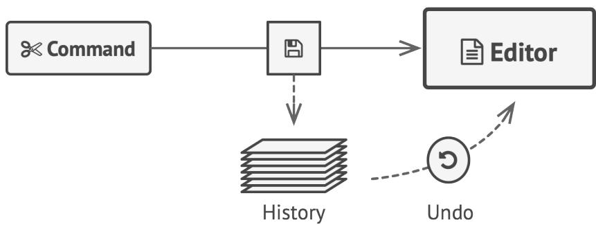

Before executing an operation,the app saves α snapshot of the objects' state,which can later be used to restore objects to their previous state.

Let's think about those state snapshots. How exactly would you produce one? You'd probably need to go over all the fields in an object and copy their values into storage. However, this would only work if the object had quite relaxed access restrictions to its contents. Unfortunately, most real objects won't let others peek inside them that easily, hiding all significant data in private fields.

Ignore that problem for now and let's assume that our objects behave like hippies: preferring open relations and keeping their state public.While this approach would solve the immediate problem and let you produce snapshots of objects' states at will, it still has some serious issues. In the future, you might decide to refactor some of the editor classes, or add or remove some of the fields. Sounds easy, but this would also require changing the classes responsible for copying the state of the affected objects.

<table><tr><td rowspan="3">private = can&#x27;t copy public = unsafe</td><td>Editor</td></tr><tr><td>text cursorPos selection</td></tr><tr><td>currentFont styles</td></tr><tr><td rowspan="2"></td><td></td></tr><tr><td></td></tr></table>

How to make α copy of the object's private state?

But there's more.Let's consider the actual “snapshots”of the editor's state.What data does it contain? At a bare minimum, it must contain the actual text, cursor coordinates, current scroll position, etc. To make a snapshot, you'd need to collect these values and put them into some kind of container.

Most likely, you're going to store lots of these container objects inside some list that would represent the history. Therefore the containers would probably end up being objects of one class.The class would have almost no methods, but lots of fields that mirror the editor's state.To allow other objects to write and read data to and from a snapshot, you'd probably need to make its fields public. That would expose all the editor's states, private or not. Other classes would become dependent on every little change to the snapshot class,which would otherwise happen within private fields and methods without affecting outer classes.

It looks like we've reached a dead end: you either expose all internal details of classes, making them too fragile,or restrict access to their state,making it impossible to produce snap-shots.Is there any other way to implement the "undo"?

# Solution

All problems that we've just experienced are caused by broken encapsulation.Some objects try to do more than they are supposed to.To collect the data required to perform some action, they invade the private space of other objects instead of letting these objects perform the actual action.

The Memento pattern delegates creating the state snapshots to the actual owner of that state,the originator object. Hence, instead of other objects trying to copy the editor's state from the “outside” the editor class itself can make the snapshot since it has full access to its own state.

The pattern suggests storing the copy of the object's state in a special object called memento. The contents of the memento aren't accessible to any other object except the one that produced it. Other objects must communicate with mementos using a limited interface which may allow fetching the snapshot's metadata (creation time,the name of the performed operation, etc.), but not the original object's state contained in the snapshot.

Originator Editor Snapshot -text - text - cursorPos - cursorPos 《interface》 - selection - selection Memento - currentFont - styles - currentFont - styles Qd 四 + getName() + getSnapshotDate() … +makesns:Mement) snapshot.getName() history.add(snapshot) = = 1 Caretakers History snapshot $=$ editor.makeSnapshot0 //.. Command editor.restore(snapshot)

The originator has full access to the memento,whereas the caretaker can only access the metadata.

Such a restrictive policy lets you store mementos inside other objects,usually called caretakers. Since the caretaker works with the memento only via the limited interface,it's not able to tamper with the state stored inside the memento.At the same time, the originator has access to all fields inside the memento, allowing it to restore its previous state at will.

In our text editor example, we can create a separate history class to act as the caretaker.A stack of mementos stored inside the caretaker will grow each time the editor is about to execute an operation. You could even render this stack within the app's Ul, displaying the history of previously performed operations to a user.

When a user triggers the undo, the history grabs the most recent memento from the stack and passes it back to the editor, requesting a roll-back. Since the editor has full access to the memento,it changes its own state with the values taken from the memento.

# Implementation based on nested classes

The classic implementation of the pattern relies on support for nested classes,available in many popular programming languages (such as ${ \mathsf { C } } { + } { + }$ ,C#,and Java).

3 Caretaker Originator Memento   
- state - state □ -riry: Mementol i   
+ eəveo: m:Memento) -Memento(state) ： +d5omethngo I m = history.pop( $\mathsf { m } =$ originator.save() originator.restore(m) history.push(m) //originator.change(

1.The Originator class can produce snapshots of its own state,as well as restore its state from snapshots when needed.

2.The Memento is a value object that acts as a snapshot of the originator's state. It's a common practice to make the memento immutable and pass it the data only once,via the constructor.

3.The Caretaker knows not only“when”and“why" to capture the originator's state, but also when the state should be restored.

A caretaker can keep track of the originator's history by storing a stack of mementos.When the originator has to travel back in history, the caretaker fetches the topmost memento from the stack and passes it to the originator's restoration method.

4.In this implementation,the memento class is nested inside the originator. This lets the originator access the fields and methods of the memento, even though they're declared private. On the other hand, the caretaker has very limited access to the memento's fields and methods,which lets it store mementos in a stack but not tamper with their state.

# Implementation based on an intermediate interface

There's an alternative implementation, suitable for programming languages that don't support nested classes (yeah, PHP, I'm talking about you).

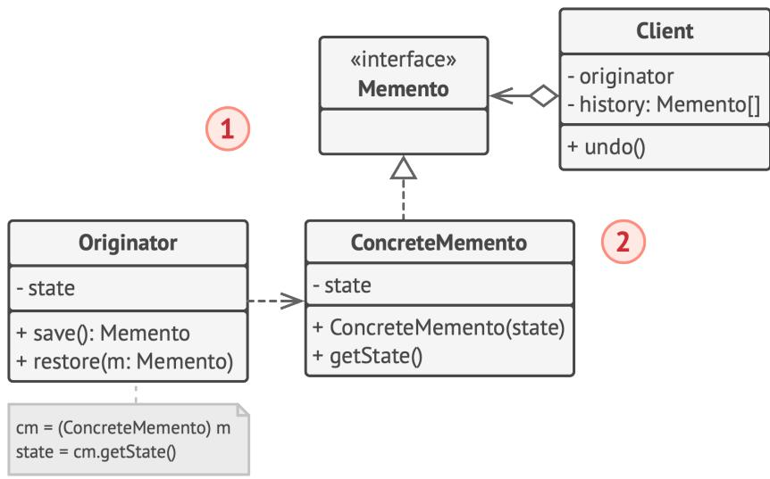

1.In the absence of nested classes,you can restrict access to the memento's fields by establishing a convention that caretakers can work with a memento only through an explicitly declared intermediary interface,which would only declare methods related to the memento's metadata.

2.On the other hand,originators can work with a memento object directly，accessing fields and methods declared in the memento class. The downside of this approach is that you need to declare all members of the memento public.

# Implementation with even stricter encapsulation

There's another implementation which is useful when you don't want to leave even the slightest chance of other classes accessing the state of the originator through the memento.

《interface》 ② 《interface> Caretaker Originator Memento -history: Memento[] Save amento +undo0 ① 1 ConcreteMemento ③   
ConcreteOriginator   
- state -riginator   
+ save(): Memento $^ +$ ConcreteMemento(originator, state)   
+ setState(state) + restore() originator.setState(state)

1.This implementation allows having multiple types of originators and mementos. Each originator works with a corresponding memento class. Neither originators nor mementos expose their state to anyone.

2.Caretakers are now explicitly restricted from changing the state stored in mementos. Moreover， the caretaker class becomes independent from the originator because the restoration method is now defined in the memento class.

3.Each memento becomes linked to the originator that produced it.The originator passes itself to the memento's constructor, along with the values of its state.Thanks to the close relationship between these classes,a memento can restore the state of its originator, given that the latter has defined the appropriate setters.

# # Pseudocode

This example uses the Memento pattern alongside the Command pattern for storing snapshots of the complex text editor's state and restoring an earlier state from these snapshots when needed.

Editor Snapshot Command - state <>-state 小 - backup: Snapshot + setState(x) + Snapshot(state) + makeBackup0 + createSnapshot0 + restore) + undo0

Saving snapshots of the text editor's state.

The command objects act as caretakers. They fetch the editor's memento before executing operations related to commands. When a user attempts to undo the most recent command, the editor can use the memento stored in that command to revert itself to the previous state.

The memento class doesn't declare any public fields, getters or setters. Therefore no object can alter its contents. Mementos are linked to the editor object that created them.This lets a memento restore the linked editor's state by passing the data via setters on the editor object. Since mementos are linked to specific editor objects, you can make your app support several independent editor windows with a centralized undo stack.

1 // The originator holds some important data that may change over   
2 // time. It also defines a method for saving its state inside a   
3 // memento and another method for restoring the state from it.   
4 class Editor is   
5 private field text， curX，curY， selectionWidth   
6   
7 method setText(text） is   
8 this.text $=$ text   
9   
10 method setCursor(x，y) is   
11 this.curX $= ~ \times$   
12 this.curY $=  { y }$   
13   
14 method setSelectionWidth(width） is   
15 this.selectionWidth $=$ width   
16   
17 // Saves the current state inside a memento.   
18 method createSnapshot $( )$ :Snapshot is   
19 // Memento is an immutable object; that's why the   
20 // originator passes its state to the memento's   
21 // constructor parameters.   
22 return new Snapshot(this， text， curX， curY， selectionWidth)   
23   
24 // The memento class stores the past state of the editor.   
25 class Snapshot is   
26 private field editor: Editor   
27 private field text， curX， curY， selectionWidth   
28   
29 constructor Snapshot(editor， text，curX，curY， selectionWidth） is   
30 this.editor $=$ editor   
31 this.text $=$ text   
32 this.curX $= ~ \times$   
33 this.curY $=  { y }$   
34 this.selectionWidth $=$ selectionWidth   
35   
36 // At some point，a previous state of the editor can be   
37 // restored using a memento object.   
38 method restore $( )$ is   
39 editor.setText(text)   
40 editor.setCursor(curX, curY)   
41 editor.setSelectionWidth(selectionWidth)   
42   
43 // A command object can act as a caretaker. In that case， the   
44 // command gets a memento just before it changes the   
45 // originator's state. When undo is requested， it restores the   
46 // originator's state from a memento.   
47 class Command is   
48 private field backup: Snapshot   
49 method makeBackup(） is   
50 backup $=$ editor.createSnapshot $( )$   
51   
52 method undo $( )$ is   
53 if （backup $\therefore =$ null)   
54 backup.restore()   
55

# Applicability

Use the Memento pattern when you want to produce snapshots of the object's state to be able to restore a previous state of the object.

The Memento pattern lets you make full copies of an object's state,including private fields,and store them separately from the object. While most people remember this pattern thanks to the“undo” use case,it's also indispensable when dealing with transactions (i.e.,if you need to roll back an operation on error).

Use the pattern when direct access to the object's fields/get-ters/setters violates its encapsulation.

The Memento makes the objectitself responsible for creating a snapshot of its state. No other object can read the snapshot, making the original object's state data safe and secure.

# How to Implement

1.Determine what class will play the role of the originator. It's important to know whether the program uses one central object of this type or multiple smaller ones.

2.Create the memento class. One by one,declare a set of fields that mirror the fields declared inside the originator class.

3.Make the memento class immutable.A memento should accept the data just once, via the constructor. The class should have no setters.

4.If your programming language supports nested classes,nest the memento inside the originator. If not, extract a blank interface from the memento class and make all other objects use it to refer to the memento. You may add some metadata operations to the interface,but nothing that exposes the originator's state.

5.Add a method for producing mementos to the originator class. The originator should pass its state to the memento via one or multiple arguments of the memento's constructor.

The return type of the method should be of the interface you extracted in the previous step (assuming that you extracted it at all). Under the hood, the memento-producing method should work directly with the memento class.

6.Add a method for restoring the originator's state to its class. It should accept a memento object as an argument. If you extracted an interface in the previous step, make it the type of the parameter. In this case,you need to typecast the incoming object to the memento class, since the originator needs full access to that object.

7.The caretaker, whether it represents a command object,a history,or something entirely different， should know when to request new mementos from the originator, how to store them and when to restore the originator with a particular memento.

8.The link between caretakers and originators may be moved into the memento class.In this case,each memento must be connected to the originator that had created it. The restoration method would also move to the memento class. However, this would all make sense only if the memento class is nested into originator or the originator class provides sufficient setters for overriding its state.

# Pros and Cons

You can produce snapshots of the object's state without violating its encapsulation.

You can simplify the originator's code by letting the caretaker maintain the history of the originator's state.

XThe app might consume lots of RAM if clients create mementos too often.

Caretakers should track the originator's lifecycle to be able to destroy obsolete mementos.

Most dynamic programming languages, such as PHP, Python and JavaScript, can't guarantee that the state within the memento stays untouched.

# ← Relations with Other Patterns

You can use Command and Memento together when implementing“undo". In this case, commands are responsible for performing various operations over a target object,while mementos save the state of that object just before a command gets executed.

You can use Memento along with Iterator to capture the current iteration state and roll it back if necessary.

Sometimes Prototype can be a simpler alternative to Memento. This works if the object, the state of which you want to store in the history, is fairly straightforward and doesn't have links to external resources, or the links are easy to re-establish.

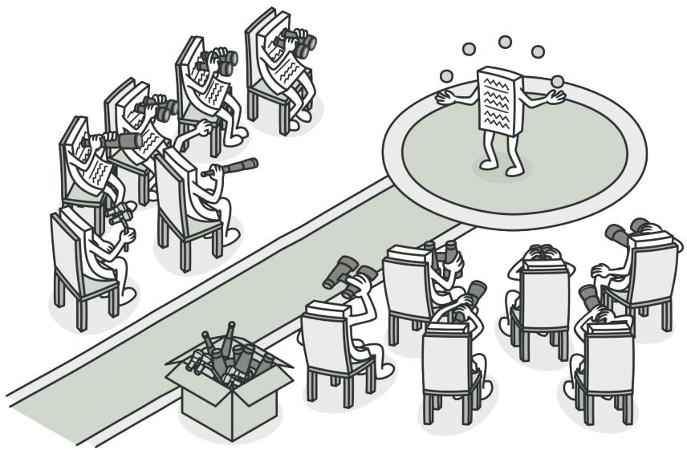

OBSERVER

Also known as:Event-Subscriber, Listener

Observer is a behavioral design pattern that lets you define a subscription mechanism to notify multiple objects about any events that happen to the object they're observing.

Imagine that you have two types of objects: a Customer and a Store .The customer is very interested in a particular brand of product (say, it's a new model of the iPhone) which should become available in the store very soon.

The customer could visit the store every day and check product availability. But while the product is still en route, most of these trips would be pointless.

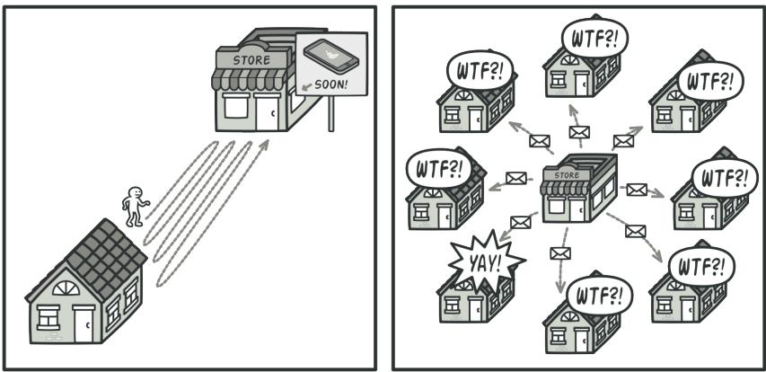  
Visiting the store vs.sending spam

On the other hand, the store could send tons of emails (which might be considered spam) to all customers each time a new product becomes available. This would save some customers from endless trips to the store.At the same time, it'd upset other customers who aren't interested in new products.

It looks like we've got a conflict. Either the customer wastes time checking product availability or the store wastes resources notifying the wrong customers.

# Solution

The object that has some interesting state is often called subject, but since it's also going to notify other objects about the changes to its state,we'll callit publisher.All other objects that want to track changes to the publisher's state are called subscribers.

The Observer pattern suggests that you add a subscription mechanism to the publisher class so individual objects can subscribe to or unsubscribe from a stream of events coming from that publisher. Fear not! Everything isn't as complicated as it sounds.In reality, this mechanism consists of 1) an array field for storing a list of references to subscriber objects and 2) several public methods which allow adding subscribers to and removing them from that list.

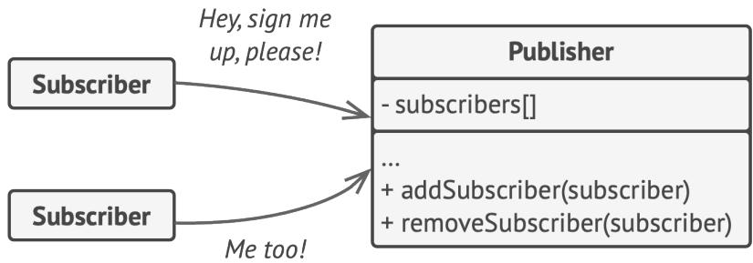  
A subscription mechanism lets individual objects subscribe to event notifications.

Now, whenever an important event happens to the publisher, it goes over its subscribers and calls the specific notification method on their objects.

Real apps might have dozens of different subscriber classes that are interested in tracking events of the same publisher class. You wouldn't want to couple the publisher to all of those classes. Besides, you might not even know about some of them beforehand if your publisher class is supposed to be used by other people.

That's why it's crucial that all subscribers implement the same interface and that the publisher communicates with them only via that interface.This interface should declare the notification method along with a set of parameters that the publisher can use to pass some contextual data along with the notification.

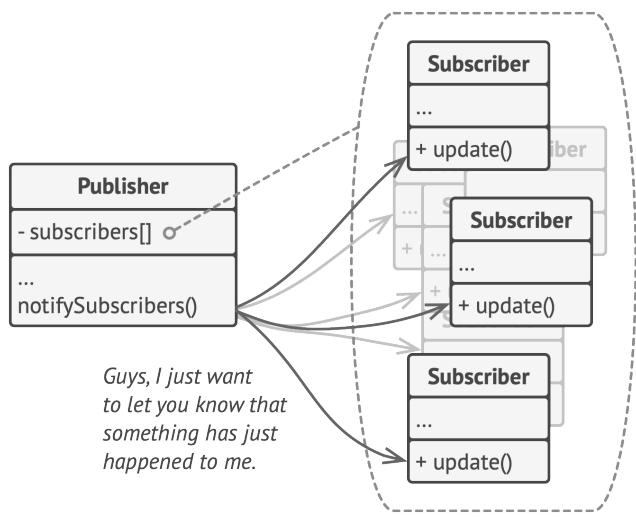  
Publisher notifies subscribers by calling the specific notification method on their objects.

If your app has several different types of publishers and you want to make your subscribers compatible with all of them, you can go even further and make all publishers follow the same interface. This interface would only need to describe a few subscription methods. The interface would allow subscribers to observe publishers' states without coupling to their concrete classes.

# Real-World Analogy

  
Magazine and newspaper subscriptions.

If you subscribe to a newspaper or magazine,you no longer need to go to the store to check if the next issue is available. Instead, the publisher sends new issues directly to your mailbox right after publication or even in advance.

The publisher maintains a list of subscribers and knows which magazines they're interested in. Subscribers can leave the list at any time when they wish to stop the publisher sending new magazine issues to them.

# Structure

② ① Publisher 《interface》 ③ - subscribers: Subscriber[] Subscriber   
foreach (s in subscribers) A - mainState + update(context)   
s.update(this) $^ +$ subscribe(s: Subscriber) A   
mainState $=$ newState 。 + unsubscribe(s: Subscriber) + notifySubscribers( ④ Concrete   
notifySubscribers() + mainBusinessLogic() Subscribers publisher.subscribe(s) ${ \sf s } =$ new ConcreteSubscriber() +pdate(cntc - Client

1.The Publisher issues events of interest to other objects. These events occur when the publisher changes its state or executes some behaviors. Publishers contain a subscription infrastructure that lets new subscribers join and current subscribers leave the list.

2.When a new event happens, the publisher goes over the subscription list and calls the notification method declared in the subscriber interface on each subscriber object.

3.The Subscriber interface declares the notification interface. In most cases, it consists of a single update method. The method may have several parameters that let the publisher pass some event details along with the update.

4. Concrete Subscribers perform some actions in response to notifications issued by the publisher. All of these classes must implement the same interface so the publisher isn't coupled to concrete classes.

5.Usually, subscribers need some contextual information to handle the update correctly. For this reason, publishers often pass some context data as arguments of the notification method. The publisher can pass itself as an argument, leting subscriber fetch any required data directly.

6.The Client creates publisher and subscriber objects separately and then registers subscribers for publisher updates.

# # Pseudocode

In this example, the Observer pattern lets the text editor object notify other service objects about changes in its state.

Editor EventManager   
$^ +$ events: EventManager ? - listeners   
+ Editor0 $^ +$ subscribe(eventType, listener)   
+ openFile( $^ +$ unsubscribe(eventType,listener)   
+ saveFile() + notify(eventType,data) 《interface》 EventListeners + update(filename) A EmailAlertsListener LoggingListener ：· .· + update(filename) + update(filename)

Notifying objects about events that happen to other objects.

The list of subscribers is compiled dynamically: objects can start or stop listening to notifications at runtime,depending on the desired behavior of your app.

In this implementation, the editor class doesn't maintain the subscription list by itself. It delegates this job to the special helper object devoted to just that. You could upgrade that object to serve as a centralized event dispatcher, letting any object act as a publisher.

Adding new subscribers to the program doesn't require changes to existing publisher classes,as long as they work with all subscribers through the same interface.

1 // The base publisher class includes subscription management   
2 // code and notification methods.   
3 class EventManager is   
4 private field listeners: hash map of event types and listeners   
5   
6 method subscribe(eventType，listener） is   
7 listeners.add(eventType， listener)   
8   
9 method unsubscribe(eventType， listener） is   
10 listeners.remove(eventType， listener)   
11   
12 method notify(eventType，data） is   
13 foreach (listener in listeners.of(eventType)） do   
14 listener.update(data)   
15   
16 // The concrete publisher contains real business logic that's   
17 // interesting for some subscribers. We could derive this class   
18 // from the base publisher，but that isn't always possible in   
19 // real life because the concrete publisher might already be a   
20 // subclass. In this case，you can patch the subscription logic   
21 // in with composition，as we did here.   
22 class Editor is   
23 public field events: EventManager   
24 private field file: File   
25   
26 constructor Editor $( )$ is   
27 events $=$ new EventManager $( )$   
28 // Methods of business logic can notify subscribers about   
29 // changes.   
30 method openFile(path） is   
31 this.file $=$ new File(path)   
32 events.notify("open"， file.name)   
33   
34 method saveFile $( )$ is   
35 file.write()   
36 events.notify("save"，file.name)   
37   
38 / ...   
39   
40   
41 // Here's the subscriber interface. If your programming language   
42 // supports functional types，you can replace the whole   
43 // subscriber hierarchy with a set of functions.   
44 interface EventListener is   
45 method update(filename)   
46   
47 // Concrete subscribers react to updates issued by the publisher   
48 // they are attached to.   
49 class LoggingListener implements EventListener is   
50 private field log: File   
51 private field message: string   
52   
53 constructor LoggingListener(log_filename， message） is   
54 this.log $=$ new File(log_filename)   
55 this.message $=$ message   
56   
57 method update(filename） is   
58 log.write(replace('%s',filename,message))   
59   
60 class EmailAlertsListener implements EventListener is   
61 private field email: string   
62 private field message: string   
63   
64 constructor EmailAlertsListener(email， message) is   
65 this.email $=$ email   
66 this.message $=$ message   
67   
68 method update(filename） is   
69 system.email(email， replace('%s',filename,message))   
70   
71   
72 // An application can configure publishers and subscribers at   
73 // runtime.   
74 class Application is   
75 method config $( )$ is   
76 editor $=$ new Editor $( )$   
77   
78 logger $=$ new LoggingListener(   
79 "/path/to/log.txt",   
80 "Someone has opened the file: %s")   
81 editor.events.subscribe("open",logger)   
82   
83 emailAlerts $=$ new EmailAlertsListener(   
84 "admin@example.com",   
85 "Someone has changed the file: %s")   
86 editor.events.subscribe("save"，emailAlerts)

# Applicability

Use the Observer pattern when changes to the state of one object may require changing other objects, and the actual set of objects is unknown beforehand or changes dynamically.

You can often experience this problem when working with classes of the graphical user interface.For example,you created custom button classes,and you want to let the clients hook some custom code to your buttons so that it fires whenever a user presses a button.

The Observer pattern lets any object that implements the subscriber interface subscribe for event notifications in publisher objects. You can add the subscription mechanism to your buttons,letting the clients hook up their custom code via custom subscriber classes.

Use the pattern when some objects in your app must observe others, but only for a limited time or in specific cases.

The subscription list is dynamic,so subscriberscan join or leave the list whenever they need to.

# How to Implement

1.Look over your business logic and try to break it down into two parts: the core functionality, independent from other code, will act as the publisher; the rest will turn into a set of subscriber classes.

2.Declare the subscriber interface.At a bare minimum,it should declare a single update method.

3.Declare the publisher interface and describe a pair of methods for adding a subscriber object to and removing it from the list. Remember that publishers must work with subscribers only via the subscriber interface.

4.Decide where to put the actual subscription list and the implementation of subscription methods. Usually, this code looks the same for all types of publishers,so the obvious place to put it is in an abstract class derived directly from the publisher interface. Concrete publishers extend that class,inheriting the subscription behavior.

However, if you're applying the pattern to an existing class hierarchy, consider an approach based on composition: put the subscription logic into a separate object, and make all real publishers use it.

5.Create concrete publisher classes.Each time something important happens inside a publisher, it must notify all its subscribers.

6.Implement the update notification methods in concrete subscriber classes. Most subscribers would need some context data about the event. It can be passed as an argument of the notification method.

But there's another option. Upon receiving a notification, the subscriber can fetch any data directly from the notification. In this case, the publisher must pass itself via the update method. The less flexible option is to link a publisher to the subscriber permanently via the constructor.

7.The client must create all necessary subscribers and register them with proper publishers.

# Pros and Cons

Open/Closed Principle. You can introduce new subscriber classes without having to change the publisher's code (and vice versa if there's a publisher interface).

You can establish relations between objects at runtime.

Subscribers are notified in random order.

# Relations with Other Patterns

Chain of Responsibility， Command， Mediator and Observer address various ways of connecting senders and receivers of requests:

。 Chain of Responsibility passes a request sequentially along a dynamic chain of potential receivers until one of them handles it.   
。 Command establishes unidirectional connections between senders and receivers.   
。Mediator eliminates direct connections between senders and receivers,forcing them to communicate indirectly via a mediator object.   
。Observer lets receivers dynamically subscribe to and unsubscribe from receiving requests.

The difference between Mediator and Observer is often elusive.In most cases,you can implement either of these patterns; but sometimes you can apply both simultaneously. Let's see how we can do that.

The primary goal of Mediator is to eliminate mutual dependencies among a set of system components. Instead, these components become dependent on a single mediator object. The goal of Observer is to establish dynamic one-way connections between objects,where some objects act as subordinates of others.

There's a popular implementation of the Mediator pattern that relies on Observer. The mediator object plays the role of publisher,and the components act as subscribers which subscribe to and unsubscribe from the mediator's events.When Mediator is implemented this way, it may look very similar to Observer.

When you're confused, remember that you can implement the Mediator pattern in other ways. For example,you can permanently link all the components to the same mediator object. This implementation won't resemble Observer but will still be an instance of the Mediator pattern.

Now imagine a program where all components have become publishers,allowing dynamic connections between each other. There won't be a centralized mediator object,only a distributed set of observers.

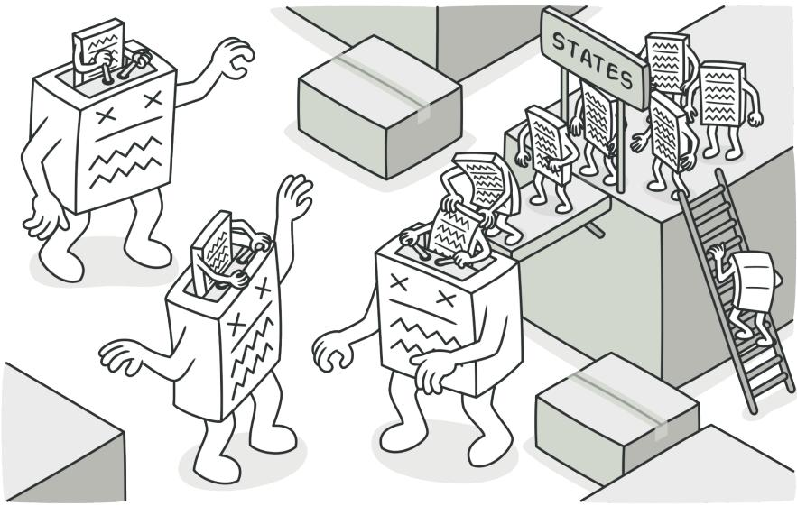

STATE

State is a behavioral design pattern that lets an object alter its behavior when its internal state changes. It appears as if the object changed its class.

The State pattern is closely related to the concept of a Finite-State Machine.

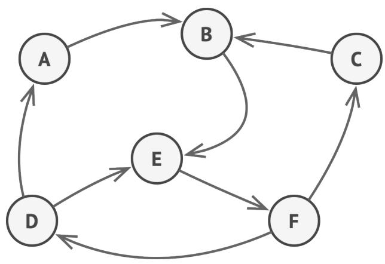  
Finite-State Machine.

The main idea is that,at any given moment, there's a finite number of states which a program can be in.Within any unique state,the program behaves differently,and the program can be switched from one state to another instantaneously. However, depending on a current state,the program may or may not switch to certain other states.These switching rules, called transitions,are also finite and predetermined.

You can also apply this approach to objects. Imagine that we have a Document class.A document can be in one of three States: Draft ，Moderation and Published .The publish method of the document works a little bit differently in each state:

In Draft ,it moves the document to moderation.   
In Moderation ,it makes the document public, but only if the current user is an administrator.   
In Published,itdoesn't do anything at all.

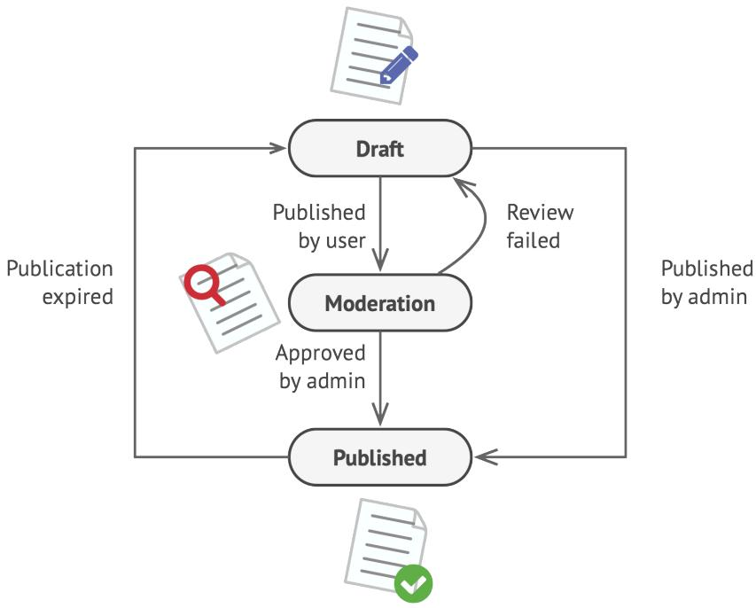  
Possible states and transitions of a document object.

State machines are usually implemented with lots of conditional operators( if or switch ） that select the appropriate behavior depending on the current state of the object. Usually, this “state”is just a set of values of the object's fields. Even if you've never heard about finite-state machines before, you've probably implemented a state at least once. Does the following code structure ring a bell?

1 class Document is 2 field state: string 3 // 4 method publish $( )$ is 5 switch (state) 6 "draft": 7 state $=$ "moderation" 8 break 9 "moderation": 10 if (currentUser.role $= =$ 'admin') 11 state $=$ "published" 12 break 13 "published" : 14 // Do nothing. 15 break 16

The biggest weakness of a state machine based on conditionals reveals itself once we start adding more and more states and state-dependent behaviors to the Document class. Most methods will contain monstrous conditionals that pick the proper behavior of a method according to the current state. Code like this is very difficult to maintain because any change to the transition logic may require changing state conditionals in every method.

The problem tends to get bigger as a project evolves. It's quite difficult to predict all possible states and transitions at the design stage. Hence, a lean state machine built with a limited set of conditionals can grow into a bloated mess over time.

The State pattern suggests that you create new classes for all possible states of an object and extract all state-specific behaviors into these classes.

Instead of implementing all behaviors on its own,the original object, called context, stores a reference to one of the state objects that represents its current state,and delegates all the state-related work to that object.

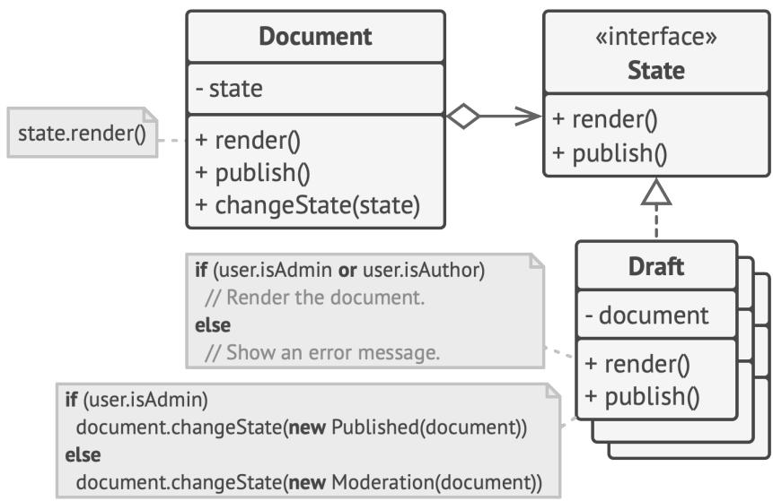  
Document delegates the work to α state object.

To transition the context into another state, replace the active state object with another object that represents that new state.This is possible only if all state classes follow the same interface and the context itself works with these objects through that interface.

This structure may look similar to the Strategy pattern, but there's one key difference.In the State pattern, the particular states may be aware of each other and initiate transitions from one state to another, whereas strategies almost never know about each other.

# Real-World Analogy

The buttons and switches in your smartphone behave differently depending on the current state of the device:

When the phone is unlocked, pressing buttons leads to executing various functions.   
When the phone is locked, pressing any button leads to the unlock screen.   
When the phone's charge is low, pressing any button shows the charging screen.

# 品Structure

① 2 Context 《interface》 - state State +doThis0 + Context(initialState) + doThat0 全 1 ConcreteStates ③   
this.state $=$ state A state.doThis0 - context   
state.setContext(this) + setContext(context) Client >+ doThis() 1 +doThat0 ： initialState $=$ new ConcreteState() context $=$ new Context(initialState) context.doThis() // A state may issue state A // Current state may have been // transition in context. // changed by context or the state state $=$ new OtherState() // object itself. context.changeState(state)

1.Context stores a reference to one of the concrete state objects and delegates to it all state-specific work. The context communicates with the state object via the state interface. The context exposes a setter for passing it a new state object.

2.The State interface declares the state-specific methods. These methods should make sense for all concrete states because you don't want some of your states to have useless methods that will never be called.

3. Concrete States provide their own implementations for the state-specific methods. To avoid duplication of similar code across multiple states, you may provide intermediate abstract classes that encapsulate some common behavior.

State objects may store a backreference to the context object. Through this reference, the state can fetch any required info from the context object, as well as initiate state transitions.

4.Both context and concrete states can set the next state of the context and perform the actual state transition by replacing the state object linked to the context.

# # Pseudocode

In this example, the State pattern lets the same controls of the media player behave differently, depending on the current playback state.

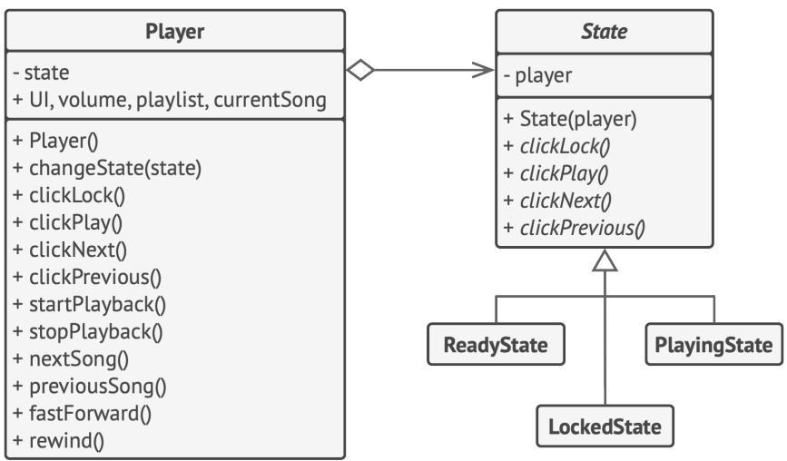  
Example of changing object behavior with state objects.

The main object of the player is always linked to a state object that performs most of the work for the player. Some actions replace the current state object of the player with another, which changes the way the player reacts to user interactions.

1 // The AudioPlayer class acts as a context. It also maintaing   
2 // reference to an instance of one of the state classes that   
3 // represents the current state of the audio player.   
4 class AudioPlayer is   
5 field state: State   
6 field UI，volume，playlist， currentSong   
7   
8 constructor AudioPlayer $( )$ is   
9 this.state $=$ new ReadyState(this)   
10   
11 // Context delegates handling user input to a state   
12 // object. Naturally， the outcome depends on what state   
13 // is currently active， since each state can handle the   
14 // input differently.   
15 $\ U { \ I } \ =$ new UserInterface()   
16 UI.lockButton.onClick(this.clickLock)   
17 UI.playButton.onClick(this.clickPlay)   
18 UI.nextButton.onClick(this.clickNext)   
19 UI.prevButton.onClick(this.clickPrevious)   
20   
21 // Other objects must be able to switch the audio player's   
22 // active state.   
23 method changeState(state: State) is   
24 this.state $=$ state   
27 // UI methods delegate execution to the active state.   
28 method clickLock $( )$ is   
29 state.clickLock()   
30 method clickPlay $( )$ is   
31 state.clickPlay()   
32 method clickNext $( )$ is   
33 state.clickNext $( )$   
34 method clickPrevious $( )$ is   
35 state.clickPrevious $( )$   
36   
37 // A state may call some service methods on the context.   
38 method startPlayback $( )$ is   
39 //   
40 method stopPlayback $( )$ is   
41 //   
42 method nextSong $( )$ is   
43 //   
44 method previousSong $( )$ is   
45 ：   
46 method fastForward(time) is   
47 // ：   
48 method rewind(time） is   
49 // ..   
50   
51   
52 // The base state class declares methods that all concrete   
53 // states should implement and also provides a backreference to   
54 // the context object associated with the state. States can use   
55 // the backreference to transition the context to another state.   
56 abstract class State is   
57 protected field player: AudioPlayer   
58   
59 // Context passes itself through the state constructor. This   
60 // may help a state fetch some useful context data if it's   
61 // needed.   
62 constructor State(player) is   
63 this.player $=$ player   
64   
65 abstract method clickLock $( )$   
66 abstract method clickPlay $( )$   
67 abstract method clickNext $( )$   
68 abstract method clickPrevious $( )$   
69   
70   
71 // Concrete states implement various behaviors associated with   
72 // state of the context.   
73 class LockedState extends State is   
74   
75 // When you unlock a locked player，it may assume one of two   
76 // states.   
77 method clickLock $( )$ is   
78 if (player.playing)   
79 player.changeState(new PlayingState(player))   
80 else   
81 player.changeState(new ReadyState(player))   
82   
83 method clickPlay $( )$ is   
84 // Locked， so do nothing.   
85   
86 method clickNext $( )$ is   
87 // Locked， so do nothing.   
88   
89 method clickPrevious $( )$ is   
90 // Locked， so do nothing.   
91 // They can also trigger state transitions in th   
92 class ReadyState extends State is   
93 method clickLock $( )$ is   
94 player.changeState(new LockedState(player))   
95   
96 method clickPlay $( )$ is   
97 player.startPlayback $( )$   
98 player.changeState(new PlayingState(player))   
99   
100 method clickNext $( )$ is   
101 player.nextSong()   
102   
103 method clickPrevious $( )$ is   
104 player.previousSong $( )$   
105   
106   
107 class PlayingState extends State is   
108 method clickLock $( )$ is   
109 player.changeState(new LockedState(player))   
110   
111 method clickPlay $( )$ is   
112 player.stopPlayback $( )$   
113 player.changeState(new ReadyState(player))   
114   
115 method clickNext $( )$ is   
116 if (event.doubleclick)   
117 player.nextSong $( )$   
118 else   
119 player.fastForward(5)   
120   
121 method clickPrevious $( )$ is   
122 if (event.doubleclick)   
123 player.previous $( )$   
124 else   
125 player.rewind(5)

# Applicability

Use the State pattern when you have an object that behaves differently depending on its current state, the number of states is enormous,and the state-specific code changes frequently.

The pattern suggests that you extract all state-specific code into a set of distinct classes. As a result, you can add new states or change existing ones independently of each other, reducing the maintenance cost.

Use the pattern when you have a class polluted with massive conditionals that alter how the class behaves according to the current values of the class's fields.

The State patern lets you extract branches of these conditionals into methods of corresponding state classes. While doing so,you can also clean temporary fields and helper methods involved in state-specific code out of your main class.

Use State when you have a lot of duplicate code across similar states and transitions of a condition-based state machine.

The Statepaternletsyoucomposehierarchesofstateclasses and reduce duplication by extracting common code into abstract base classes.

# How to Implement

1.Decide what class will act as the context. It could be an existing class which already has the state-dependent code; or a new class,if the state-specific code is distributed across multiple classes.

2.Declare the state interface. Although it may mirror all the methods declared in the context, aim only for those that may contain state-specific behavior.

3.For every actual state, create a class that derives from the state interface.Then go over the methods of the context and extract all code related to that state into your newly created class.

While moving the code to the state class,you might discover that it depends on private members of the context. There are several workarounds:

。 Make these fields or methods public.   
。 Turn the behavior you're extracting into a public method in the context and callit from the state class. This way is ugly but quick,and you can always fix it later.

。 Nest the state classes into the context class,but only if your programming language supports nesting classes.

4.In the context class,add a reference field of the state interface type and a public setter that allows overriding the value of that field.

5. Go over the method of the context again and replace empty state conditionals with calls to corresponding methods of the state object.

6.To switch the state of the context, create an instance of one of the state classes and pass it to the context. You can do this within the context itself, or in various states, or in the client. Wherever this is done, the class becomes dependent on the concrete state class that it instantiates.

# Pros and Cons

Single Responsibility Principle. Organize the code related to particular states into separate classes.

Open/Closed Principle.Introduce new states without changing existing state classes or the context.

Simplify the code of the context by eliminating bulky state machine conditionals.

XApplying the pattern can be overkillif a state machine has only a few states or rarely changes.

# ← Relations with Other Patterns

Bridge, State, Strategy (and to some degree Adapter) have very similar structures. Indeed,all of these patterns are based on composition,which is delegating Work to other objects. However, they all solve different problems. A pattern isn't just a recipe for structuring your code in a specific way. It can also communicate to other developers the problem the pattern solves.

State can be considered as an extension of Strategy. Both patterns are based on composition: they change the behavior of the context by delegating some work to helper objects. Strategy makes these objects completely independent and unaware of each other. However, State doesn't restrict dependencies between concrete states, letting them alter the state of the context at will.

# STRATEGY

Strategy is a behavioral design pattern that lets you define a family of algorithms, put each of them into a separate class, and make their objects interchangeable.

One day you decided to create a navigation app for casual travelers. The app was centered around a beautiful map which helped users quickly orient themselves in any city.

One of the most requested features for the app was automatic route planning.A user should be able to enter an address and see the fastest route to that destination displayed on the map.

The first version of the app could only build the routes over roads. People who traveled by car were bursting with joy. But apparently, not everybody likes to drive on their vacation. So with the next update,you added an option to build walking routes. Right after that, you added another option to let people use public transport in their routes.

However, that was only the beginning. Later you planned to add route building for cyclists. And even later, another option for building routes through all of a city's tourist attractions.

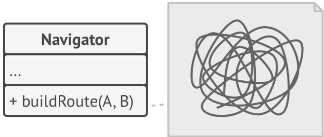

The code of the navigator became bloated.

While from a business perspective the app was a success, the technical part caused you many headaches. Each time you added a new routing algorithm, the main class of the navigator doubled in size. At some point, the beast became too hard to maintain.

Any change to one of the algorithms,whether it was a simple bug fix or a slight adjustment of the street score,affected the whole class,increasing the chance of creating an error in already-working code.

In addition, teamwork became inefficient. Your teammates, who had been hired right after the successful release, complain that they spend too much time resolving merge conflicts. Implementing a new feature requires you to change the same huge class, conflicting with the code produced by other people.

# Solution

The Strategy pattern suggests that you take a class that does something specific in a lot of different ways and extract all of these algorithms into separate classes called strategies.

The original class, called context, must have a field for storing a reference to one of the strategies.The context delegates the work to a linked strategy object instead of executing it on its own.

The context isn't responsible for selecting an appropriate algorithm for the job. Instead, the client passes the desired strategy to the context.In fact, the context doesn't know much about strategies. It works with all strategies through the same gener-ic interface, which only exposes a single method for triggering the algorithm encapsulated within the selected strategy.

This way the context becomes independent of concrete strategies,so you can add new algorithms or modify existing ones without changing the code of the context or other strategies.

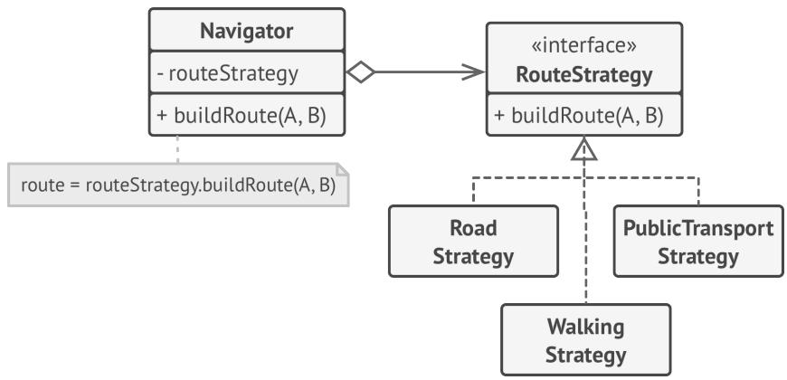  
Route planning strategies.

In our navigation app,each routing algorithm can be extracted to its own class with a single buildRoute method. The method accepts an origin and destination and returns a collection of the route's checkpoints.

Even though given the same arguments,each routing class might build a different route, the main navigator class doesn't really care which algorithm is selected since its primary job is to render a set of checkpoints on the map. The class has a method for switching the active routing strategy, so its clients, such as the buttons in the user interface,can replace the currently selected routing behavior with another one.

# Real-World Analogy

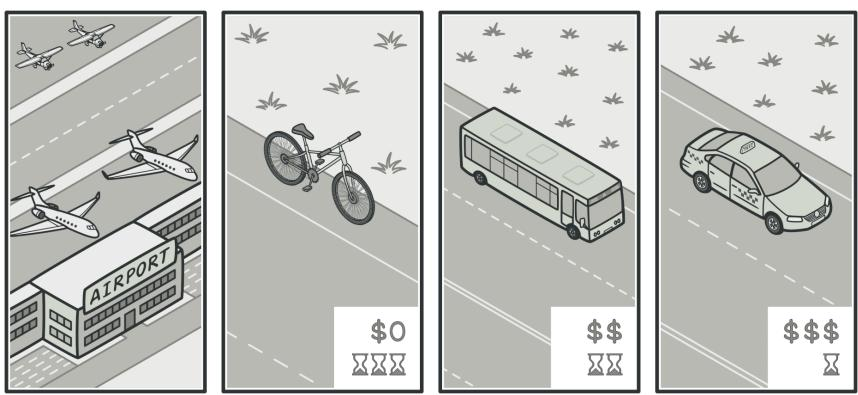  
Various strategies for getting to the airport.

Imagine that you have to get to the airport. You can catch a bus,order a cab,or get on your bicycle. These are your transportation strategies. You can pick one of the strategies depending on factors such as budget or time constraints.

# 品Structure

1 Context 《interface> - strategy Strategy + setStrategy(strategy) + execute(data) + doSomething0 ： strategy.execute() ConcreteStrategies3 Client 1 ■ + execute(data) str $=$ new SomeStrategy0 A context.setStrategy(str) context.doSomething( 5 //... other $=$ new OtherStrategy0 context.setStrategy(other) context.doSomething()

1. The Context maintains a reference to one of the concrete strategies and communicates with this object only via the strategy interface.

2.The Strategy interface is common to all concrete strategies. It declares a method the context uses to execute a strategy.

3.Concrete Strategies implement different variations of an algorithm the context uses.

4.The context calls the execution method on the linked strategy object each time it needs to run the algorithm.The context doesn't know what type of strategy it works with or how the algorithm is executed.

5.The Client creates a specific strategy object and passes it to the context. The context exposes a setter which lets clients replace the strategy associated with the context at runtime.

# # Pseudocode

In this example, the context uses multiple strategies to execute various arithmetic operations.

1 // The strategy interface declares operations common to all   
2 // supported versions of some algorithm. The context uses this   
3 // interface to call the algorithm defined by the concrete   
4 // strategies.   
5 interface Strategy is   
6 method execute(a，b)   
7   
8 // Concrete strategies implement the algorithm while following   
9 // the base strategy interface. The interface makes them   
10 // interchangeable in the context.   
11 class ConcreteStrategyAdd implements Strategy is   
12 method execute(a，b） is   
13 return a $^ +$ b   
14   
15 class ConcreteStrategySubtract implements Strategy is   
16 method execute(a，b） is   
17 return a - b   
18   
19 class ConcreteStrategyMultiply implements Strategy is   
20 method execute(a，b） is   
21 return a $^ *$ b   
22   
23 // The context defines the interface of interest to clients.   
24 class Context is   
25 // The context maintains a reference to one of the strateg   
26 // objects. The context doesn't know the concrete class of   
27 // strategy. It should work with all strategies via the   
28 // strategy interface.   
29 private strategy: Strategy   
30   
31 // Usually the context accepts a strategy through the   
32 // constructor，and also provides a setter so that the   
33 // strategy can be switched at runtime.   
34 method setStrategy(Strategy strategy） is   
35 this.strategy $=$ strategy   
36   
37 // The context delegates some work to the strategy object   
38 // instead of implementing multiple versions of the   
39 // algorithm on its own.   
40 method executeStrategy(int a， int b） is   
41 return strategy.execute(a， b)   
42   
43   
44 // The client code picks a concrete strategy and passes it t   
45 // the context. The client should be aware of the difference   
46 // between strategies in order to make the right choice.   
47 class ExampleApplication is   
48 method main $( )$ is

49 Create context object.

51 Read first number.   
52 Read last number.   
53 Read the desired action from user input.

if (action $= =$ addition） thencontext.setStrategy(new ConcreteStrategyAdd $( )$ ）

if (action $= =$ subtraction） thencontext.setStrategy(new ConcreteStrategySubtract $( )$ ）

if (action $= =$ multiplication） thencontext.setStrategy(new ConcreteStrategyMultiply $( )$ ）

result $=$ context.executeStrategy(First number， Second number)

# Applicability

Use the Strategy pattern when you want to use diferent variants of an algorithm within an object and be able to switch from one algorithm to another during runtime.

The Strategy pattrn lets you indirectly alter the object's behavior at runtime by associating it with different sub-objects which can perform specific sub-tasks in different ways.

Use the Strategy when you have a lot of similar classes that only differ in the way they execute some behavior.

The Strategy pattern lets you extract the varying behavior into a separate class hierarchy and combine the original classes into one, thereby reducing duplicate code.

Use the pattern to isolate the business logic of a class from the implementation details of algorithms that may not be as important in the context of that logic.

TheStrategypattern letsyouisolate thecode,internaldata and dependencies of various algorithms from the rest of the code.Various clients get a simple interface to execute the algorithms and switch them at runtime.

Use the pattern when your class has a massve conditional operator that switches between different variants of the same algorithm.

TheStrategypatern letsyoudoawaywithsuchaconditional by extracting all algorithms into separate classes,all of which implement the same interface.The original object delegates execution to one of these objects,instead of implementing all variants of the algorithm.

# How to Implement

1.In the context class, identify an algorithm that's prone to frequent changes. It may also be a massive conditional that selects and executes a variant of the same algorithm at runtime.

2.Declare the strategy interface common to all variants of the algorithm.

3.One by one, extract all algorithms into their own classes.They should all implement the strategy interface.

4.In the context class,add a field for storing a reference to a strategy object. Provide a setter for replacing values of that field. The context should work with the strategy object only via the strategy interface.The context may define an interface which lets the strategy access its data.

5.Clients of the context must associate it with a suitable strategy that matches the way they expect the context to perform its primary job.

# Pros and Cons

You can swap algorithms used inside an object at runtime.

You can isolate the implementation details of an algorithm from the code that uses it.

You can replace inheritance with composition.

Open/Closed Principle. You can introduce new strategies without having to change the context.

If you only have a couple of algorithms and they rarely change, there's no real reason to overcomplicate the program with new classes and interfaces that come along with the pattern.

Clients must be aware of the differences between strategies to be able to select a proper one.

XA lot of modern programming languages have functional type support that lets you implement different versions of an algorithm inside a set of anonymous functions.Then you could use these functions exactly as you'd have used the strategy objects, but without bloating your code with extra classes and interfaces.

# Relations with Other Patterns

Bridge, State, Strategy (and to some degree Adapter) have very similar structures. Indeed,all of these patterns are based on composition,which is delegating work to other objects. However, they all solve different problems. A pattern isn't just a recipe for structuring your code in a specific way. It can also communicate to other developers the problem the pattern solves.

Command and Strategy may look similar because you can use both to parameterize an object with some action. However, they have very different intents.

。 You can use Command to convert any operation into an object.The operation's parameters become fields of that object. The conversion lets you defer execution of the operation, queue it, store the history of commands, send commands to remote services, etc.

。On the other hand, Strategy usually describes diferent ways of doing the same thing, letting you swap these algorithms within a single context class.

Decorator lets you change the skin of an object, while Strategy lets you change the guts.

Template Method is based on inheritance: it lets you alter parts of an algorithm by extending those parts in subclasses. Strategy is based on composition: you can alter parts of the object's behavior by supplying it with different strategies that correspond to that behavior. Template Method works at the class level,so it's static. Strategy works on the object level, letting you switch behaviors at runtime.

State can be considered as an extension of Strategy. Both patterns are based on composition: they change the behavior of the context by delegating some work to helper objects. Strategy makes these objects completely independent and unaware of each other. However， State doesn't restrict dependencies between concrete states, letting them alter the state of the context at will.

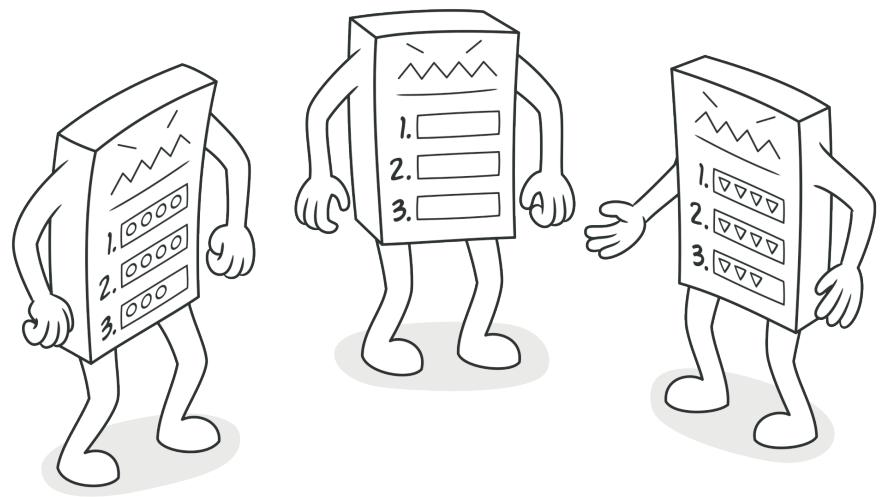

# TEMPLATEMETHOD

Template Method is a behavioral design pattern that defines the skeleton of an algorithm in the superclass but lets subclasses override specific steps of the algorithm without changing its structure.

# Problem

Imagine that you're creating a data mining application that analyzes corporate documents. Users feed the app documents in various formats (PDF,DOC, CSV)，and it tries to extract meaningful data from these docs in a uniform format.

The first version of the app could work only with DOC files. In the following version, it was able to support CSV files. A month later, you “taught” it to extract data from PDF files.

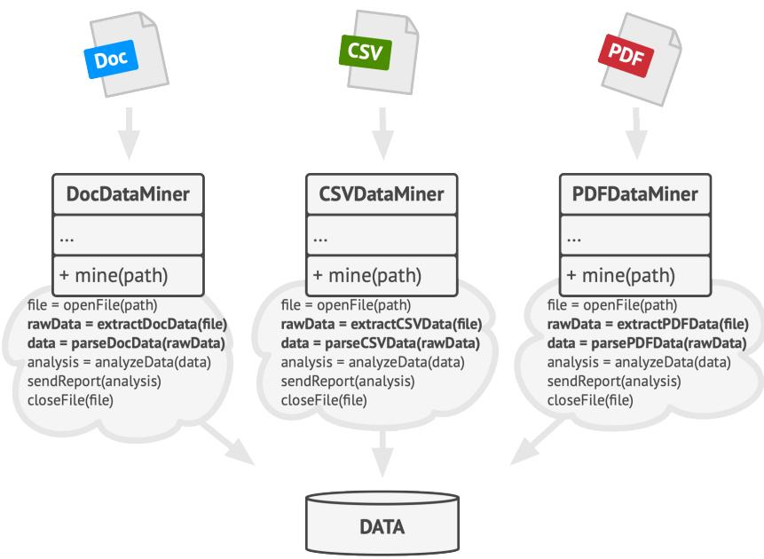  
Data mining classes contained a lot of duplicate code.

At some point, you noticed that all three classes have a lot of similar code.While the code for dealing with various data formats was entirely different in all classes, the code for data processing and analysis is almost identical. Wouldn't it be great to get rid of the code duplication,leaving the algorithm structure intact?

There was another problem related to client code that used these classes.It had lots of conditionals that picked a proper course of action depending on the class of the processing object. If all three processing classes had a common interface or a base class, you'd be able to eliminate the conditionals in client code and use polymorphism when calling methods on a processing object.

# Solution

The Template Method pattern suggests that you break down an algorithm into a series of steps, turn these steps into methods,and put a series of calls to these methods inside a single template method. The steps may either be abstract ，or have some default implementation. To use the algorithm, the client is supposed to provide its own subclass, implement all abstract steps,and override some of the optional ones if needed (but not the template method itself).

Let's see how this will play out in our data mining app.We can create a base class for all three parsing algorithms.This class defines a template method consisting of a series of calls to various document-processing steps.

At first, we can declare all steps abstract , forcing the subclasses to provide their own implementations for these methods.In our case， subclasses already have all necessary implementations,so the only thing we might need to do is adjust signatures of the methods to match the methods of the superclass.

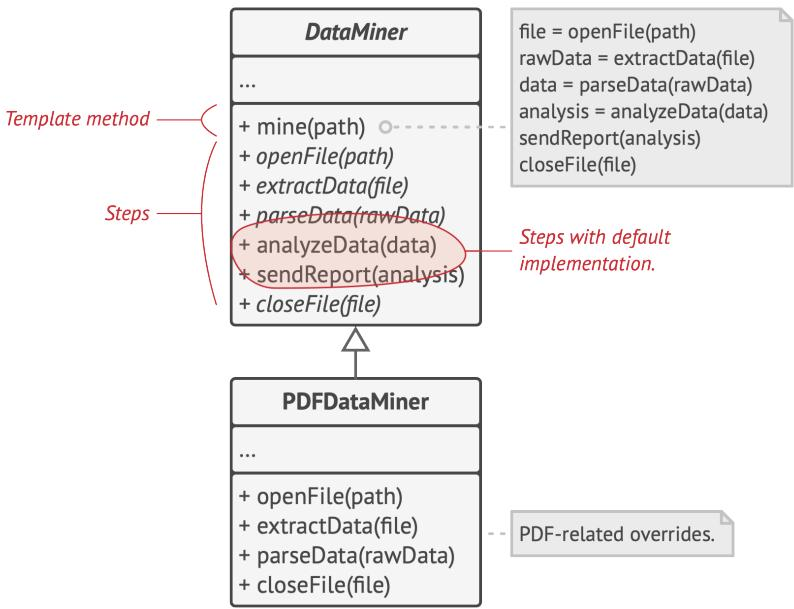  
Template method breaks the algorithm into steps,allowing subclasses to override these steps but not the actual method.

Now, let's see what we can do to get rid of the duplicate code. It looks like the code for opening/closing files and extracting/ parsing data is different for various data formats, so there's no point in touching those methods. However, implementation of other steps, such as analyzing the raw data and composing reports,is very similar, so it can be pulled up into the base class,where subclasses can share that code.

As you can see, we've got two types of steps:

abstract steps must be implemented by every subclass optional steps already have some default implementation, but still can be overridden if needed

There's another type of step, called hooks. A hook is an optional step with an empty body. A template method would work even if a hook isn't overridden. Usually， hooks are placed before and after crucial steps of algorithms, providing subclasses with additional extension points for an algorithm.

# Real-World Analogy

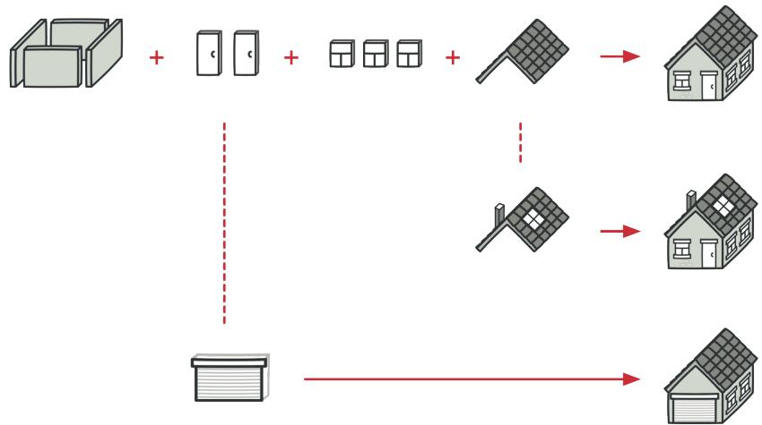  
A typical architectural plan can be slightly altered to better fit the client's needs.

The template method approach can be used in mass hous-ing construction. The architectural plan for building a standard house may contain several extension points that would let a potential owner adjust some details of the resulting house.

Each building step, such as laying the foundation, framing, building walls, installing plumbing and wiring for water and electricity,etc.,can be slightly changed to make the resulting house a little bit different from others.

# Structure

1 AbstractClass step10 if (step20){ step30 + templateMethod0 } + step10 else{ + step20 step40 + step30 } +step40 A   
ConcreteClass1 2 ConcreteClass2   
： ：   
+ step30 + step10   
+ step40 + step20 + step30 + step40

1. The Abstract Class declares methods that act as steps of an algorithm,as well as the actual template method which calls these methods in a specific order. The steps may either be declared abstract or have some default implementation.

2. Concrete Classes can override all of the steps, but not the template method itself.

# # Pseudocode

In this example, the Template Method pattern provides a “skeleton” for various branches of artificial intelligence in a simple strategy video game.

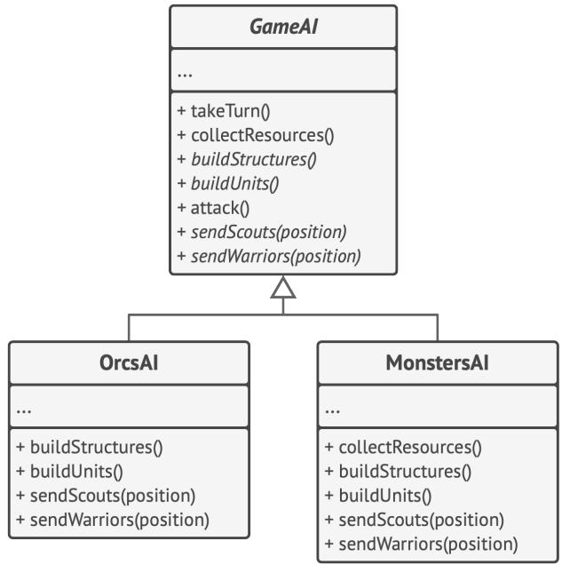  
Al classes of a simple video game.

All races in the game have almost the same types of units and buildings. Therefore you can reuse the same Al structure for various races, while being able to override some of the details. With this approach,you can override the orcs' Al to make it more aggressive,make humans more defense-oriented,and make monsters unable to build anything. Adding a new race to the game would require creating a new Al subclass and overriding the default methods declared in the base Al class.

1 // The abstract class defines a template method that contain:   
2 // skeleton of some algorithm composed of calls，usually to   
3 // abstract primitive operations. Concrete subclasses implemi   
4 // these operations，but leave the template method itself   
5 // intact.   
6 class GameAI is   
7 // The template method defines the skeleton of an algorithl   
8 method turn $( )$ is   
9 collectResources $( )$   
10 buildStructures()   
11 buildUnits()   
12 attack()   
13   
14 // Some of the steps may be implemented right in a base   
15 // class.   
16 method collectResources $( )$ is   
17 foreach (s in this.builtStructures） do   
18 s.collect()   
19   
20 // And some of them may be defined as abstract.   
21 abstract method buildStructures $( )$   
22 abstract method buildUnits $( )$   
23   
24 // A class can have several template methods.   
25 method attack $( )$ is   
26 enemy $=$ closestEnemy()   
27 if (enemy $= =$ null)   
28 sendScouts(map.center)   
29 else   
30 sendWarriors(enemy.position)   
31   
32 abstract method sendScouts(position)   
33 abstract method sendwarriors(position)   
34   
35 // Concrete classes have to implement all abstract operations of   
36 // the base class but they must not override the template method   
37 // itself.   
38 class OrcsAI extends GameAI is   
39 method buildStructures $( )$ is   
40 if (there are some resources） then   
41 // Build farms， then barracks， then stronghold.   
42   
43 method buildUnits $( )$ is   
44 if (there are plenty of resources） then   
45 if (there are no scouts)   
46 // Build peon，add it to scouts group.   
47 else   
48 // Build grunt，add it to warriors group.   
49   
50 // ...   
51   
52 method sendScouts(position） is   
53 if (scouts.length $> ~ 0$ ）then   
54 // Send scouts to position.   
55   
56 method sendwarriors(position） is   
57 if (warriors.length $> 5$ ）then   
58 // Send warriors to position.   
59   
60 // Subclasses can also override some operations with a default   
61 // implementation.   
62 class MonstersAI extends GameAI is   
63 method collectResources $( )$ is   
64 // Monsters don't collect resources.   
65   
66 method buildStructures $( )$ is   
67 // Monsters don't build structures.   
68   
69 method buildUnits $( )$ is   
70 // Monsters don't build units.

# Applicability

Use the Template Method pattern when you want to let clients extend only particular steps of an algorithm, but not the whole algorithm or its structure.

The Template Method lets you turn a monolithic algorithm into a series of individual steps which can be easily extended by subclasses while keeping intact the structure defined in a superclass.

Use the pattern when you have several classes that contain almost identical algorithms with some minor differences. As a result, you might need to modify all classes when the algorithm changes.

When youturn such an algorithm into a template method,you can also pull up the steps with similar implementations into a superclass, eliminating code duplication. Code that varies between subclasses can remain in subclasses.

# How to Implement

1.Analyze the target algorithm to see whether you can break it into steps. Consider which steps are common to all subclasses and which ones will always be unique.

2. Create the abstract base class and declare the template method and a set of abstract methods representing the algorithm's steps. Outline the algorithm's structure in the template method by executing corresponding steps. Consider making the template method final to prevent subclasses from overriding it.

3.It's okay if all the steps end up being abstract. However, some steps might benefit from having a default implementation. Subclasses don't have to implement those methods.

4.Think of adding hooks between the crucial steps of the algorithm.

5.For each variation of the algorithm,create a new concrete subclass.It must implement all of the abstract steps, but may also override some of the optional ones.

# Pros and Cons

You can let clients override only certain parts of a large algorithm,making them less affected by changes that happen to other parts of the algorithm.

You can pull the duplicate code into a superclass.

Some clients may be limited by the provided skeleton of an algorithm.

You might violate the Liskov Substitution Principle by suppressing a default step implementation via a subclass.

Template methods tend to be harder to maintain the more steps they have.

# ← Relations with Other Patterns

Factory Method is a specialization of Template Method. At the same time,a Factory Method may serve as a step in a large Template Method.

Template Method is based on inheritance: it lets you alter parts of an algorithm by extending those parts in subclasses. Strategy is based on composition: you can alter parts of the object's behavior by supplying it with different strategies that correspond to that behavior. Template Method works at the class level,so it's static. Strategy works on the object level, letting you switch behaviors at runtime.

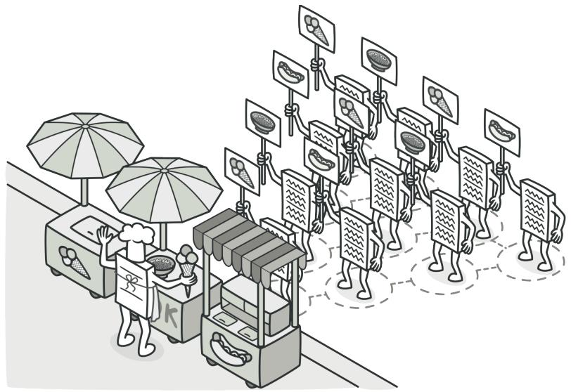  
VISITOR

Visitor is a behavioral design pattern that lets you separate algorithms from the objects on which they operate.

Imagine that your team develops an app which works with geographic information structured as one colossal graph. Each node of the graph may represent a complex entity such as a city, but also more granular things like industries, sightseeing areas,etc. The nodes are connected with others if there's a road between the real objects that they represent. Under the hood,each node type is represented by its own class,while each specific node is an object.

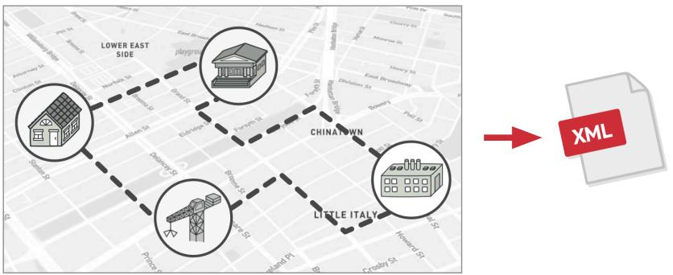  
Exporting the graph into XML.

At some point,you got a task to implement exporting the graph into XML format.At first, the job seemed pretty straightforward. You planned to add an export method to each node class and then leverage recursion to go over each node of the graph,executing the export method. The solution was simple and elegant: thanks to polymorphism, you weren't coupling the code which called the export method to concrete classes of nodes.

Unfortunately, the system architect refused to allow you to alter existing node classes. He said that the code was already in production and he didn't want to risk breaking it because of a potential bug in your changes.

Existing application's classes

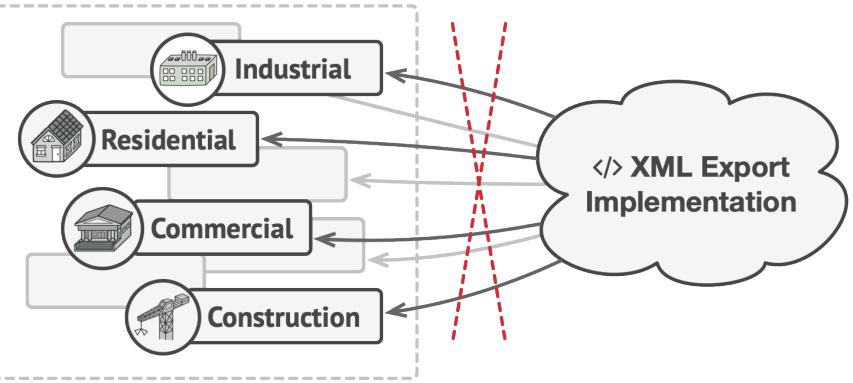  
The XML export method had to be added into all node classes, which bore the risk of breaking the whole application if any bugs slipped through along with the change.

Besides,he questioned whether it makes sense to have the XML export code within the node classes. The primary job of these classes was to work with geodata. The XML export behavior would look alien there.

There was another reason for the refusal. It was highly likely that after this feature was implemented, someone from the marketing department would ask you to provide the ability to export into a different format,or request some other weird stuff.This would force you to change those precious and fragile classes again.

# Solution

The Visitor pattern suggests that you place the new behavior into a separate class called visitor, instead of trying to integrate it into existing classes. The original object that had to perform the behavior is now passed to one of the visitor's methods as an argument, providing the method access to all necessary data contained within the object.

Now, what if that behavior can be executed over objects of different classes? For example, in our case with XML export, the actual implementation will probably be a little bit different across various node classes. Thus, the visitor class may define not one,but a set of methods,each of which could take arguments of different types, like this:

1 class ExportVisitor implements Visitor is  
method doForCity(City c） { .\* }  
3 method doForIndustry(Industry f） { ... }  
4 method doForSightSeeing(SightSeeing ss） { \*\*\*  
5

But how exactly would we call these methods, especially when dealing with the whole graph? These methods have diferent signatures, so we can't use polymorphism.To pick a proper vis-itor method that's able to process a given object, we'd need to check its class. Doesn't this sound like a nightmare?

1 foreach (Node node in graph)   
2 if (node instanceof City)   
3 exportVisitor.doForCity((City) node)   
4 if (node instanceof Industry)   
5 exportVisitor.doForIndustry((Industry） node)   
6   
}

You might ask, why don't we use method overloading? That's when you give all methods the same name, even if they support different sets of parameters. Unfortunately, even assuming that our programming language supports it at all (as Java and C# do), it won't help us. Since the exact class of a node object is unknown in advance,the overloading mechanism won't be able to determine the correct method to execute. It'll default to the method that takes an object of the base Node class.

However, the Visitor pattern addresses this problem. It uses a technique called Double Dispatch, which helps to execute the proper method on an object without cumbersome conditionals. Instead of letting the client select a proper version of the method to call, how about we delegate this choice to objects we're passing to the visitor as an argument?

Since the objects know their own classes, they'll be able to pick a proper method on the visitor less awkwardly. They “accept”a visitor and tell it what visiting method should be executed.

1 // Client code 2 foreach (Node node in graph) 3 node.accept(exportVisitor) 4   
5 // City 6 class City is 7 method accept(Visitor v) is 8 v.doForCity(this)   
9 /   
10   
11 // Industry   
12 class Industry is   
13 method accept(Visitor v) is   
14 v.doForIndustry(this)   
15 二

I confess.We had to change the node classes after all. But at least the change is trivial and it lets us add further behaviors without altering the code once again.

Now, if we extract a common interface for all visitors,all existing nodes can work with any visitor you introduce into the app. If you find yourself introducing a new behavior related to nodes,all you have to do is implement a new visitor class.

# Real-World Analogy

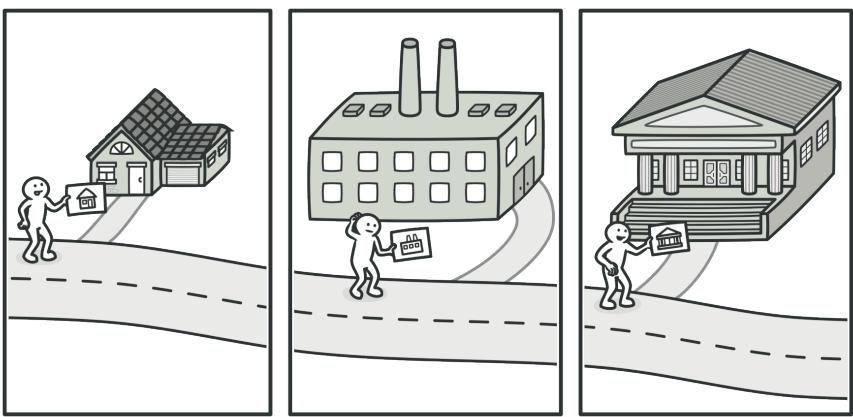  
A good insurance agent is always ready to offer diferent policies to various types of organizations.

Imagine a seasoned insurance agent who's eager to get new customers. He can visit every building in a neighborhood, trying to sell insurance to everyone he meets. Depending on the type of organization that occupies the building,he can offer specialized insurance policies:

If it's a residential building, he sells medical insurance.   
If it's a bank, he sells theft insurance.   
If it's a coffee shop,he sels fire and flood insurance.

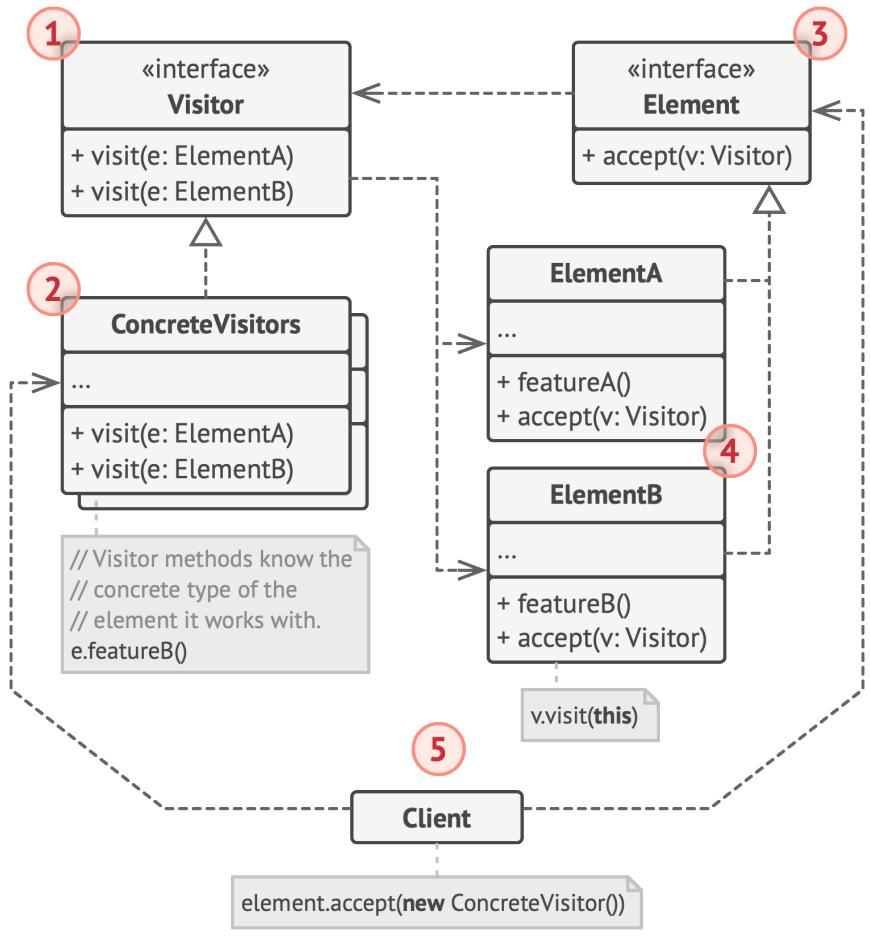

1.The Visitor interface declares a set of visiting methods that can take concrete elements of an object structure as arguments. These methods may have the same names if the program is written in a language that supports overloading,but the type of their parameters must be different.

2.Each Concrete Visitor implements several versions of the same behaviors,tailored for different concrete element classes.

3.The Element interface declares a method for “accepting” vis-itors.This method should have one parameter declared with the type of the visitor interface.

4.Each Concrete Element must implement the acceptance method. The purpose of this method is to redirect the call to the proper visitor's method corresponding to the current element class. Be aware that even if a base element class implements this method,all subclasses must still override this method in their own classes and call the appropriate method on the visitor object.

5.The Client usually represents a collection or some other complex object (for example,a Composite tree). Usually, clients aren't aware of all the concrete element classes because they work with objects from that collection via some abstract interface.

# # Pseudocode

In this example, the Visitor pattern adds XML export support to the class hierarchy of geometric shapes.

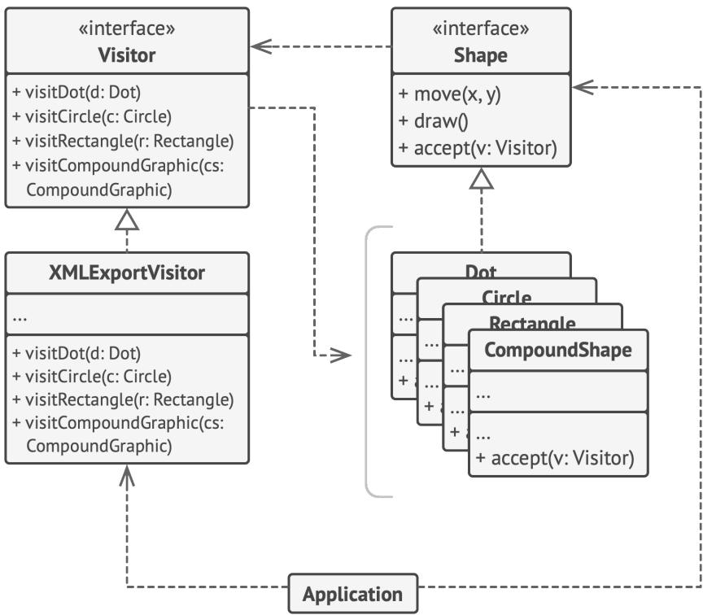

Exporting various types of objects into XML format via a visitor object.

1 // The element interface declares an \`accept\` method that takes   
2 // the base visitor interface as an argument.   
3 interface Shape is   
4 method move(x，y)   
5 method draw()   
6 method accept(v: Visitor)   
7   
8 // Each concrete element class must implement the\`accept\`   
9 // method in such a way that it calls the visitor's method that   
10 // corresponds to the element's class.   
11 class Dot implements Shape is   
12 /   
13 // Note that we're calling \`visitDot\`，which matches the   
14 // current class name. This way we let the visitor know the   
15 // class of the element it works with.   
16 method accept(v: Visitor） is   
17 v.visitDot(this)   
18   
19 class Circle implements Shape is   
20 / ...   
21 method accept(v: Visitor) is   
22 v.visitCircle(this)   
23   
24 class Rectangle implements Shape is   
25 // ...   
26 method accept(v: Visitor) is   
27 v.visitRectangle(this)   
28   
29 class CompoundShape implements Shape is   
30 // ...   
31 method accept(v: Visitor) is   
32 v.visitCompoundShape( this)   
33   
34   
35 // The Visitor interface declares a set of visiting methods that   
36 // correspond to element classes. The signature of a visiting   
37 // method lets the visitor identify the exact class of the   
38 // element that it's dealing with.   
39 interface Visitor is   
40 method visitDot(d: Dot)   
41 method visitCircle(c: Circle)   
42 method visitRectangle(r: Rectangle)   
43 method visitCompoundShape(cs: CompoundShape)   
44   
45 // Concrete visitors implement several versions of the si   
46 // algorithm，which can work with all concrete element c1   
47 /   
48 // You can experience the biggest benefit of the Visitor   
49 // when using it with a complex object structure such as   
50 // Composite tree. In this case，it might be helpful to :   
51 // some intermediate state of the algorithm while execut:   
52 // visitor's methods over various objects of the structul   
53 class XMLExportVisitor implements Visitor is   
54 method visitDot(d: Dot） is   
55 // Export the dot's ID and center coordinates.   
56   
57 method visitCircle(c: Circle) is   
58 // Export the circle's ID，center coordinates and   
59 // radius.   
60   
61 method visitRectangle(r: Rectangle) is   
62 // Export the rectangle's ID， left-top coordinates,   
63 // width and height.   
64   
65 method visitCompoundShape(cs: CompoundShape） is   
66 // Export the shape's ID as well as the list of its   
67 // children's IDs.   
68   
69   
70 // The client code can run visitor operations over any Se   
71 // elements without figuring out their concrete classes.   
72 // accept operation directs a call to the appropriate ope   
73 // in the visitor object.   
74 class Application is   
75 field allShapes: array of Shapes   
76 method export $( )$ is   
77 exportVisitor $=$ new XMLExportVisitor $( )$   
78   
79 foreach （shape in allShapes） do   
80 shape.accept(exportVisitor)

If you wonder why we need the accept method in this exam-ple,my article Visitor and Double Dispatch addresses this question in detail.

# Applicability

Use the Visitor when you need to perform an operation on all elements of a complex object structure (for example, an object tree).

The Visitor pattern lets you execute an operation over a set of objects with different classes by having a visitor object implement several variants of the same operation,which correspond to all target classes.

：Use the Visitor to clean up the business logic of auxiliary behaviors.

The patern lets you make the primary classes of your app more focused on their main jobs by extracting all other behaviors into a set of visitor classes.

Use the pattern when a behavior makes sense only in some classes of a class hierarchy, but not in others.

You can extract this behavior into a separate visitor class and implement only those visiting methods that accept objects of relevant classes, leaving the rest empty.

# How to Implement

1.Declare the visitor interface with a set of“visiting”methods,one per each concrete element class that exists in the program.

2.Declare the element interface.If you're working with an existing element class hierarchy, add the abstract “acceptance" method to the base class of the hierarchy. This method should accept a visitor object as an argument.

3.Implement the acceptance methods in all concrete element classes. These methods must simply redirect the call to a visiting method on the incoming visitor object which matches the class of the current element.

4.The element classes should only work with visitors via the visitor interface. Visitors, however, must be aware of all concrete element classes,referenced as parameter types of the visiting methods.

5.For each behavior that can’t be implemented inside the element hierarchy, create a new concrete visitor class and implement all of the visiting methods.

You might encounter a situation where the visitor will need access to some private members of the element class. In this case,you can either make these fields or methods public, violating the element's encapsulation,or nest the visitor class in the element class. The latter is only possible if you're lucky to work with a programming language that supports nested classes.

6.The client must create visitor objects and pass them into elements via“acceptance”methods.

# Pros and Cons

Open/Closed Principle. You can introduce a new behavior that can work with objects of different classes without changing these classes.

Single Responsibility Principle. You can move multiple versions of the same behavior into the same class.

A visitor object can accumulate some useful information while working with various objects. This might be handy when you want to traverse some complex object structure, such as an object tree,and apply the visitor to each object of this structure.

XYou need to update allvisitors each time a class gets added to or removed from the element hierarchy.

Visitors might lack the necessary access to the private fields and methods of the elements that they're supposed to work with.

# ← Relations with Other Patterns

You can treat Visitor as a powerful version of the Command pattern. Its objects can execute operations over various objects of different classes.

You can use Visitor to execute an operation over an entire Composite tree.

You can use Visitor along with Iterator to traverse a complex data structure and execute some operation over its elements, even if they all have different classes.

# Conclusion

# Congrats! You have reached the end of the book!

However, there are many other patterns in the world.I hope that the book will become your starting point for learning patterns and developing superhero program design abilities.

Here are a couple of ideas that will help you decide what to do next.

</> Don't forget that you also have access to an archive of downloadable code samplesindifferent programming languages.

Read Joshua Kerievsky's “Refactoring To Patterns".

Know nothing about refactoring? Ihave a course for you.

目Print out these patterns cheat sheets and put them somewhere where you'll be able to see them all the time.

$\nQ$ Leave feedback on this book. I'll be very excited to learn your opinion, even a highly critical one $\circleddot$